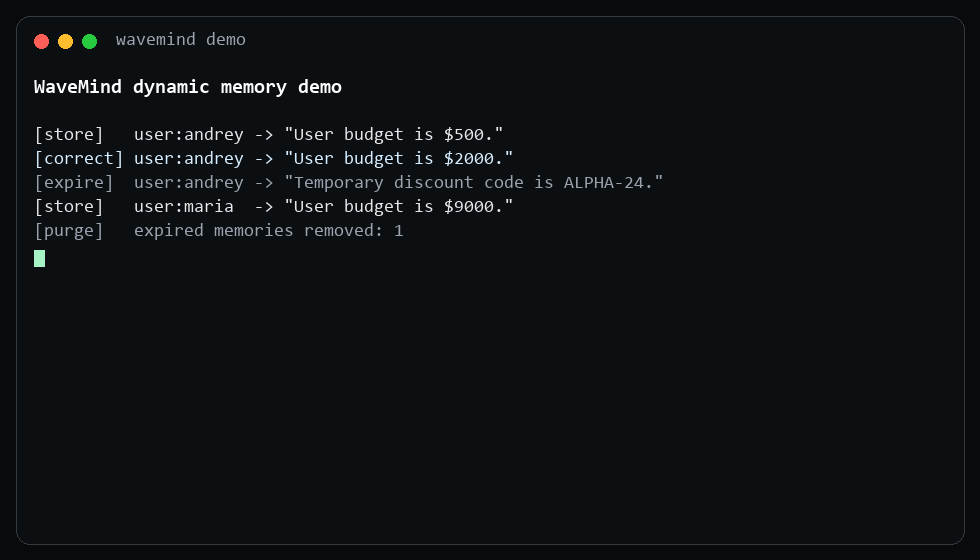

# WaveMind Crypto Research

**A research branch that tests whether WaveMind's dynamic memory can recognize recurring crypto market states and turn them into auditable price targets.**

[Core WaveMind](https://github.com/CaspianG/wavemind/tree/main) | [Research method](docs/CRYPTO_RESEARCH.md) | [24h forecast](benchmarks/results/crypto/current_24h.md) | [Forecast audit](benchmarks/results/crypto/forecast_audit.md)

> Research software only. It is not financial advice, a profit guarantee, or a production trading bot.

## What It Does

WaveMind turns completed OHLCV candles into memories of market states. Each memory stores the observable setup and the outcome that followed it. For a new market state, the system retrieves historical analogues, applies the wave-field priority layer, checks the current regime, and produces:

- an `up` or `down` market estimate;
- an expected percentage move and target price;
- a separate `trade` or `no_trade` validation decision;
- an evidence score that is explicitly not presented as probability;
- an immutable forecast ID that can be evaluated after the horizon closes.

The current 24h model uses a guarded 4h state-field: observable trend and RSI state choose direction, while WaveMind analogue memory supplies target magnitude. The rule was accepted only after a separate holdout-asset check.

## Quick Start

```sh
pip install -e ".[crypto,dev]"
python benchmarks/crypto_current_forecast.py --exchange okx --symbols BTC/USDT:USDT ETH/USDT:USDT SOL/USDT:USDT --horizon 24h --ledger benchmarks/results/crypto/forecast_ledger.jsonl --output benchmarks/results/crypto/current_24h.json --report benchmarks/results/crypto/current_24h.md
python benchmarks/crypto_forecast_audit.py --ledger benchmarks/results/crypto/forecast_ledger.jsonl --exchange okx
```

The forecast runner accepts only completed candles and fails if exchange data is stale. The audit runner keeps pending forecasts separate from mature outcomes and measures direction accuracy, target error, and whether the target was touched inside the horizon.

## Current Evidence

Real OKX 4h candles, 1,200 bars per asset, four walk-forward folds, 90 test windows per fold. Every query uses only outcomes that were already mature at that point.

| universe | model | queries | direction hit | target MAE | worst slice hit |
|---|---|---:|---:|---:|---:|
| BTC / ETH / SOL | **WaveMind guarded state-field** | 1,080 | **0.537** | **223.5 bps** | **0.444** |
| BTC / ETH / SOL | previous WaveMind target | 1,080 | 0.504 | 225.7 bps | 0.389 |
| BTC / ETH / SOL | momentum | 1,080 | 0.499 | 236.1 bps | 0.356 |
| ADA / AVAX / DOGE / LINK / XRP holdout | **WaveMind guarded state-field** | 1,800 | **0.506** | 258.9 bps | 0.389 |
| ADA / AVAX / DOGE / LINK / XRP holdout | previous WaveMind target | 1,800 | 0.469 | 261.3 bps | 0.311 |
| ADA / AVAX / DOGE / LINK / XRP holdout | momentum | 1,800 | 0.468 | 275.8 bps | 0.344 |

Full reports:

- [Core assets 4h target benchmark](benchmarks/results/crypto/core_assets_4h_price_target.md)
- [Holdout assets 4h target benchmark](benchmarks/results/crypto/holdout_assets_4h_price_target.md)
- [Eight-asset 80% admission gate](benchmarks/results/crypto/accuracy_gate.md)
- [Long-history 80% admission gate](benchmarks/results/crypto/long_history_accuracy_gate.md)
- [Current 24h forecast](benchmarks/results/crypto/current_24h.md)
- [Current 7d forecast](benchmarks/results/crypto/current_7d.md)
- [Live forecast audit](benchmarks/results/crypto/forecast_audit.md)
- [Official Binance futures 24h stress test](benchmarks/results/crypto/binance_futures_8asset_24h.md)
- [Official Binance futures 7d stress test](benchmarks/results/crypto/binance_futures_8asset_7d.md)
- [Direct WaveField 24h ablation](benchmarks/results/crypto/binance_wavefield_ablation_24h.md)
- [Direct WaveField 7d ablation](benchmarks/results/crypto/binance_wavefield_ablation_7d.md)

### Official Binance futures stress test

The derivatives layer is now tested on the official Binance USD-M archive from
2025-07-01 through 2026-06-30: BTC, ETH, SOL, XRP, DOGE, BNB, ADA, and LINK.
Every downloaded ZIP is checked against Binance's published SHA-256 checksum.
Features include completed 4h candles, funding, open interest, trader ratios,
premium index, cross-asset context, and 5-minute order-book depth snapshots.

| horizon | best full-coverage engine | direction hit | worst fold | worst coin | best selective result | admission |
|---|---|---:|---:|---:|---:|---|
| 24h | ExtraTrees baseline | 53.1% | 50.8% | 50.1% | 58.0% / 226 independent signals | rejected |
| 7d | return regression ensemble | 56.0% | 48.4% | 44.3% | 62.9% / 124 independent signals | rejected |

These are statistical baselines for the market-memory research, not accuracy
credited to the WaveMind core. A direct reproducible core ablation reaches
52.0% full-coverage / 55.9% selective on 24h and 51.6% full-coverage / 58.4%
selective on 7d. It does not beat the best statistical baselines. No tested
Binance candidate passes the 75% or 80% gate, so the branch does not expose
these scores as probability.

## Honest Interpretation

The guarded state-field is a real improvement over the previous WaveMind direction model on both the development universe and untouched holdout assets. It also improves target error over momentum.

It is not yet a predictive breakthrough:

- 53.7% on core assets and 50.6% on holdout assets are not enough for unattended trading;
- holdout target MAE is still about 2.59%;
- the robust WaveMind target has slightly better holdout MAE, while the guarded state-field has better direction accuracy;
- the 7d policy is still unvalidated and therefore returns `no_trade`;
- evidence strength is not a calibrated probability.

This branch treats those limitations as test failures to improve, not as marketing footnotes.

### The 80% accuracy rule

WaveMind does not count an isolated 80% result as a breakthrough. A candidate is
admitted only when it reaches at least 80% direction accuracy on non-overlapping
forecasts, has at least 40 effective signals and 5% coverage, clears a 70% lower
Wilson bound, and remains at or above 70% in every time fold and every
symbol/timeframe slice.

| real walk-forward set | best mandatory-signal result | selective 80% result | gate verdict |
|---|---:|---:|---|
| 8 assets, 1,200 x 4h bars | 52.0% | 90.9% on only 11 independent signals / 2.3% coverage | rejected |
| BTC/ETH/SOL, 2,000 x 4h bars | 54.2% | 100% on only 10 independent signals / 3.2% coverage | rejected |

These results show that OHLCV-only direction is still close to noise at useful
coverage. The next research layer therefore adds exchange-derived funding rate,
open interest, and long/short ratio instead of continuing to tune the same candle
features. Probability remains disabled until the admission gate passes.

The guarded price-target head is branch-specific research code built over WaveMind's market-memory representation. Trade validation uses the actual WaveMind field engine, but this experimental target head is not part of the stable core library yet.

## Architecture

```text
completed OHLCV candles
        |
        v
market-state features
        |
        v
WaveMind analogue memory + dynamic field priority
        |
        +--> guarded state direction
        +--> analogue target magnitude
        +--> trade-quality policy
        |
        v
forecast ID --> JSONL ledger --> outcome audit at maturity
```

SQLite remains the source of truth for WaveMind memory. Market benchmarks compare against market and time-series baselines; Chroma and Qdrant are storage controls, not the primary competitors for prediction quality.

## Repository Map

| path | purpose |
|---|---|
| `benchmarks/crypto_ohlcv.py` | CSV/CCXT import, completed-candle handling, feature windows |
| `benchmarks/crypto_derivatives.py` | strict CCXT funding/open-interest/long-short import and causal alignment |
| `benchmarks/crypto_binance_archive.py` | checksum-verified Binance futures candles, derivatives metrics, and book depth |
| `benchmarks/crypto_derivatives_field_benchmark.py` | 8-asset 24h/7d causal derivatives stress test and admission gate |
| `benchmarks/crypto_wavefield_outcome_ablation.py` | direct signed/unsigned core WaveField outcome ablation |
| `benchmarks/crypto_accuracy_gate.py` | non-overlapping, coverage-aware 80% admission test |
| `benchmarks/crypto_walk_forward_benchmark.py` | field retrieval and trade-policy walk-forward tests |
| `benchmarks/crypto_price_target_benchmark.py` | future-close target benchmarks and baselines |
| `benchmarks/crypto_current_forecast.py` | fresh 24h/7d forecasts and ledger recording |
| `benchmarks/crypto_forecast_audit.py` | automatic evaluation of matured forecasts |
| `benchmarks/results/crypto/` | current compact evidence and live forecast ledger |
| `examples/freqtrade_wavemind_strategy.py` | dry-run-first Freqtrade adapter |
| `docs/CRYPTO_RESEARCH.md` | methodology, caveats, and research roadmap |

Historical experiment artifacts remain under `benchmarks/` for reproducibility, but they are not the headline evidence.

## Core Platform References

This research branch inherits the production tooling and documentation from WaveMind core:



- [Observability and OpenTelemetry](docs/OBSERVABILITY.md)
- [Chroma migration guide](docs/CHROMA_MIGRATION.md) and [`examples/chroma_migration.py`](examples/chroma_migration.py)
- [Benchmark methodology](docs/BENCHMARK_BRIEF.md)
- [`examples/customer_support_memory.py`](examples/customer_support_memory.py) and [`examples/research_notebook_memory.py`](examples/research_notebook_memory.py)

Scale and consolidation checks remain available through `wavemind scale-plan --target-memories 50000 --fail-on action_required`, `GET /scale-plan?target_memories=50000`, `wavemind consolidate`, `POST /consolidate`, and the Python `consolidate_concepts` API.

**Checked-in production 50000-vector point:** WaveMind faiss-persisted and Qdrant service both reached recall@10 `1.000`; WaveMind pgvector reached `0.811` with `WAVEMIND_PGVECTOR_EF_SEARCH=400`. These are index measurements from [`benchmarks/production_index_profile_results.json`](benchmarks/production_index_profile_results.json), not crypto prediction results.

## Research Rules

- Real exchange data before synthetic data.
- Walk-forward and holdout validation before adoption.
- Fees and slippage for strategy metrics.
- Completed candles only, with explicit UTC close timestamps.
- Market forecasts and trade validation reported separately.
- No probability until calibration is stable across folds, symbols, and timeframes.
- Failed live forecasts stay in the ledger and count against the model.

## Next Work

1. Expand the independent holdout across exchanges and market regimes.
2. Add a WaveMind-native market-state memory model that must beat the new
   Binance statistical baselines; do not relabel a classifier as a field.
3. Expand the checksum-verified futures stress test to a second exchange and a
   longer regime history.
4. Improve target magnitude and publish calibrated prediction intervals.
5. Validate the 1d/7d policy before allowing trade signals.
6. Connect only an admitted signal layer to the Freqtrade adapter in dry-run mode.

## Development

```sh
python -m pytest -q
python -m build
python -m twine check dist/*
```

The main WaveMind product remains on [`main`](https://github.com/CaspianG/wavemind/tree/main). This branch isolates market research so experimental trading claims do not leak into the core library documentation.
