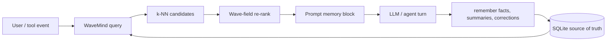

<div align="center">

# WaveMind

**Persistent dynamic memory for AI agents.**

Vector search finds similar memories. A wave-field priority layer makes useful
memories hotter, lets stale facts fade, and keeps user/project memory scoped.


[](https://pypi.org/project/wavemind/)
[](https://github.com/CaspianG/wavemind/actions/workflows/tests.yml)


[Quick Start](#quick-start) |
[LangChain](#langchain-memory) |
[OpenClaw](#openclaw-integration) |
[HTTP API](#http-api) |
[Benchmarks](#benchmark) |
[Limitations](#known-limitations)

</div>

## At a Glance

| If you need... | WaveMind gives you... |
|---|---|
| Agent memory that survives restarts | SQLite-backed `remember()`, `query()`, and `forget()`. |
| Scoped memory per user, agent, or project | Namespaces and tags on every record. |
| Memory that changes over time | Hotness, priority, TTL, and decay-aware ranking. |
| Easy integration | Python API, CLI, FastAPI server, and LangChain memory class. |
| Honest local benchmarks | Static Chroma comparison plus dynamic memory-policy checks. |



## Terminal Demo

From a cloned repository:

```text
$ python examples/demo.py
[ok] Remembered: "Andrey is a trader who tracks market breakouts."
[ok] Remembered: "Andrey prefers short practical answers about AI agents."

Query: "Andrey trader agent"
-> Result 1 (0.60): "Andrey is a trader who tracks market breakouts."
-> Result 2 (0.30): "Andrey prefers short practical answers about AI agents."
```

The demo is offline, keyless, and uses the built-in hash encoder.

## Quick Start

Install from PyPI and create your first local memory:

```sh
python -m pip install wavemind
wavemind remember "Andrey is a trader" --namespace demo
wavemind query "trader" --namespace demo
```

What happens here:

- `remember` writes the text and its vector pattern into a local SQLite database.
- By default, the database file is `wavemind.sqlite3` in your current working directory.
- `--namespace demo` keeps this memory separate from other users, agents, or projects.
- `query` reads from the same SQLite file and returns the closest remembered texts.

## Optional Embeddings

For sentence-transformer embeddings:

```sh
python -m pip install "wavemind[sentence]"
wavemind --encoder sentence remember "Andrey is a trader" --namespace demo
wavemind --encoder sentence query "What does Andrey do?" --namespace demo
```

## Data Location

For an explicit database path, put global options before the command:

```sh
wavemind --db ./agent_memory.sqlite3 remember "Andrey is a trader" --namespace demo
wavemind --db ./agent_memory.sqlite3 query "trader" --namespace demo
```

WaveMind is local-first. One SQLite file is the source of truth for texts,
metadata, vectors, namespaces, tags, TTL, and recall state. For real agents,
prefer an explicit path under your application's state directory:

```python
from wavemind import WaveMind

memory = WaveMind(db_path="./state/wavemind.sqlite3")
memory.remember("The user prefers short answers.", namespace="user:42", tags=["preference"])
```

Useful storage patterns:

| runtime | Suggested database path |
|---|---|
| local CLI experiment | `./wavemind.sqlite3` |
| Python app or agent | `./state/wavemind.sqlite3` |
| OpenClaw sidecar | `~/.openclaw/wavemind/<agent-id>.sqlite3` |
| server daemon | `/var/lib/wavemind/wavemind.sqlite3` |
| Docker | mounted volume, for example `/data/wavemind.sqlite3` |

Keep the SQLite file out of git. Back it up like any other application state.

## HTTP API

Run the local FastAPI server:

```sh
wavemind --db ./agent_memory.sqlite3 serve --host 127.0.0.1 --port 8000
```

Store and query memory over HTTP:

```sh
curl -X POST http://127.0.0.1:8000/remember -H "Content-Type: application/json" -d "{\"text\":\"Andrey is a trader\",\"namespace\":\"demo\"}"
curl -X POST http://127.0.0.1:8000/query -H "Content-Type: application/json" -d "{\"query\":\"trader\",\"namespace\":\"demo\",\"top_k\":1}"
```

## Install From Source

For contributors installing from a local clone:

```sh
git clone https://github.com/CaspianG/wavemind.git
cd wavemind
python -m pip install -e ".[sentence]"
```

One-file setup scripts are also included in the repository:

```sh
sh install.sh
```

```bat
install.bat
```

## LangChain Memory

Install the optional integration:

```sh
pip install "wavemind[langchain]"
```

Use WaveMind as a drop-in LangChain memory object:

```python
from wavemind.integrations.langchain import WaveMindMemory

memory = WaveMindMemory(db_path="agent_memory.sqlite3")
# Replace: memory = ConversationBufferMemory()
```

Offline runnable example from a cloned repository:

```sh
python examples/langchain_memory.py
```

## Integration Patterns

WaveMind only needs two touch points in an agent or app:

1. Before the model call, `query()` for relevant memories and inject the short
   results into the prompt.
2. After the turn, `remember()` durable facts, preferences, summaries, tool
   outcomes, or user corrections.

That makes it usable in more than LangChain:

| Use case | Integration style |
|---|---|
| LangChain or LangGraph agent | Use `WaveMindMemory` from `wavemind.integrations.langchain`. |
| Custom Python agent | Create one `WaveMind` instance and call `query()` before the LLM. |
| Node, Go, Ruby, PHP, or no-code app | Run `wavemind serve` and call the HTTP API. |
| Multi-user SaaS | Use `namespace="user:<id>"` or `namespace="tenant:<id>:agent:<id>"`. |
| Temporary context | Store with `ttl_seconds=...` so stale memory expires automatically. |
| Preference/profile memory | Store with tags such as `profile`, `preference`, `project`, `decision`. |
| Corrections/privacy | Use `forget()` or namespace deletion workflows. |

Minimal custom agent loop:

```python
from wavemind import WaveMind

memory = WaveMind(db_path="./state/wavemind.sqlite3")

def run_turn(user_id: str, user_text: str, history: list[str]) -> str:
    namespace = f"user:{user_id}"
    hits = memory.query(user_text, namespace=namespace, top_k=5, min_score=0.25)
    recalled = "\n".join(f"- {hit.text}" for hit in hits)

    prompt = f"Relevant memory:\n{recalled}\n\nUser: {user_text}"
    answer = call_your_llm(prompt, history)

    memory.remember(f"User said: {user_text}", namespace=namespace, tags=["conversation"])
    memory.remember(f"Assistant answered: {answer}", namespace=namespace, tags=["conversation"])
    return answer
```

## OpenClaw Integration

[OpenClaw memory](https://docs.openclaw.ai/concepts/memory) is file-centered:
it writes durable memory into `MEMORY.md`, daily notes under `memory/`, and uses
tools such as `memory_search` / `memory_get`. OpenClaw's documented agent loop
also exposes hooks such as `before_prompt_build`, `agent_end`,
`message_received`, and `message_sent`.

The safest WaveMind integration is a sidecar, not a replacement:

- Keep OpenClaw's Markdown memory as the human-readable source of durable truth.
- Use WaveMind as the dynamic recall layer for hotness, TTL, namespaces, and
  correction-sensitive ranking.
- Store the SQLite file outside committed workspace files, for example
  `~/.openclaw/wavemind/<agent-id>.sqlite3`.
- Query WaveMind from `before_prompt_build` and inject a compact memory block
  with `prependContext`.
- Capture new durable summaries from `agent_end` or message hooks.

Sketch of the adapter logic:

```python
from pathlib import Path
from wavemind import WaveMind

db_path = Path.home() / ".openclaw" / "wavemind" / "main.sqlite3"
memory = WaveMind(db_path=db_path)

def before_prompt_build(agent_id: str, user_text: str) -> str:
    namespace = f"openclaw:{agent_id}"
    hits = memory.query(user_text, namespace=namespace, top_k=5, min_score=0.25)
    return "\n".join(f"- {hit.text}" for hit in hits)

def agent_end(agent_id: str, summary: str) -> None:
    namespace = f"openclaw:{agent_id}"
    memory.remember(summary, namespace=namespace, tags=["summary"], priority=1.5)
```

For a production OpenClaw plugin, translate that sketch into the documented
plugin hook surface: `before_prompt_build` for recall and `agent_end` /
`message_received` / `message_sent` for capture.

## Hermes and Custom Agent Loops

The public [HERMES Agent](https://github.com/aziksh-ospanov/HERMES) is a
LangChain / LangGraph mathematical-reasoning agent. Its README describes
`HermesReasoner` as a LangChain `BaseTool` and mentions an optional in-memory
embedding store for previously verified claims.

WaveMind fits there as a persistent memory layer around that loop:

- Recall previously verified claims before `HermesReasoner` is invoked.
- Store successfully verified claims with `tags=["verified-claim"]`.
- Scope by `user_id`, project, benchmark, or theorem namespace.
- Replace short-lived in-memory vector recall when the agent needs restarts,
  TTL, explicit forgetting, or cross-session reuse.

Generic Hermes-style loop:

```python
from wavemind import WaveMind

memory = WaveMind(db_path="./state/hermes_claims.sqlite3")

def verify_with_memory(user_id: str, problem: str) -> str:
    namespace = f"hermes:{user_id}"
    claims = memory.query(problem, namespace=namespace, tags=["verified-claim"], top_k=5)
    context = "\n".join(f"- {claim.text}" for claim in claims)

    result = call_hermes_reasoner(problem=problem, extra_context=context)

    if result.label == "CORRECT":
        memory.remember(result.claim, namespace=namespace, tags=["verified-claim"], priority=2.0)
    return result.text
```

For any other agent framework, the rule is the same: recall before the model,
capture after the turn, isolate users with namespaces, and use TTL for temporary
facts.

## Non-Agent Use Cases

WaveMind can store any small-to-medium memory stream where freshness and usage
matter:

| Use case | Example |
|---|---|
| Support memory | Recall past user issues, plans, bugs, and resolutions. |
| Product research | Store interview snippets with `tags=["customer", "pain"]`. |
| Team knowledge | Remember project decisions and suppress expired decisions with TTL. |
| Personal assistant | Store preferences, routines, people, and recurring context. |
| Game/NPC memory | Give characters scoped memory that strengthens after repeated events. |
| Trading research | Store labeled OHLCV pattern notes before building a backtest layer. |
| Document notebook | Import text/PDF/JSON chunks and query by namespace/project. |

## Why Dynamic Memory

WaveMind is not positioned as "a faster Chroma." Chroma, Qdrant, Pinecone, and Weaviate are vector databases: they store embeddings and return nearest neighbors. That is the right tool for many static RAG workloads.

WaveMind is an agent memory layer. It still uses vector search first, but then applies memory-specific signals that a plain vector store does not model by default:

| memory behavior | Why it matters for agents | WaveMind mechanism |
|---|---|---|
| Hot memories | Facts recalled repeatedly should become easier to recall again. | Wave-field hotness and priority updates. |
| Aging memories | Old low-value facts should fade instead of competing forever. | TTL and decay-aware scoring. |
| Scoped memory | One user, agent, workspace, or project should not leak into another. | Namespaces and tags. |
| Explicit forgetting | Agents need deletion, privacy cleanup, and correction workflows. | `forget()` plus SQLite persistence. |
| Stable restart behavior | A memory system must survive process restarts. | SQLite source of truth, reloadable indexes. |
| Vector plus memory rank | Semantic similarity is necessary but not sufficient for long-running agents. | k-NN candidates first, wave field as re-ranker. |

The current Chroma benchmark below is intentionally conservative: it compares static retrieval on the same facts and the same hash embeddings. That benchmark is useful, but it does not exercise WaveMind's main product thesis: memory that changes over time as an agent recalls, reinforces, ages, and forgets information.

The benchmark that should decide whether WaveMind is worth using is a dynamic agent-memory benchmark:

| scenario | What should happen |
|---|---|
| A user repeats a preference many times. | WaveMind should rank it higher than equally similar but unused facts. |
| A fact expires via TTL. | WaveMind should suppress it without requiring manual vector cleanup. |
| A user corrects an old fact. | WaveMind should prefer the newer or reinforced memory. |
| A query is ambiguous across namespaces. | WaveMind should return only the scoped user's memory. |
| A long conversation has many irrelevant facts. | WaveMind should preserve useful recall instead of treating all vectors equally. |

In short: static vector search answers "what is nearest?" Agent memory also asks "what is still relevant, reinforced, scoped, and allowed to be remembered?"

## Benchmark

WaveMind tracks benchmarks in two layers:

- **Implemented local checks** - fast, reproducible scripts that run from this repository and protect the core memory behavior.
- **Public benchmark roadmap** - external retrieval and memory benchmarks that should decide whether WaveMind is competitive outside hand-made demos.

Machine-readable benchmark matrix: `benchmarks/benchmark_matrix_results.json`.

Visual summary generated from the checked-in JSON results:


Regenerate the matrix and chart locally:

```sh
python benchmarks/benchmark_registry.py --output benchmarks/benchmark_matrix_results.json
python benchmarks/render_benchmark_charts.py --output docs/assets/benchmark-summary.svg
```

The chart only shows completed local measurements. Planned public benchmarks stay
in the matrix until the dataset, engine, and result JSON are committed.

Current read:

| area | result | honest interpretation |
|---|---|---|
| Static agent recall | WaveMind `precision@1` equals Chroma at `0.82`; WaveMind `precision@3` is `0.90` vs Chroma `0.88`. | Competitive quality, but Chroma is faster on the static vector-store path. |
| Dynamic memory policy | WaveMind reaches `1.00` stale suppression; Chroma static is `0.00`. | This is the strongest current differentiation: hotness, TTL, corrections, and namespaces. |
| Long-term evidence | WaveMind reaches `1.00` evidence recall@5, `1.00` precision@1, and `1.00` stale suppression on the synthetic long-memory evidence benchmark. | This is the first proof-shaped benchmark for agent memory: it measures whether stale/corrected/expired/cross-user facts stay out of retrieved evidence. |
| Capacity | Static `precision@1` is `0.94` at 5000 memories; dynamic policy keeps `1.00` on the current checks. | Quality is holding on these checks, but dynamic latency must be optimized. |
| Next public proof | BEIR-style runner supports WaveMind, Chroma, and Qdrant on the same qrels. | The next README number should come from SciFact/NFCorpus, not another hand-made scenario. |

### Real Benchmark Matrix

| benchmark | what it proves | status | baseline / competitor | target |
|---|---|---|---|---|
| Agent user-memory retrieval | Natural-language recall over 200 user facts. | implemented | Chroma | Match Chroma `precision@1`, beat `precision@3`, stay under 5 ms at 200 memories. |
| Dynamic memory policy | Hot memory, TTL, corrections, stale suppression, namespace isolation. | implemented | Chroma static | Keep `precision@1` and stale suppression at 1.00, cut avg latency below 10 ms at 1000 memories. |
| WaveMind capacity curve | How recall and latency change at 200 / 1000 / 5000 memories. | implemented | WaveMind-only today | Keep `precision@1 >= 0.95` at 5000 memories and dynamic latency below 20 ms. |
| Long-term memory evidence | Evidence retrieval from long histories with profile, preference, correction, TTL, namespace, and filler noise. | implemented | Static vector, Chroma/Qdrant runners optional | Prove dynamic memory behavior before adding public LoCoMo/LongMemEval adapters. |
| BEIR-style open retrieval runner | Public `corpus.jsonl`, `queries.jsonl`, `qrels/*.tsv` datasets with the same metrics for each engine. | implemented | WaveMind / Chroma / Qdrant | Use identical embeddings and report `nDCG@k`, `Recall@k`, `MRR@k`, `precision@1`, and latency. |
| [BEIR](https://github.com/beir-cellar/beir) | Standard zero-shot information retrieval quality. | planned | Chroma / Qdrant / FAISS | Stay within 0.02 `nDCG@10` on identical embeddings. |
| [MTEB Retrieval](https://github.com/embeddings-benchmark/mteb) | Separates encoder quality from retrieval-store quality. | planned | Chroma / Qdrant / FAISS | Prove WaveMind does not reduce same-embedding retrieval quality. |
| [MIRACL Russian](https://miracl.ai/) | Multilingual retrieval with Russian relevance judgments. | planned | Chroma / Qdrant / FAISS | Reach same-embedding parity on Russian `nDCG@10`. |
| [ANN-Benchmarks](https://github.com/erikbern/ann-benchmarks) style curve | Recall/latency tradeoff for vector indexes. | planned | FAISS / Annoy / Qdrant HNSW | Keep `recall@10 >= 0.95` while beating NumPy exact latency. |
| [LoCoMo](https://arxiv.org/abs/2402.17753) | Long conversation memory, temporal consistency, multi-hop recall. Retrieval-only runner is implemented for official `locomo10.json`. | runner ready | Static vector / Chroma / Qdrant first; RAG answer baselines next | Publish full `evidence_recall@k`, `precision@1`, `MRR@k`, and latency on the official file. |
| [LongMemEval](https://arxiv.org/abs/2410.10813) | Long-term assistant memory with updates and abstention. | planned | Chroma RAG / Qdrant RAG / Mem0-style memory | Improve update/abstention evidence recall under 100 ms retrieval latency. |
| [LongMemEval-V2](https://arxiv.org/abs/2605.12493) | Web-agent memory: state recall, dynamic state, workflow gotchas. | planned | AgentRunbook-R / Chroma RAG / Qdrant RAG | Prove WaveMind can retrieve compact evidence from agent trajectories. |
| [LMEB](https://github.com/KaLM-Embedding/LMEB) | Long-horizon memory embedding tasks beyond normal passage retrieval. | planned | Embedding-only baselines / Chroma / Qdrant | Choose the default semantic encoder using memory-specific tasks. |
| [RAGBench](https://huggingface.co/datasets/rungalileo/ragbench) | Downstream RAG context and answer quality. | planned | Chroma RAG / Qdrant RAG / Pinecone RAG | Show whether stale-memory suppression improves context relevance. |

The planned rows are not claimed wins. They are the public evaluation path WaveMind needs before strong production claims.

### Open Retrieval Benchmarks

Many retrieval benchmarks use the same simple shape:

- `corpus.jsonl` - documents with `_id`, optional `title`, and `text`.
- `queries.jsonl` - queries with `_id` and `text`.
- `qrels/test.tsv` - judged relevance rows: `query-id`, `corpus-id`, `score`.

WaveMind includes a BEIR-style runner so the same downloaded dataset can be used
for WaveMind, Chroma, and Qdrant:

```sh
pip install -e ".[bench]"
python benchmarks/open_retrieval_benchmark.py --dataset ./benchmarks/data/scifact --engines wavemind chroma qdrant --top-k 10
```

That runner reports `nDCG@k`, `Recall@k`, `MRR@k`, `precision@1`, average
latency, and p95 latency. It intentionally uses the same WaveMind encoder for
all engines, so the comparison is about retrieval/index behavior rather than
which embedding model each project chooses by default.

### LoCoMo Evidence Retrieval

WaveMind now includes a retrieval-only runner for the public
[LoCoMo](https://github.com/snap-research/locomo) dataset. It treats LoCoMo
conversation turns as memories and LoCoMo QA `evidence` dialog IDs as relevance
labels. This measures the memory layer before any LLM answer-generation noise.

Run it on the official `locomo10.json` file:

```sh
mkdir -p benchmarks/data
curl -L https://raw.githubusercontent.com/snap-research/locomo/main/data/locomo10.json -o benchmarks/data/locomo10.json
python benchmarks/locomo_memory_benchmark.py --dataset benchmarks/data/locomo10.json --engines wavemind static chroma qdrant --top-k 5 --output benchmarks/locomo_evidence_results.json
```

Metrics reported:

- `evidence_recall@k` - whether the labeled LoCoMo evidence turns appear in the returned memory block.
- `precision@1` - whether the first returned memory is labeled evidence.
- `MRR@k` - how high the first relevant evidence turn appears.
- `context_budget_saved` - how much smaller the returned evidence block is than the full conversation memory.
- `avg_latency_ms` and `p95_latency_ms` - retrieval latency only.

If Chroma or Qdrant are not installed, use the baseline-only command:

```sh
python benchmarks/locomo_memory_benchmark.py --dataset benchmarks/data/locomo10.json --engines wavemind static --top-k 5
```

The current repository does not claim a full LoCoMo score yet. The runner is
implemented and smoke-tested; the checked-in result should be added only after a
real run on the official dataset. LongMemEval is the next public memory
benchmark target. Its retrieval layer can use the same evidence-first pattern,
while answer quality can be evaluated later with a local Ollama model.

### Current Local Runs

Long-term memory evidence benchmark:

200 memories, 8 evidence queries, same `HashingTextEncoder` embeddings.
This benchmark asks a stricter agent-memory question than static retrieval:
did the system return the right evidence while suppressing stale, corrected,
expired, or cross-user evidence?
Full machine-readable result: `benchmarks/long_memory_evidence_results.json`.

| engine | evidence recall@5 | precision@1 | stale suppression | context saved | avg latency |
|---|---:|---:|---:|---:|---:|
| WaveMind | 1.00 | 1.00 | 1.00 | 0.87 | 6.10 ms |
| Static vector | 1.00 | 0.57 | 0.00 | 0.88 | 0.65 ms |

Run locally from a cloned repository:

```sh
python benchmarks/long_memory_evidence_benchmark.py --dataset synthetic --engines wavemind static --memories 200 --top-k 5
```

To compare the same normalized benchmark with Chroma or Qdrant, install the benchmark extras and include those engines:

```sh
pip install -e ".[bench]"
python benchmarks/long_memory_evidence_benchmark.py --dataset synthetic --engines wavemind chroma qdrant --memories 200 --top-k 5
```

Real Russian sentences from Tatoeba, 50 one-word queries, NumPy exact index.

| metric | hash | sentence-transformers |
|---|---:|---:|
| precision@1 | 1.00 | 1.00 |
| precision@3 | 1.00 | 1.00 |
| avg query | 0.49 ms | 52.84 ms |

Capacity check with the hash encoder:

| memories | precision@1 | precision@3 | avg query |
|---:|---:|---:|---:|
| 200 | 1.00 | 1.00 | 0.49 ms |
| 1000 | 0.88 | 1.00 | 1.50 ms |
| 5000 | 0.72 | 0.88 | 5.68 ms |

Run locally from a cloned repository:

```sh
python benchmarks/ru_sentences_benchmark.py --sentences 200 --queries 50 --encoder hash --index numpy
python benchmarks/ru_sentences_benchmark.py --sentences 200 --queries 50 --encoder sentence --index numpy
```

Agent-memory benchmark against Chroma:

200 Russian user facts, 50 natural-language questions, same precomputed `HashingTextEncoder` embeddings for WaveMind and Chroma.
Full machine-readable result: `benchmarks/agent_memory_results.json`.

This is a static retrieval benchmark. It measures baseline ranking and latency, not hotness, TTL, repeated recall, or memory aging.

| engine | precision@1 | precision@3 | avg latency |
|---|---:|---:|---:|
| WaveMind | 0.82 | 0.90 | 2.25 ms |
| Chroma | 0.82 | 0.88 | 0.93 ms |

WaveMind-only capacity checks from the current ranking path:

| scenario | memories | precision@1 | precision@3 | avg latency | p95 latency |
|---|---:|---:|---:|---:|---:|
| static agent facts | 200 | 0.96 | 0.98 | 4.05 ms | 8.18 ms |
| static agent facts | 1000 | 0.96 | 0.98 | 3.53 ms | 5.20 ms |
| static agent facts | 5000 | 0.94 | 0.98 | 13.71 ms | 17.20 ms |
| dynamic memory policy | 200 | 1.00 | 1.00 | 38.40 ms | 41.14 ms |
| dynamic memory policy | 1000 | 1.00 | 1.00 | 54.29 ms | 72.38 ms |
| dynamic memory policy | 5000 | 1.00 | 1.00 | 48.36 ms | 86.13 ms |

Machine-readable local capacity result: `benchmarks/wavemind_capacity_results.json`.
These capacity checks are WaveMind-only because the local restricted environment did not have Chroma installed.

Run locally from a cloned repository:

```sh
pip install -e ".[bench]"
python benchmarks/agent_memory_benchmark.py --engines wavemind chroma --facts 200 --queries 50
```

Dynamic agent-memory benchmark:

200 memories, 8 checks, same precomputed `HashingTextEncoder` embeddings.
This benchmark exercises hot memory, TTL, corrections, and namespace isolation.
WaveMind applies its built-in memory policy. `Chroma static` is a plain vector-store baseline without application-layer TTL, delete handling, namespace filters, or recall reinforcement.
Full machine-readable result: `benchmarks/dynamic_memory_results.json`.

| engine | precision@1 | precision@3 | stale suppression | avg latency |
|---|---:|---:|---:|---:|
| WaveMind | 1.00 | 1.00 | 1.00 | 25.26 ms |
| Chroma static | 0.57 | 1.00 | 0.00 | 1.75 ms |

Category success:

| behavior | WaveMind | Chroma static |
|---|---:|---:|
| hot memory | 1.00 | 0.50 |
| TTL | 1.00 | 0.00 |
| correction | 1.00 | 0.00 |
| namespace isolation | 1.00 | 0.00 |

Run locally from a cloned repository:

```sh
pip install -e ".[bench]"
python benchmarks/dynamic_memory_benchmark.py --engines wavemind chroma --memories 200
```

## Comparison

| feature | WaveMind | Chroma | Qdrant |
|---|---|---|---|
| Primary role | Agent memory engine | Embedding database | Production vector database |
| Local SQLite persistence | Yes | Yes | No, separate service/storage |
| HTTP API | FastAPI included | Included | Included |
| Dynamic memory priority | Wave-field hotness, TTL, priority | Metadata/filter driven | Payload/filter driven |
| Built-in forgetting | TTL and explicit forget | Manual delete/filtering | Manual delete/filtering |
| Best fit | Small to medium agent memory with dynamic recall | Local RAG apps and prototypes | Large-scale vector search |
| Scale target today | Up to 1000 optimal on NumPy, FAISS recommended beyond 5000 | Larger than WaveMind local mode | Production scale |

WaveMind is not trying to replace dedicated vector databases at scale. The intended product gap is dynamic priority: frequently used memories can become hotter while old or low-priority memories fade. For static RAG over large document collections, use a mature vector database. For agent memory that needs persistence, scoped recall, TTL, forgetting, and reinforcement, WaveMind is designed to sit above or beside the vector index.

## Known Limitations

- Optimal capacity on the current NumPy exact index is up to 1000 records.
- At 5000 records, one-word `precision@1` is currently 0.72 with the hash encoder; many misses are ambiguous queries where another sentence containing the same word ranks first.
- For `N > 5000`, use the FAISS backend with `--index faiss` or another production vector index.
- `sentence-transformers/paraphrase-multilingual-mpnet-base-v2` requires about 420 MB of model files and measured about 53 ms per query on the benchmark machine.
- The Chroma comparison currently uses shared precomputed hash embeddings to isolate retrieval/ranking behavior; semantic model comparisons should be run separately.
- In the 200-fact agent benchmark, Chroma is faster on average while WaveMind is slightly higher at `precision@3`.
- The dynamic benchmark currently compares WaveMind against a static Chroma baseline. Chroma and Qdrant can implement similar behavior with extra application-layer metadata policy, deletes, filters, and reinforcement logic.
- The long-term memory evidence benchmark is currently synthetic. It is useful for regression and product-shape proof, but it is not a substitute for LoCoMo or LongMemEval public results.
- The LoCoMo runner is implemented, but a full official `locomo10.json` result is not checked in yet because this local environment could not download from `raw.githubusercontent.com`.
- BEIR, MTEB, MIRACL, LoCoMo, LongMemEval, LMEB, ANN-Benchmarks, and RAGBench are listed as the public benchmark roadmap, not as completed results yet.
- Public benchmark adapters require optional datasets, heavier dependencies, or running services. They are intentionally outside the minimal `pip install wavemind` path.
- Dynamic memory is slower than static Chroma in the current local benchmark: 25.26 ms vs 1.75 ms average query latency on this machine.
- Current WaveMind-only dynamic checks keep `precision@1` at 1.00 through 5000 memories, but average latency is around 48-54 ms. The next optimization target is field/re-ranking latency, not basic recall quality.

## Roadmap

- FAISS-first production index path with persisted index rebuilds.
- Add public benchmark adapters in this order: finish the full LoCoMo run, BEIR SciFact/NFCorpus, MIRACL Russian, ANN-style index curve, then LongMemEval retrieval evidence.
- Expand competitor baselines to Qdrant local/service mode, Chroma metadata-policy mode, FAISS, Annoy, and sentence-transformers.
- Optimize dynamic re-ranking latency after lexical candidate filtering.
- Better semantic query expansion for short and ambiguous queries.
- Namespace quotas, backups, and daemon hardening for SaaS use.
- Webhook on recall for agent runtimes.
- OHLCV pattern-memory experiments for market research and backtests.

## License

MIT. See [LICENSE](LICENSE).
