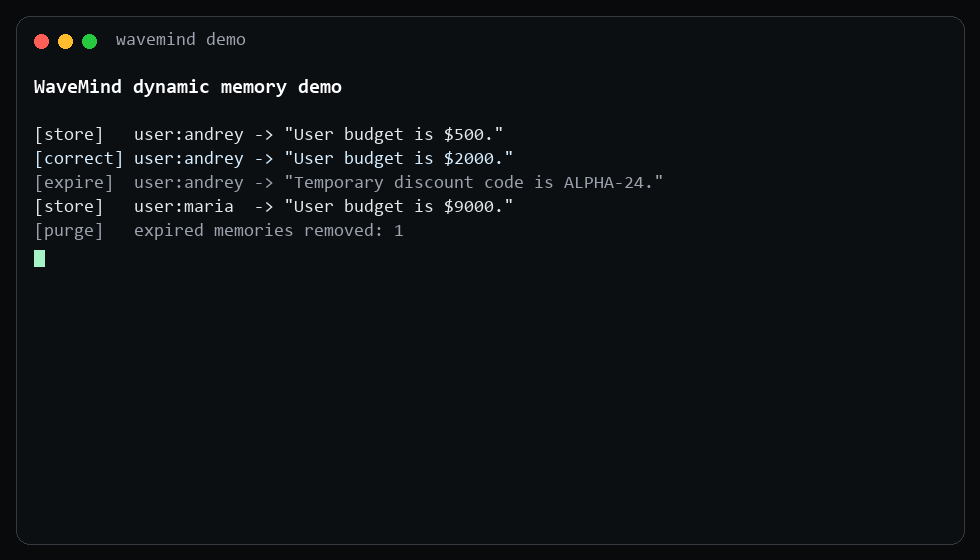

# WaveMind Crypto Research

**A research branch that tests whether WaveMind's dynamic memory can recognize recurring crypto market states and turn them into auditable price targets.**

[Core WaveMind](https://github.com/CaspianG/wavemind/tree/main) | [Research method](docs/CRYPTO_RESEARCH.md) | [24h forecast](benchmarks/results/crypto/current_24h.md) | [Forecast audit](benchmarks/results/crypto/forecast_audit.md)

> Research software only. It is not financial advice, a profit guarantee, or a production trading bot.

## What It Does

WaveMind turns completed OHLCV candles into memories of market states. Each memory stores the observable setup and the outcome that followed it. For a new market state, the system retrieves historical analogues, applies the wave-field priority layer, checks the current regime, and produces:

- an `up` or `down` market estimate;
- an expected percentage move and target price;
- a separate `trade` or `no_trade` validation decision;
- an evidence score that is explicitly not presented as probability;
- a stable forecast ID plus a tamper-evident ledger record that can be
  evaluated after the horizon closes.

The current 24h model uses a guarded 4h state-field: observable trend and RSI state choose direction, while WaveMind analogue memory supplies target magnitude. The rule was accepted only after a separate holdout-asset check.

## Quick Start

```sh
pip install -e ".[crypto,dev]"
python benchmarks/crypto_current_forecast.py --exchange okx --symbols BTC/USDT:USDT ETH/USDT:USDT SOL/USDT:USDT --horizon 24h --ledger benchmarks/results/crypto/forecast_ledger.jsonl --output benchmarks/results/crypto/current_24h.json --report benchmarks/results/crypto/current_24h.md
python benchmarks/crypto_forecast_audit.py --ledger benchmarks/results/crypto/forecast_ledger.jsonl --exchange okx
```

The forecast runner accepts only completed candles and fails if exchange data
is stale. Every new ledger row includes SHA-256 fingerprints for its input
candles and model sources, then extends a hash chain over the complete JSONL
history. The audit runner rejects duplicate IDs or a broken chain, keeps pending
forecasts separate from mature outcomes, and measures direction accuracy,
target error, and whether the target was touched inside the horizon.

## Live Forecast Evidence

The live ledger is the non-selective reality check. As of the latest settlement:

| metric | result |
|---|---:|
| physical forecasts | 25 |
| evaluated / pending | 15 / 10 |
| evaluated direction accuracy | **26.7%** |
| 95% Wilson lower bound | 10.9% |
| target touch rate | 53.3% |
| target return MAE | 216.1 bps |
| strict 70% live admission | **rejected** |
| ledger integrity | verified, 15 legacy rows anchored + 10 hashed rows |

The first live sample is small and materially worse than the historical
walk-forward tests. It is therefore evidence against deployment, not a
breakthrough claim. All 15 failed or successful matured forecasts remain in
[`forecast_ledger.jsonl`](benchmarks/results/crypto/forecast_ledger.jsonl);
the next ten are pending and will be settled from completed OKX candles.

## Current Evidence

Real OKX 4h candles, 1,200 bars per asset, four walk-forward folds, 90 test windows per fold. Every query uses only outcomes that were already mature at that point.

| universe | model | queries | direction hit | target MAE | worst slice hit |
|---|---|---:|---:|---:|---:|
| BTC / ETH / SOL | **WaveMind guarded state-field** | 1,080 | **0.537** | **223.5 bps** | **0.444** |
| BTC / ETH / SOL | previous WaveMind target | 1,080 | 0.504 | 225.7 bps | 0.389 |
| BTC / ETH / SOL | momentum | 1,080 | 0.499 | 236.1 bps | 0.356 |
| ADA / AVAX / DOGE / LINK / XRP holdout | **WaveMind guarded state-field** | 1,800 | **0.506** | 258.9 bps | 0.389 |
| ADA / AVAX / DOGE / LINK / XRP holdout | previous WaveMind target | 1,800 | 0.469 | 261.3 bps | 0.311 |
| ADA / AVAX / DOGE / LINK / XRP holdout | momentum | 1,800 | 0.468 | 275.8 bps | 0.344 |

### Frozen capitulation rebound signal

A separate sparse-event experiment found a causal extreme-state pattern and
froze it before a third, asset-disjoint holdout. The signal fires only when the
previous 48-hour return is in the past-only lower 1% tail and the latest 4-hour
open-interest change is in the past-only lower 10% tail. It predicts a rebound
over the next 24 hours.

| split | assets | independent signals | coverage | direction accuracy | Wilson low 95% |
|---|---:|---:|---:|---:|---:|
| development walk-forward | 16 | 112 | 0.8% | 92.9% | 86.5% |
| frozen asset holdout | 8 | 58 | 0.9% | **82.8%** | **71.1%** |

The holdout clears the aggregate 70% evidence threshold without target leakage
or overlapping forecasts. It is not a universal 82.8% market predictor:
coverage is only 0.9%, and FILUSDT is 7/11 (63.6%), below the predeclared 65%
per-asset stability threshold. The aggregate result is admitted as evidence of
a conditional edge; the stricter cross-asset stability gate remains rejected.
See the [full frozen-transfer report](benchmarks/results/crypto/capitulation_field_24h.md).

Full reports:

- [Core assets 4h target benchmark](benchmarks/results/crypto/core_assets_4h_price_target.md)
- [Holdout assets 4h target benchmark](benchmarks/results/crypto/holdout_assets_4h_price_target.md)
- [Eight-asset 80% admission gate](benchmarks/results/crypto/accuracy_gate.md)
- [Long-history 80% admission gate](benchmarks/results/crypto/long_history_accuracy_gate.md)
- [Current 24h forecast](benchmarks/results/crypto/current_24h.md)
- [Current 7d forecast](benchmarks/results/crypto/current_7d.md)
- [Live forecast audit](benchmarks/results/crypto/forecast_audit.md)
- [Official Binance futures 24h stress test](benchmarks/results/crypto/binance_futures_8asset_24h.md)
- [Official Binance futures 7d stress test](benchmarks/results/crypto/binance_futures_8asset_7d.md)
- [Direct WaveField 24h ablation](benchmarks/results/crypto/binance_wavefield_ablation_24h.md)
- [Direct WaveField 7d ablation](benchmarks/results/crypto/binance_wavefield_ablation_7d.md)
- [Multi-year Binance 24h event benchmark](benchmarks/results/crypto/binance_multiyear_event_24h.md)
- [Multi-year Binance 7d event benchmark](benchmarks/results/crypto/binance_multiyear_event_7d.md)
- [Multi-year Binance 24h intraday-path benchmark](benchmarks/results/crypto/binance_multiyear_intraday_24h.md)
- [Multi-year Binance 7d intraday-path benchmark](benchmarks/results/crypto/binance_multiyear_intraday_7d.md)
- [Multi-year Binance 24h LightGBM benchmark](benchmarks/results/crypto/binance_multiyear_intraday_lightgbm_24h.md)
- [Multi-year Binance 7d LightGBM benchmark](benchmarks/results/crypto/binance_multiyear_intraday_lightgbm_7d.md)
- [Causal online router benchmark](benchmarks/results/crypto/binance_online_wavefield_router_24h.md)
- [Strict OOS stacking benchmark](benchmarks/results/crypto/binance_oos_stacking_24h.md)
- [Causal source fusion 24h benchmark](benchmarks/results/crypto/binance_evidence_fusion_24h.md)
- [Causal source fusion 7d benchmark](benchmarks/results/crypto/binance_evidence_fusion_7d.md)
- [Deribit options evidence 24h benchmark](benchmarks/results/crypto/deribit_options_24h.md)
- [Deribit options evidence 7d benchmark](benchmarks/results/crypto/deribit_options_7d.md)
- [Causal temporal-state 24h benchmark](benchmarks/results/crypto/temporal_wavefield_24h.md)
- [Causal temporal-state 7d benchmark](benchmarks/results/crypto/temporal_state_7d.md)
- [Fear & Greed 24h source ablation](benchmarks/results/crypto/fear_greed_24h.md)
- [Fear & Greed 7d source ablation](benchmarks/results/crypto/fear_greed_7d.md)
- [Nested OKX perpetual signal transfer](benchmarks/results/crypto/okx_perp_signal_transfer.md)
- [Frozen asset-transfer capitulation field](benchmarks/results/crypto/capitulation_field_24h.md)

### Latest causal ablations

The newest experiments deliberately target earlier weak points: temporal field
state, external sentiment, and threshold transfer. All three are reproducible,
and all three are rejected for production use.

| experiment | independent result | final-period or transfer result | verdict |
|---|---:|---:|---|
| lagged causal state LightGBM, 24h | 53.8% / 2,260 selected | 51.7% in 2026-H1; worst fold 51.7% | rejected |
| lagged causal state Logistic, 7d | 52.0% / 839 selected | 53.6% in 2026-H1; worst fold 46.8% | rejected |
| multi-timescale temporal WaveField, 24h | 52.1% best selected | best final 52.1%; best worst fold 50.8% | rejected |
| Fear & Greed, 24h WaveField gate | 53.2% vs 53.8% control | 51.4% vs 52.5% control | rejected |
| Fear & Greed, 7d LightGBM | 54.0% vs 53.2% control | 43.0% vs 52.5% control | rejected |
| past-selected OKX perp policy | 148 transferred signals | 48.6%, Wilson low 40.7% | rejected |

The OKX transfer check is especially important. The older `80.6%` frontier was
a same-event diagnostic over overlapping forecasts. After collapsing 2,880 raw
rows to 304 independent horizons and freezing each threshold before the next
fold, the transferred accuracy is only `48.6%`. The old number remains in the
historical report for reproducibility, but it is not evidence of a transferable
edge.

### Multi-year Binance regime holdout

The primary robustness test now covers 2022-01-01 through 2026-06-30 on eight
Binance USD-M contracts. Five fixed half-year test folds begin in 2024. Before
each fold, three disjoint past-only blocks train the reliability model,
calibrate its score, and select its threshold. Forecasts are collapsed to
non-overlapping horizons before accuracy is counted.

| horizon | full-coverage baseline | best tested gate | gate worst fold | 2026-H1 | verdict |
|---|---:|---:|---:|---:|---|
| 24h | 52.0% | 54.6% ExtraTrees | 51.8% | 52.8% | rejected |
| 7d | 48.7% | 53.3% direction-margin | 48.0% | 53.5% | rejected |

The latest run adds 3.78 million checksum-verified 5-minute candles and derives
causal intraday path, realized-volatility, volume, trade-count, and taker-flow
features before each completed 4h decision point. The best field-backed 24h
gate reaches 53.1%; the strongest statistical head reaches 54.6%. Neither is
close to the strict 70% admission gate, and the 7d result remains unstable.

The multi-year result supersedes the smaller historical datasets for benchmark
admission decisions. The live ledger remains a separate and stricter deployment
check.
It also exposes an important measurement trap: the best 24h logistic head was
53.9% on overlapping 4h rows but only 52.3% after forecasts were made
independent. No current engine passes either the 75% or 80% gate, so these
scores are not exposed as probabilities and must not drive live trades.

### Stronger-model transfer test

The latest round adds a fixed-parameter LightGBM expert, a causal online
reliability router, and a strict out-of-sample stacker. Base models are trained
without future labels; router state changes only after a target has matured;
the stacker trains on folds 0-2, selects on fold 3, and is evaluated once on
2026-H1.

| experiment | development / all-period result | 2026-H1 | worst 2026-H1 asset | verdict |
|---|---:|---:|---:|---|
| 24h LightGBM-weighted ensemble | 53.4% / 4,561 signals | 52.9% / 1,122 | 47.5% | small robust uplift, rejected at 70% |
| causal online router | 57.7% validation | 51.5% / 1,432 | 47.5% | no test uplift over best expert |
| strict OOS stacker | 51.8% validation | 50.9% / 1,432 | 46.4% | rejected |
| 7d LightGBM expert | 47.4% / 909 signals | 46.0% / 200 | 36.0% | rejected |

The 24h ensemble improves robustness over the previous tabular ensemble, but
the gain is nowhere near deployment quality. The 7d transfer fails. These
tests narrow the next work to genuinely new causal information such as options,
liquidations, macro, and timestamped news rather than more wrappers around the
same OHLCV and derivatives features.

### Causal source ablations

The latest benchmark adds six independent, timestamped evidence families:
Binance book depth, Binance Options BVOL, Binance spot flow, six FRED market
series, Coin Metrics on-chain activity, and sampled Deribit option trades. The
on-chain source includes
exchange inflows/outflows, exchange supply, active addresses, transactions,
fees, and MVRV. Historical source timestamps are accepted only when they fall
inside the initial publication window; late recomputation timestamps fall back
to a conservative two-day lag.

All rows, folds, model settings, and thresholds are held constant. The table
uses the same WaveField-gated Logistic direction for every arm, so source
quality is not confused with a model change.

| 24h evidence arm | all periods | untouched 2026-H1 | verdict |
|---|---:|---:|---|
| control | 54.1% | 52.3% | rejected |
| book depth | 54.0% | 54.0% | rejected |
| options BVOL | 54.2% | 53.8% | rejected |
| spot flow | 54.0% | 52.9% | rejected |
| macro | 53.5% | 53.5% | rejected |
| **on-chain** | **54.6%** | **54.0%** | best aggregate arm, rejected |
| all-source fusion | 52.5% | 52.3% | negative transfer, rejected |

The direct WaveField outcome head is reported separately from the
WaveField-gated statistical direction. On-chain evidence raises its
past-selected 2026-H1 result to `54.5%` on `334` independent forecasts, but
full-coverage accuracy remains `50.0%`. A clustered multi-field direction
ablation also failed transfer and remains in the report as negative evidence.
No source or model passes the 70% admission gate.

At 7d, the direct WaveField control reaches `54.4%` across all periods and
`56.0%` on 50 independent `2026-H1` forecasts. On-chain and all-source fusion
both make that result worse, and no past-selected 7d WaveField policy produces
enough final signals. The 7d layer therefore remains disabled for trading.

The checked source audit contains 637,632 spot 5-minute bars, 2,162 BVOL daily
summaries, 6,777 FRED observations, and 3,284 Coin Metrics on-chain
observations. Binance archive files are checksum-verified; FRED and Coin
Metrics responses carry SHA-256 fingerprints in the benchmark artifact.

The Deribit arm is evaluated separately because its historical window starts in
July 2023. It contains 2,192 complete BTC/ETH daily summaries with no missing
days. Three deterministic windows of the official historical option-trade tape
are sampled per UTC day, fingerprinted, and exposed to the model only at the
next midnight. This is not represented as complete exchange volume.

| options evidence | control all/final | options all/final | worst final asset | verdict |
|---|---:|---:|---:|---|
| 24h WaveField-gated Logistic | 54.2% / 50.6% | 53.0% / 51.4% | 48.6% | negative all-period transfer, rejected |
| 24h direct WaveField outcome | 52.0% / 49.4% | 51.8% / 50.6% | 49.7% | rejected |
| 7d direct WaveField outcome | 42.7% / 30.0% | 49.2% / 42.0% | 32.0% | large relative repair, unusable absolute result |
| 7d best final engine | 52.8% / 50.0% | 50.0% / 52.0% | 48.0% | rejected |

Options skew and directional flow therefore remain research evidence, not a
production feature. No options treatment passes the 70% admission gate.

### Official Binance futures stress test

The derivatives layer is now tested on the official Binance USD-M archive from
2025-07-01 through 2026-06-30: BTC, ETH, SOL, XRP, DOGE, BNB, ADA, and LINK.
Every downloaded ZIP is checked against Binance's published SHA-256 checksum.
Features include completed 4h candles, funding, open interest, trader ratios,
premium index, cross-asset context, and 5-minute order-book depth snapshots.

| horizon | best full-coverage engine | direction hit | worst fold | worst coin | best selective result | admission |
|---|---|---:|---:|---:|---:|---|
| 24h | ExtraTrees baseline | 53.1% | 50.8% | 50.1% | 58.0% / 226 independent signals | rejected |
| 7d | return regression ensemble | 56.0% | 48.4% | 44.3% | 62.9% / 124 independent signals | rejected |

These are statistical baselines for the market-memory research, not accuracy
credited to the WaveMind core. A direct reproducible core ablation reaches
52.0% full-coverage / 55.9% selective on 24h and 51.6% full-coverage / 58.4%
selective on 7d. It does not beat the best statistical baselines. No tested
Binance candidate passes the 75% or 80% gate, so the branch does not expose
these scores as probability.

## Honest Interpretation

The guarded state-field is a real improvement over the previous WaveMind direction model on both the development universe and untouched holdout assets. It also improves target error over momentum.

It is not yet a predictive breakthrough:

- 53.7% on core assets and 50.6% on holdout assets are not enough for unattended trading;
- holdout target MAE is still about 2.59%;
- the robust WaveMind target has slightly better holdout MAE, while the guarded state-field has better direction accuracy;
- the 7d policy is still unvalidated and therefore returns `no_trade`;
- evidence strength is not a calibrated probability.

This branch treats those limitations as test failures to improve, not as marketing footnotes.

### The 80% accuracy rule

WaveMind does not count an isolated 80% result as a breakthrough. A candidate is
admitted only when it reaches at least 80% direction accuracy on non-overlapping
forecasts, has at least 40 effective signals and 5% coverage, clears a 70% lower
Wilson bound, and remains at or above 70% in every time fold and every
symbol/timeframe slice.

| real walk-forward set | best mandatory-signal result | selective 80% result | gate verdict |
|---|---:|---:|---|
| 8 assets, 1,200 x 4h bars | 52.0% | 90.9% on only 11 independent signals / 2.3% coverage | rejected |
| BTC/ETH/SOL, 2,000 x 4h bars | 54.2% | 100% on only 10 independent signals / 3.2% coverage | rejected |

These results show that OHLCV-only direction is still close to noise at useful
coverage. The next research layer therefore adds exchange-derived funding rate,
open interest, and long/short ratio instead of continuing to tune the same candle
features. Probability remains disabled until the admission gate passes.

The guarded price-target head is branch-specific research code built over WaveMind's market-memory representation. Trade validation uses the actual WaveMind field engine, but this experimental target head is not part of the stable core library yet.

## Architecture

```text
completed OHLCV candles
        |
        v
market-state features
        |
        v
WaveMind analogue memory + dynamic field priority
        |
        +--> guarded state direction
        +--> analogue target magnitude
        +--> trade-quality policy
        |
        v
input/model SHA-256 --> forecast ID --> hash-chained JSONL ledger
                                             |
                                             v
                                   outcome audit at maturity
```

SQLite remains the source of truth for WaveMind memory. Market benchmarks compare against market and time-series baselines; Chroma and Qdrant are storage controls, not the primary competitors for prediction quality.

## Repository Map

| path | purpose |
|---|---|
| `benchmarks/crypto_ohlcv.py` | CSV/CCXT import, completed-candle handling, feature windows |
| `benchmarks/crypto_derivatives.py` | strict CCXT funding/open-interest/long-short import and causal alignment |
| `benchmarks/crypto_binance_archive.py` | checksum-verified Binance futures candles, 5m intraday paths, derivatives metrics, and book depth |
| `benchmarks/crypto_binance_bvol.py` | checksum-verified Binance Options BVOL history and causal daily features |
| `benchmarks/crypto_binance_depth.py` | checksum-verified Binance book-depth history and bundle enrichment |
| `benchmarks/crypto_binance_spot.py` | checksum-verified Binance spot 5m flow history |
| `benchmarks/crypto_fred_macro.py` | fingerprinted FRED market-risk series with publication lag |
| `benchmarks/crypto_coinmetrics_onchain.py` | fingerprinted Coin Metrics on-chain and exchange-flow history |
| `benchmarks/crypto_fear_greed.py` | fingerprinted daily Fear & Greed history with a conservative publication lag |
| `benchmarks/crypto_evidence_fusion_benchmark.py` | equal-row causal source ablation and fusion benchmark |
| `benchmarks/crypto_sentiment_benchmark.py` | equal-row 24h/7d Fear & Greed control-vs-treatment benchmark |
| `benchmarks/crypto_derivatives_field_benchmark.py` | 8-asset 24h/7d causal derivatives stress test and admission gate |
| `benchmarks/crypto_wavefield_outcome_ablation.py` | direct signed/unsigned core WaveField outcome ablation |
| `benchmarks/crypto_temporal_field_benchmark.py` | raw-vs-lagged-vs-WaveField causal temporal-state ablation |
| `benchmarks/crypto_multiyear_event_benchmark.py` | nested 2022-2026 regime/event benchmark with a direct WaveField reliability ablation |
| `benchmarks/crypto_online_wavefield_router.py` | target-maturity-safe online reliability and WaveField routing over OOS experts |
| `benchmarks/crypto_oos_stacking_benchmark.py` | strict fold-separated meta-model and confidence-frontier evaluation |
| `benchmarks/crypto_accuracy_gate.py` | non-overlapping, coverage-aware 80% admission test |
| `benchmarks/crypto_signal_transfer_benchmark.py` | past-only threshold selection followed by frozen next-fold transfer |
| `benchmarks/crypto_capitulation_field_benchmark.py` | frozen 24h extreme-return/open-interest rebound signal with asset-disjoint holdout |
| `benchmarks/crypto_binance_liquidations.py` | checksum-verified Binance COIN-M liquidation snapshots and causal 4h aggregation |
| `benchmarks/crypto_walk_forward_benchmark.py` | field retrieval and trade-policy walk-forward tests |
| `benchmarks/crypto_price_target_benchmark.py` | future-close target benchmarks and baselines |
| `benchmarks/crypto_current_forecast.py` | fresh 24h/7d forecasts and ledger recording |
| `benchmarks/crypto_forecast_ledger.py` | duplicate rejection, legacy anchoring, and tamper-evident hash-chain verification |
| `benchmarks/crypto_forecast_audit.py` | automatic evaluation of matured forecasts |
| `benchmarks/results/crypto/` | current compact evidence and live forecast ledger |
| `examples/freqtrade_wavemind_strategy.py` | dry-run-first Freqtrade adapter |
| `docs/CRYPTO_RESEARCH.md` | methodology, caveats, and research roadmap |

Historical experiment artifacts remain under `benchmarks/` for reproducibility, but they are not the headline evidence.

## Core Platform References

This research branch inherits the production tooling and documentation from WaveMind core:



- [Observability and OpenTelemetry](docs/OBSERVABILITY.md)
- [Chroma migration guide](docs/CHROMA_MIGRATION.md) and [`examples/chroma_migration.py`](examples/chroma_migration.py)
- [Benchmark methodology](docs/BENCHMARK_BRIEF.md)
- [`examples/customer_support_memory.py`](examples/customer_support_memory.py) and [`examples/research_notebook_memory.py`](examples/research_notebook_memory.py)

Scale and consolidation checks remain available through `wavemind scale-plan --target-memories 50000 --fail-on action_required`, `GET /scale-plan?target_memories=50000`, `wavemind consolidate`, `POST /consolidate`, and the Python `consolidate_concepts` API.

**Checked-in production 50000-vector point:** WaveMind faiss-persisted and Qdrant service both reached recall@10 `1.000`; WaveMind pgvector reached `0.811` with `WAVEMIND_PGVECTOR_EF_SEARCH=400`. These are index measurements from [`benchmarks/production_index_profile_results.json`](benchmarks/production_index_profile_results.json), not crypto prediction results.

## Research Rules

- Real exchange data before synthetic data.
- Walk-forward and holdout validation before adoption.
- Fees and slippage for strategy metrics.
- Completed candles only, with explicit UTC close timestamps.
- Market forecasts and trade validation reported separately.
- No probability until calibration is stable across folds, symbols, and timeframes.
- Failed live forecasts stay in the ledger and count against the model.
- A live 70% claim requires at least 100 evaluated forecasts, five symbols,
  ten forecasts per symbol, a 65% Wilson lower bound, and at least 60% on the
  worst sufficiently sampled symbol.

## Next Work

1. Add a second checksum-verifiable exchange holdout; the Binance history now
   spans 4.5 years, but cross-venue transfer is still unproven.
2. Train a WaveMind-native temporal state transition against past outcomes.
   The first causal lagged-state and multi-timescale reservoir arms are
   complete. The best selected scores are `53.8%` on 24h and `52.0%` on 7d,
   so neither explicit lags nor random projected field state are sufficient.
3. Add liquidation history and timestamped news sentiment one source at a
   time. BVOL, book depth, spot flow, macro, on-chain, and sampled Deribit
   options ablations are complete. Daily Fear & Greed is also complete and
   rejected; genuinely timestamped news and liquidation history remain.
4. Improve target magnitude and publish prediction intervals only after their
   empirical coverage is stable by fold and asset.
5. Validate the 1d/7d policy before allowing trade signals.
6. Connect only an admitted signal layer to the Freqtrade adapter in dry-run mode.

## Development

```sh
python -m pytest -q
python -m build
python -m twine check dist/*
```

The main WaveMind product remains on [`main`](https://github.com/CaspianG/wavemind/tree/main). This branch isolates market research so experimental trading claims do not leak into the core library documentation.
