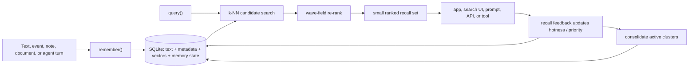

<div align="center">

# WaveMind

**Adaptive memory infrastructure for agents and applications that need to learn from experience.**

WaveMind gives long-running software a durable, inspectable memory layer. It remembers facts, preferences,
state changes, workflows, errors, and feedback; returns compact relevant context; reinforces what works, suppresses stale information, and forgets on purpose.

<p><a href="https://pypi.org/project/wavemind/"><strong>PyPI</strong></a> &middot; <a href="https://github.com/CaspianG/wavemind/actions/workflows/full-check.yml">Build status</a> &middot; <a href="https://github.com/CaspianG/wavemind/releases/latest">Latest release</a> &middot; <a href="https://github.com/CaspianG/wavemind/blob/main/pyproject.toml">Python &gt;=3.10</a> &middot; <a href="LICENSE">MIT</a></p>


<p>
  <a href="#quick-start"><strong>Quick Start</strong></a> &middot;
  <a href="docs/README.md">Documentation</a> &middot;
  <a href="#wavemind-studio">Studio</a> &middot;
  <a href="https://caspiang.github.io/wavemind/">Benchmarks</a> &middot;
  <a href="docs/ROADMAP.md">Roadmap</a> &middot;
  <a href="#contributing">Contributing</a>
</p>

</div>

## What Makes It Different

Vector stores answer **what is similar?** Agent memory must also answer **what
still matters now?**

| Capability | What WaveMind adds |
|---|---|
| Adaptive recall | Hotness, decay, priority, TTL, feedback, and correction handling around vector candidates. |
| Durable state | SQLite by default; PostgreSQL, Redis coordination, and service-backed vector indexes for production paths. |
| Explicit control | Namespaces, provenance, audit events, backup/restore, inspection, and deliberate deletion. |
| Small integration surface | Python API, CLI, FastAPI, MCP, LangChain memory, and framework adapters. |
| Evidence-first releases | Public JSON artifacts, admission gates, reproducible commands, and locked claims when proof is missing. |

WaveMind complements FAISS, Qdrant, pgvector, Chroma, and other candidate
indexes. It is the memory policy and lifecycle around retrieval, not another
claim that one vector database should replace every other system.

## Verified Today

| Proof | Current checked result | Source |
|---|---|---|
| Production Memory OS | `admitted`, 13/13 requirements | [`memory_os_admission_results.json`](benchmarks/memory_os_admission_results.json) |
| Adaptive agent-memory advantage | Controlled adaptive slice passes, but the composite public gate remains `blocked` | [`agent_memory_advantage_admission_results.json`](benchmarks/agent_memory_advantage_admission_results.json) |
| Goal 4 generalization experiment | `failed_experiment`: full 451 quality uplift `-0.44 pp`; untouched 419 uplift `-1.19 pp`; context `-41.0%`; p95 `+1.59 ms` | [`goal4_quality_experiment_results.json`](benchmarks/goal4_quality_experiment_results.json) |
| Verified Agent Experience Runtime | `admitted`, 15/15 checks on 150 frozen stateful tasks across three domains; success `20%` -> `100%`; repeated errors `-100%`; context `-39.2%`; runtime p95 `6.12 ms` | [`verified_experience_admission_results.json`](benchmarks/verified_experience_admission_results.json) |
| Experienced Work Agent v1 | `admitted` only for its frozen local three-domain scenario: 12/12 checks; success `16.7%` -> `100%`; repeated errors `83.3%` -> `0%`; context `-40%` | [`experience_quality_admission_results.json`](benchmarks/experience_quality_admission_results.json) |
| Developer onboarding | `admitted`, 8/8 checks; Python, TypeScript, MCP, and Docker starters; first cited Experience Packet in `0.58s` | [`developer_experience_admission_results.json`](benchmarks/developer_experience_admission_results.json) |
| Memory safety | `admitted`, 10/10 checks; 375 attacks contained, 100% benign acceptance, zero cross-namespace leakage, rollback/provenance `1.00` | [`memory_safety_admission_results.json`](benchmarks/memory_safety_admission_results.json) |
| Provider integrations | `admitted`, 10/10 checks and 11/11 mandatory cases across Python, OpenAI Agents, Anthropic, MCP, LangGraph, HTTP, portable bundles, Mem0 import, and a clean TypeScript package; semantic parity `1.00` | [`integration_admission_results.json`](benchmarks/integration_admission_results.json) |
| Remote Redis/worker soak | 6 hours, 500/500 cycles, 2,500 attempts, zero failures or state corruption | [`memory_os_remote_worker_soak_results.json`](benchmarks/memory_os_remote_worker_soak_results.json) |
| LongMemEval-V2 protocol | Goal 4 completed a strict frozen 451-question experiment; it passed execution/context/latency controls but failed quality uplift, so no admission claim is made | [`failed experiment`](benchmarks/goal4_quality_experiment_results.json) / [`Memory OS run`](benchmarks/longmemeval_v2_small_memory_os_results.json) / [`strict smoke`](benchmarks/longmemeval_v2_frozen20_protocol_results.json) |
| Core production readiness | `pass`, 39/39 criteria | [`production_readiness_results.json`](benchmarks/production_readiness_results.json) |
| Public package | PyPI and GitHub release `v2.9.0` | [PyPI](https://pypi.org/project/wavemind/) / [release](https://github.com/CaspianG/wavemind/releases/latest) |

Remote multi-region, managed serverless, 100M service evidence, and universal
multimodal admission remain explicitly gated. See
[Known Limitations](#known-limitations) and the
[evidence dashboard](https://caspiang.github.io/wavemind/).

## Quick Start

The shortest path from install to first recall:

```sh
python -m pip install wavemind
wavemind remember "Andrey is a trader" --namespace demo
wavemind query "What does Andrey do?" --namespace demo
```

Need a reminder after install?

```sh
wavemind quickstart
```

Want to see and manage memory in a browser?

```sh
wavemind studio
```

Want a runnable project that produces a trusted Experience Packet?

```sh
wavemind init my-agent --template python
cd my-agent
python app.py
```

Use `--template typescript`, `--template mcp`, or `--template docker` for the
other starter paths. The Docker starter runs with
`docker compose up --build`. Diagnose Python, SQLite, local state, the encoder,
the Experience Compiler, and optional Node/Docker/MCP support with:

```sh
wavemind doctor --project .
```

By default, WaveMind creates `wavemind.sqlite3` in the current working
directory. That file is the local source of truth. Keep it out of git and back
it up like application state.

## Verified Agent Experience

The Agent Experience Runtime captures tool runs, accepts outcomes only from an
independent test, tool, environment, or operator, and keeps new procedures in
shadow until repeated evidence promotes them. At query time it can remain
silent or inject one compact, cited Experience Packet.

```sh
python examples/verified_experience_runtime.py
```

The example performs a real local cycle: a cold plan fails, the environment
verifies the result, independently verified executions activate a procedure,
and a held-out attempt succeeds using the cited procedure. The same lifecycle
is available through Python, HTTP, OpenAI Agents, Anthropic hooks, LangGraph,
MCP, TypeScript, and the Studio inspection views. See the
[runtime guide](docs/VERIFIED_EXPERIENCE_RUNTIME.md).

## CLI Cheat Sheet

Start here if you only want to use WaveMind from the terminal:

| Goal | Command |
|---|---|
| Show first-run help | `wavemind quickstart` |
| Create a runnable starter | `wavemind init my-agent --template python` |
| Diagnose the local environment | `wavemind doctor --project my-agent` |
| Store a memory | `wavemind remember "Andrey prefers short answers" --namespace user:42` |
| Search memory | `wavemind query "answer style" --namespace user:42` |
| Consolidate active patterns | `wavemind consolidate --namespace user:42 --seed "Rust compiler systems"` |
| Open local dashboard | `wavemind studio` |
| See stored state | `wavemind stats --namespace user:42` |
| Delete a namespace | `wavemind forget --namespace user:42` |
| Import notes | `wavemind import ./notes.txt --namespace project:alpha` |
| Use another database file | `wavemind --db ./state/memory.sqlite3 query "budget" --namespace user:42` |
| Start the HTTP API | `wavemind --db ./state/memory.sqlite3 serve --host 127.0.0.1 --port 8000` |

After this point, choose the integration path you need: Python, HTTP, LangChain,
framework adapters, benchmarks, or production deployment.

## WaveMind Studio

WaveMind Studio is the built-in local dashboard. It runs on top of the same
FastAPI app and SQLite database as the CLI:

```sh
wavemind studio
```

It opens `http://127.0.0.1:8000/studio` and gives you:

| View | What it is for |
|---|---|
| Memory map | See field energy as a heatmap. |
| Namespace explorer | Inspect memories per user, project, agent, or tenant. |
| Live query tester | Test recall before wiring it into an app. |
| Feedback buttons | Mark recalled memories as useful or not useful. |
| Import/export | Import local files and export a namespace snapshot. |
| Backup | Create SQLite backups from the browser. |
| Conflict visualizer | Inspect correction groups when memories disagree. |
| Memory OS Insights | See read-only hot-query, policy, execution-plan, and architecture suggestions before running background workers. |


For a server-safe local bind:

```sh
wavemind --db ./state/wavemind.sqlite3 studio --host 127.0.0.1 --port 8000
```

## Python Example

```python
from wavemind import WaveMind

memory = WaveMind(db_path="./state/wavemind.sqlite3")

memory.remember(
    "The user prefers short practical answers.",
    namespace="user:42",
    tags=["preference"],
)

hits = memory.query("How should I answer this user?", namespace="user:42", top_k=3)
for hit in hits:
    print(hit.score, hit.text)
```

The integration pattern is intentionally small:

1. Call `query()` before your app, agent, tool, or UI needs context.
2. Pass the returned memories into your prompt, screen, search result, or
   decision function.
3. Call `remember()` after something worth keeping happens.

Queries can also apply exact metadata filters. A collection value means
"match any", which is useful for tenant scopes, document sets, or benchmark
haystacks:

```python
hits = memory.query(
    "Which decision was approved?",
    namespace="team:research",
    metadata_filters={"document_id": ["report-17", "report-42"]},
)
```

## HTTP Example

The FastAPI server is included in the base install:

```sh
wavemind --db ./state/wavemind.sqlite3 serve --host 127.0.0.1 --port 8000
```

Then use WaveMind from any language:

```sh
curl -X POST http://127.0.0.1:8000/remember \
  -H "Content-Type: application/json" \
  -d "{\"text\":\"Andrey prefers short answers\",\"namespace\":\"user:42\",\"tags\":[\"preference\"]}"

curl -X POST http://127.0.0.1:8000/query \
  -H "Content-Type: application/json" \
  -d "{\"query\":\"How should I answer?\",\"namespace\":\"user:42\",\"top_k\":3}"

curl -X POST http://127.0.0.1:8000/feedback \
  -H "Content-Type: application/json" \
  -d "{\"id\":1,\"namespace\":\"user:42\",\"useful\":true,\"strength\":0.5,\"reason\":\"used in answer\"}"

curl -X POST http://127.0.0.1:8000/feedback/batch \
  -H "Content-Type: application/json" \
  -d "{\"namespace\":\"user:42\",\"items\":[{\"id\":1,\"useful\":true,\"strength\":0.5},{\"id\":2,\"useful\":false,\"strength\":0.25}]}"

curl -X POST http://127.0.0.1:8000/forget/batch \
  -H "Content-Type: application/json" \
  -d "{\"items\":[{\"text\":\"Andrey prefers short answers\",\"namespace\":\"user:42\"}]}"
```

The same feedback loop is available from the CLI:

```sh
wavemind --db ./state/wavemind.sqlite3 feedback --id 1 --namespace user:42 --strength 0.5 --reason "used in answer"
wavemind --db ./state/wavemind.sqlite3 feedback-batch --file feedback.json
```

## MCP Server

Give any MCP-compatible agent durable WaveMind tools:

```sh
python -m pip install "wavemind[mcp]"
wavemind-mcp --db ./state/agent-memory.sqlite3
```

Example client configuration:

```json
{
  "mcpServers": {
    "wavemind": {
      "command": "wavemind-mcp",
      "args": ["--db", "./state/agent-memory.sqlite3"]
    }
  }
}
```

The server exposes `remember`, `recall`, `feedback`, `forget`,
`inspect_memory`, `explain_memory`, and `manage_namespace`. It uses local
`stdio` by default, persists to SQLite across restarts, isolates every
operation by namespace, and supports idempotent writes and provenance.

See [MCP Integration](docs/MCP.md) for the tool contract, safety model,
streamable HTTP loopback mode, and tested behavior.

## Where Data Lives

WaveMind is local-first. The SQLite database stores memories, vectors, metadata,
namespaces, tags, TTL, hotness, priority, and audit events.

| runtime | Suggested database path |
|---|---|
| quick CLI experiment | `./wavemind.sqlite3` |
| Python app or agent | `./state/wavemind.sqlite3` |
| desktop app | user data directory, for example `%APPDATA%` or `~/.local/share` |
| server daemon | `/var/lib/wavemind/wavemind.sqlite3` |
| Docker | mounted volume, for example `/data/wavemind.sqlite3` |

Explicit path:

```sh
wavemind --db ./state/app_memory.sqlite3 remember "Andrey prefers short answers" --namespace user:42
wavemind --db ./state/app_memory.sqlite3 query "answer style" --namespace user:42
```

## Common Ways To Use It

| You are building... | Start with... |
|---|---|
| Python app | `from wavemind import WaveMind` |
| LangChain agent | `WaveMindMemory` from `wavemind.integrations.langchain` |
| LangGraph workflow | `make_recall_node()` and `make_persist_node()` |
| LlamaIndex pipeline | `WaveMindRetriever` |
| CrewAI or AutoGen loop | The adapters in `wavemind.integrations` |
| Node, Go, Ruby, PHP, or no-code app | `wavemind serve` and the HTTP API |
| Personal knowledge base | Store notes by project namespace and query locally |
| Support or CRM workflow | Customer issues, resolutions, preferences, corrections, TTL, and namespace isolation. See [`examples/customer_support_memory.py`](examples/customer_support_memory.py). |
| Research or analyst notebook | Findings, hypotheses, decisions, source metadata, TTL, and project isolation. See [`examples/research_notebook_memory.py`](examples/research_notebook_memory.py). |

For migrations from existing local vector memory, start with
[`docs/CHROMA_MIGRATION.md`](docs/CHROMA_MIGRATION.md). The guide has a tested
offline fixture at [`examples/chroma_migration.py`](examples/chroma_migration.py).

## Minimal Agent Loop

```python
from wavemind import WaveMind

memory = WaveMind(db_path="./state/agent.sqlite3")

def run_turn(user_id: str, user_text: str) -> str:
    namespace = f"user:{user_id}"
    hits = memory.query(user_text, namespace=namespace, top_k=5, min_score=0.25)
    recalled = "\n".join(f"- {hit.text}" for hit in hits)

    answer = call_your_llm(f"Relevant memory:\n{recalled}\n\nUser: {user_text}")

    memory.remember(f"User said: {user_text}", namespace=namespace, tags=["conversation"])
    memory.remember(f"Assistant answered: {answer}", namespace=namespace, tags=["conversation"])
    return answer
```

## Terminal Demo


From a cloned repository:

```text
$ python examples/demo.py
[ok] Remembered: "Andrey is a trader who tracks market breakouts."
[ok] Remembered: "Andrey prefers short practical answers about product decisions."

Query: "Andrey trader preferences"
-> Result 1 (0.60): "Andrey is a trader who tracks market breakouts."
-> Result 2 (0.30): "Andrey prefers short practical answers about product decisions."
```

The demo is offline, keyless, and uses the built-in hash encoder.

To see the behavior that plain vector search does not provide:

```sh
python examples/dynamic_memory_demo.py
```

That demo shows corrected facts outranking stale facts, temporary memory
expiring, namespace isolation, and index-health reporting.

To see the same behavior in a practical support/CRM workflow:

```sh
python examples/customer_support_memory.py
```

That demo stores customer preferences, billing tickets, stale CRM data,
temporary discount codes, and separate customer namespaces.

To see source-aware research memory:

```sh
python examples/research_notebook_memory.py
```

That demo stores analyst findings, temporary hypotheses, decisions, source
metadata, and isolated project namespaces.

## How The Memory Field Works


```mermaid
flowchart LR
    A["Text, event, note, document, or agent turn"] --> S["remember()"]
    S --> D[("SQLite: text + metadata + vectors + memory state")]
    Q["query()"] --> K["k-NN candidate search"]
    D --> K
    K --> W["wave-field re-rank"]
    W --> R["small ranked recall set"]
    R --> P["app, search UI, prompt, API, or tool"]
    P --> F["recall feedback updates hotness / priority"]
    F --> D
    F --> C["consolidate active clusters"]
    C --> D
```

The wave field is the dynamic layer around stored memories. It is not a
replacement for embeddings; it is the policy that decides which candidate
memories should still matter.

| signal | Plain meaning | Effect |
|---|---|---|
| vector similarity | This text is semantically close to the query. | Gets into the candidate set. |
| hotness | This memory has been useful before. | Moves upward during recall. |
| decay | This memory has not mattered recently. | Slowly loses influence. |
| priority | The app says this fact is important. | Raises ranking even before repetition. |
| TTL | This fact is temporary. | Drops out after expiry. |
| namespace and tags | This belongs to one user/project/type. | Prevents cross-user or cross-topic leakage. |
| graph dynamics | Related memories can excite or inhibit each other. | Helps clusters and corrections behave like memory, not a flat list. |
| consolidation | Active clusters can become durable concept memories. | Turns repeated patterns into inspectable higher-level memories with provenance. |

Technically, the current `MemoryFieldGraph` is a discrete graph over stored
memories, not a continuous mathematical physics field. That honesty matters:
WaveMind is useful today as a dynamic memory engine, while the research path is
to make the field dynamics more explicit, measurable, and scalable.

Self-organization is now part of the core surface. `consolidate_concepts()`,
`wavemind consolidate`, and `POST /consolidate` can turn an active graph cluster
into a new stored memory such as `Consolidated memory: systems...` without an
LLM call. The generated memory keeps the source memory ids in metadata, so it is
auditable instead of being a hidden summary.

## Optional Embeddings

The base install is offline and keyless. Add sentence-transformers when you
need semantic embeddings:

```sh
python -m pip install "wavemind[sentence]"
wavemind --encoder sentence remember "Andrey is a trader" --namespace demo
wavemind --encoder sentence query "What does Andrey do?" --namespace demo
```

## Optional Index Backends

WaveMind separates durable state from candidate generation:

| index | Install | Notes |
|---|---|---|
| `numpy` | default | Exact cosine search, local, linear scan. |
| `quantized` | default | Local int8-compressed candidate index with int32-safe scoring. Useful for memory-footprint experiments; approximate recall and latency must still be measured per workload. |
| `annoy` | `pip install "wavemind[indexes]"` | Local ANN. Faster at larger N, but recall must be checked. |
| `faiss` / `faiss-persisted` | `pip install "wavemind[indexes]"` | Local FAISS, with an optional validated persisted snapshot. |
| `pgvector` | `pip install "wavemind[postgres]"` | PostgreSQL/pgvector service candidate index. |
| `qdrant` | `pip install "wavemind[indexes]"` | Qdrant service or local-mode candidate index. |

SQLite or PostgreSQL remains the source of truth. Missing service configuration
fails clearly instead of silently switching backends. See
[Embeddings And Index Backends](docs/INDEX_BACKENDS.md) for setup, tuning,
health checks, and persistence rules.

## Scale Readiness

WaveMind ships local and service-backed storage, namespace sharding, replication,
Kubernetes/operator manifests, serverless lifecycle checks, backup/restore
drills, and strict evidence gates. The current production evidence gate passes
`5/8` requirements; remote active-active, managed serverless telemetry, and a
real 100M sharded run remain explicitly locked.

The **Checked-in production 50000-vector point** covers
`WaveMind faiss-persisted`, `Qdrant service`, and pgvector tuning with
`WAVEMIND_PGVECTOR_EF_SEARCH=400`, `pgvector-exact`, and
`pgvector-iterative`.

Deployment references use `ghcr.io/caspiang/wavemind`. The
`deploy/cloud/gcp-managed-serverless` module creates billable Google Cloud
resources. `deploy/cloud/gcp-remote-active-active` also creates billable
infrastructure and does not unlock a production claim by itself.
`deploy/cloud/gcp-qdrant-100m` creates eight billable VMs; planning or applying
that module does not unlock the 100M claim without the measured artifact.

See [Scale And Production](docs/SCALE_AND_PRODUCTION.md) for deployment modes,
failure drills, strict claim boundaries, and exact reproduction commands. See
[Observability](docs/OBSERVABILITY.md) for metrics, traces, dashboards, and
alerts.

## Structured And Multimodal Memory

WaveMind supports typed image, audio, video, 3D, table, temporal-event, and
knowledge-graph payloads. The checked real-encoder suite uses pinned local
SentenceTransformers, CLIP, CLAP, and OpenShape PointBERT models over 1000
public assets and 200 independent queries. Its three exact-SHA runs all pass
the production admission gate:

| Metric | Checked result |
|---|---:|
| Macro / cross-modal / mixed precision@1 | `0.925 / 0.925 / 0.925` |
| Persisted / reload parity | `1.000 / 1.000` |
| Retrieval p99 | `48.64 ms` |
| Errors | `0` |

The suite covers text, image, audio, video, and 3D retrieval and verifies the
asset lifecycle against local S3-compatible MinIO. The separate
precomputed-vector path remains an integration contract only; it does not prove
encoder quality.

The production gate requires real local text, image, audio, video, and 3D
encoders over at least 1000 real or publicly licensed assets and 200 independent
queries. It also requires explicit compatible shared spaces, bidirectional
cross-modal checks, per-modality quality and encoding budgets, stable repeated
verdicts, and a verified S3-compatible lifecycle. Local MinIO is valid;
descriptor, filename, metadata, OCR-only, synthetic-vector, and precomputed
shortcuts are rejected as encoder evidence.

See [Multimodal And Storage](docs/MULTIMODAL_AND_STORAGE.md) for payload schemas,
cross-modal retrieval, temporal and graph queries, storage backends, object
lifecycles, backup/restore, and API details.

## HTTP API

Start the API with:

```sh
wavemind serve --host 127.0.0.1 --port 8000
```

The service exposes memory, feedback, lifecycle, health, metrics, cluster, and
Memory OS routes. Production deployments should enable authentication, rate
limits, TLS termination, durable storage, and monitoring. The complete route
reference is in [Multimodal And Storage](docs/MULTIMODAL_AND_STORAGE.md#http-api).

## Install From Source

For contributors installing from a local clone:

```sh
git clone https://github.com/CaspianG/wavemind.git
cd wavemind
python -m pip install -e ".[sentence]"
```

One-file setup scripts are also included in the repository:

```sh
sh install.sh
```

```bat
install.bat
```

## LangChain Memory

WaveMind includes package adapters for LangChain, LangGraph, LlamaIndex,
CrewAI, and AutoGen. The adapters preserve namespaces and use the same durable
memory API as the CLI and HTTP service.

See [Framework Integrations](docs/INTEGRATIONS.md) for complete examples,
OpenClaw/Hermes guidance, and custom agent loops.

## Research Branches

Experimental work stays isolated from release claims. In particular,
`research/crypto-pattern-memory` is an evidence-gated research branch and is
not part of the stable package or current production claims.

## Benchmark

WaveMind publishes checked-in JSON and Markdown artifacts for dynamic-memory,
long-term-memory, indexing, scale, Memory OS, and production-evidence profiles.
The public leaderboard separates implemented, runner-ready, planned, local,
loopback, and production evidence.

| Evidence | Current checked result |
|---|---|
| Verified Agent Experience Runtime | `admitted`; 150 frozen tasks, 5 repeats, 95% CIs, success `0.20 -> 1.00`, context `-39.2%`, p95 `6.12 ms` |
| STATE-Bench Agent Learning adapter | `runner_ready`; official `100 x 3` train split validated at an exact upstream SHA; official paid evaluation not run |
| Memory OS admission | `admitted`, 13/13 requirements |
| Agent-memory advantage admission | Controlled adaptive slice passes; composite public gate blocked on strict LongMemEval-V2 |
| Memory OS remote soak | 6 hours, 500 cycles, 2500 attempts, zero corruption |
| Real multimodal admission | `admitted`; 1000 assets, 200 queries, precision@1 `0.925`, retrieval p99 `48.64 ms` |
| Direct Memory OS public runs | LoCoMo 1977 queries; LongMemEval-S 470 queries; strict isolated LongMemEval-V2 frozen-20 smoke |
| Strict production evidence | 5/8 requirements |
| LongMemEval evidence retrieval | WaveMind recall@5 `0.782` |
| Real LoCoMo memory systems | WaveMind recall@5 `0.548`; Mem0 OSS `0.500`; Hindsight OSS `0.316` |
| Large-N profiles | 10M Qdrant, 10M sharded Qdrant, 10M pgvector, 50M FAISS |

These results do not claim universal vector-database leadership or completed
remote 100M/multi-region proof. See the full [Benchmark Guide](docs/BENCHMARKS.md),
[real public memory-system report](benchmarks/PUBLIC_MEMORY_COMPETITORS.md),
[living dashboard](https://caspiang.github.io/wavemind/), and
[Benchmark Brief](docs/BENCHMARK_BRIEF.md) for methods, commands, limitations,
and machine-readable artifacts.

## Comparison

| feature | WaveMind | Chroma | Qdrant |
|---|---|---|---|
| Primary role | Dynamic memory engine | Embedding database | Production vector database |
| Local SQLite persistence | Yes | Yes | No, separate service/storage |
| HTTP API | FastAPI included | Included | Included |
| Audit log / metrics | SQLite audit events plus `/metrics` | App-layer only | App-layer / service metrics |
| Dynamic memory priority | Wave-field hotness, TTL, priority | Metadata/filter driven | Payload/filter driven |
| Built-in forgetting | TTL and explicit forget | Manual delete/filtering | Manual delete/filtering |
| Best fit | Small to medium memory streams with dynamic recall | Local RAG apps and prototypes | Large-scale vector search |
| Scale target today | Local exact mode for small streams; FAISS/Qdrant/pgvector plus replicated namespaces for production paths | Larger than WaveMind local exact mode | Production vector scale |

WaveMind is not trying to replace dedicated vector databases at scale. The intended product gap is dynamic priority: frequently used memories can become hotter while old or low-priority memories fade. For static RAG over large document collections, use a mature vector database. For memory that needs persistence, scoped recall, TTL, forgetting, and reinforcement, WaveMind is designed to sit above or beside the vector index.

If you already use Chroma for local memory, see the practical migration guide:
[`docs/CHROMA_MIGRATION.md`](docs/CHROMA_MIGRATION.md).

## Known Limitations

- The default NumPy exact index is intended for local memory streams. Run
  `wavemind scale-plan` and move to FAISS, Qdrant, or pgvector before treating it
  as a large-N production index.
- Dynamic memory policy adds latency compared with static nearest-neighbor
  retrieval. The value is stale suppression, reinforcement, TTL, scoped recall,
  and consolidation rather than winning every pure ANN latency test.
- Direct feedback-free Memory OS is not a universal quality boost. On LoCoMo it
  is slightly below Core (`precision@1 0.2382` vs `0.2387`); on LongMemEval-S it
  matches Core. The controlled sequential benchmark remains the admitted uplift
  evidence.
- The earlier 451-question LongMemEval-V2 run proves execution coverage, but it
  predates official per-question haystack filtering and isolated A/B stores, so
  its `7.54% -> 9.09%` result is not accepted as Memory OS uplift. The strict
  frozen-20 rerun reaches `10%` for both Core and Memory OS with
  `qwen2.5:3b`; a full strict rerun and the `18%` quality target remain open.
- `MemoryFieldGraph` is a discrete graph over stored memories, not a continuous
  physics field.
- Production Memory OS is admitted for its documented remote Redis/worker
  topology. The broader cluster gate remains 5/8: remote multi-region, managed
  serverless telemetry, and 100M service evidence are not yet admitted.
- The checked real text/image/audio/video/3D suite is admitted for its pinned
  models, datasets, exact source SHA, and local MinIO topology. This is not a
  claim of universal cross-modal quality on unseen domains; precomputed vectors
  and descriptors still cannot unlock real-encoder admission.
- Large-N Qdrant and pgvector artifacts prove their stated GitHub-hosted service
  topologies, not independent multi-host or multi-region production.

Read the complete [Known Limitations And Claim Boundaries](docs/KNOWN_LIMITATIONS.md)
before publishing performance, scale, or multimodal claims.

## Roadmap

Full roadmap: [`docs/ROADMAP.md`](docs/ROADMAP.md).
Launch and positioning kit: [`docs/LAUNCH_KIT.md`](docs/LAUNCH_KIT.md).
Documentation map: [`docs/README.md`](docs/README.md).
Release history: [`CHANGELOG.md`](CHANGELOG.md).

Near-term priorities:

- Extend the admitted real local multimodal suite with independently maintained
  public datasets while preserving its per-modality quality, latency, leakage,
  persistence, and lifecycle gates.
- Tune feedback-free Memory OS on LoCoMo, where the complete direct run is
  currently within the admission tolerance but does not beat Core.
- Raise strict LongMemEval-V2 answer quality from the frozen-20 `10%` smoke to
  at least `18%`, then rerun all 451 questions with official haystacks,
  isolated A/B stores, image support, and a pinned local reader.
- Improve dynamic re-ranking latency, context efficiency, and cost without
  weakening stale suppression, provenance, or recall quality.
- Expand production operations with stronger index-health metrics, alerting
  examples, and externally executed disaster-recovery evidence.
- Complete the remaining cluster evidence on real non-loopback infrastructure:
  multi-region active-active, managed serverless telemetry, and 100M service
  load.

Longer-term direction:

- make adaptive memory improve real agent workflows, not only retrieval
  metrics;
- preserve one provenance-aware lifecycle across text, media, structured data,
  temporal events, and knowledge graphs;
- scale from a private local database to replicated production deployments
  without changing the application-level memory contract;
- keep every public capability tied to a reproducible artifact, gate, or
  clearly locked claim.

## Contributing

Contributing guide: [`CONTRIBUTING.md`](CONTRIBUTING.md).
Community participation follows the
[`CODE_OF_CONDUCT.md`](CODE_OF_CONDUCT.md).

Useful contribution paths:

- add reproducible benchmark adapters and checked-in result JSON;
- improve FAISS, Qdrant, pgvector, or other candidate-index backends;
- add examples for LangGraph, LlamaIndex, CrewAI, AutoGen, OpenClaw, and
  HTTP-only sidecar deployments;
- improve dynamic memory behavior around TTL, corrections, namespaces, graph
  excitation/inhibition, and consolidation;
- harden production operations: backups, audit logs, metrics, tracing, and
  migration tools.

GitHub issue templates are included for bugs, features, benchmarks, and
integrations. Benchmark claims need a reproduction command and committed result
artifact before they are added to README.

## License

MIT. See [LICENSE](LICENSE).
