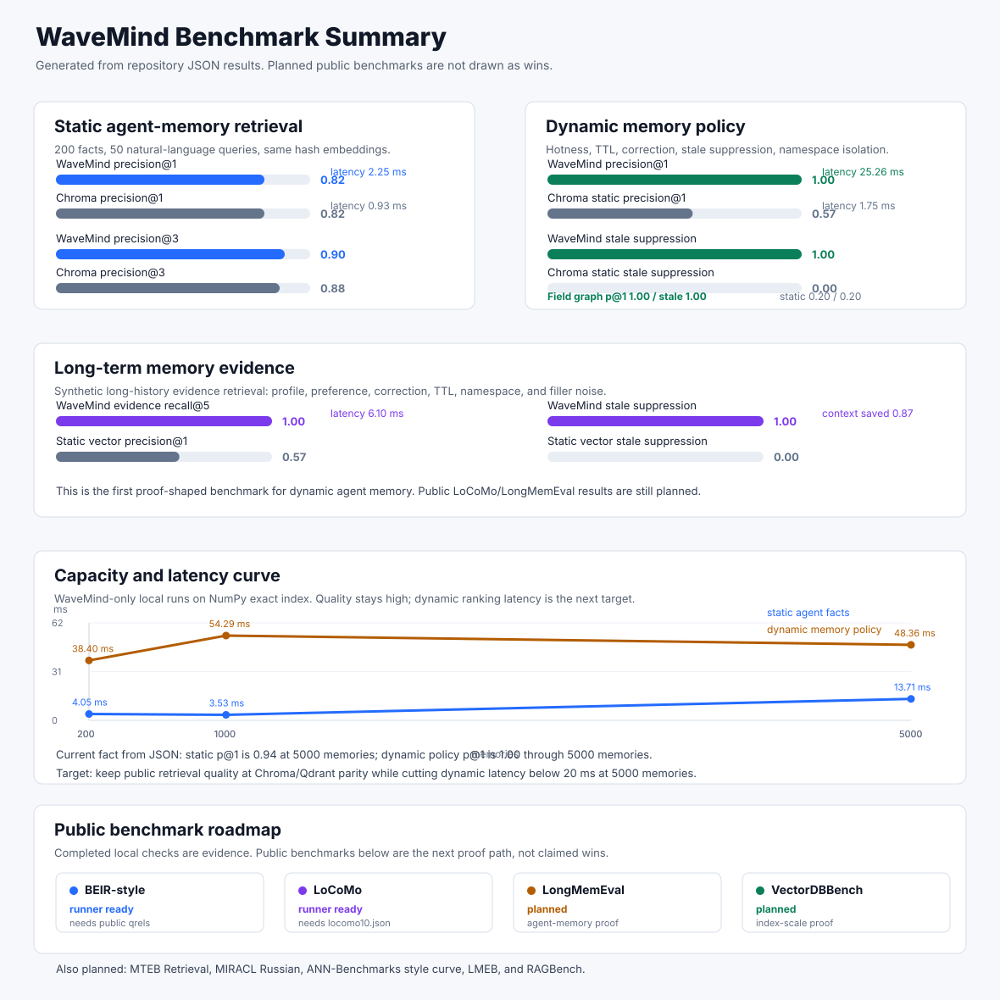

# Benchmark Guide

This guide contains the detailed benchmark tables, methods, evidence boundaries, and reproduction commands moved from the project README.

## Benchmark

WaveMind tracks benchmarks in two layers:

- **Implemented local checks** - fast, reproducible scripts that run from this repository and protect the core memory behavior.
- **Public benchmark roadmap** - external retrieval and memory benchmarks that should decide whether WaveMind is competitive outside hand-made demos.

Machine-readable benchmark matrix: `benchmarks/benchmark_matrix_results.json`.
Full generated benchmark report: [`benchmarks/BENCHMARK_REPORT.md`](../benchmarks/BENCHMARK_REPORT.md).
Compact benchmark leaderboard: [`benchmarks/BENCHMARK_LEADERBOARD.md`](../benchmarks/BENCHMARK_LEADERBOARD.md).
Real public memory-system comparison: [`benchmarks/PUBLIC_MEMORY_COMPETITORS.md`](../benchmarks/PUBLIC_MEMORY_COMPETITORS.md).
Agent-impact leaderboard: [`benchmarks/AGENT_IMPACT.md`](../benchmarks/AGENT_IMPACT.md).
Structured memory report: [`benchmarks/STRUCTURED_MEMORY.md`](../benchmarks/STRUCTURED_MEMORY.md).
Memory OS intelligence report: [`benchmarks/MEMORY_OS_INTELLIGENCE.md`](../benchmarks/MEMORY_OS_INTELLIGENCE.md).
Memory OS policy evolution report: [`benchmarks/MEMORY_OS_POLICY_EVOLUTION.md`](../benchmarks/MEMORY_OS_POLICY_EVOLUTION.md).
Memory OS policy bundle: [`benchmarks/MEMORY_OS_POLICY_BUNDLE.md`](../benchmarks/MEMORY_OS_POLICY_BUNDLE.md).
Cluster autoscale report: [`benchmarks/CLUSTER_AUTOSCALE.md`](../benchmarks/CLUSTER_AUTOSCALE.md).
Cost-efficiency leaderboard: [`benchmarks/COST_EFFICIENCY.md`](../benchmarks/COST_EFFICIENCY.md).
Strict evidence readiness runbook: [`benchmarks/STRICT_EVIDENCE_READINESS.md`](../benchmarks/STRICT_EVIDENCE_READINESS.md).
Production evidence environment contract: [`benchmarks/PRODUCTION_EVIDENCE_ENV.md`](../benchmarks/PRODUCTION_EVIDENCE_ENV.md).
Developer experience admission: [`benchmarks/DEVELOPER_EXPERIENCE_ADMISSION.md`](../benchmarks/DEVELOPER_EXPERIENCE_ADMISSION.md)
from [`benchmarks/developer_experience_admission_results.json`](../benchmarks/developer_experience_admission_results.json).
Memory safety admission: [`benchmarks/MEMORY_SAFETY_ADMISSION.md`](../benchmarks/MEMORY_SAFETY_ADMISSION.md)
from [`benchmarks/memory_safety_admission_results.json`](../benchmarks/memory_safety_admission_results.json).
Provider integration admission: [`benchmarks/INTEGRATION_ADMISSION.md`](../benchmarks/INTEGRATION_ADMISSION.md)
from [`benchmarks/integration_admission_results.json`](../benchmarks/integration_admission_results.json).
Verified Agent Experience admission: [`benchmarks/VERIFIED_EXPERIENCE_ADMISSION.md`](../benchmarks/VERIFIED_EXPERIENCE_ADMISSION.md)
from [`benchmarks/verified_experience_admission_results.json`](../benchmarks/verified_experience_admission_results.json).
It compares no memory, static always-on memory, and selective verified
experience on the same 150 frozen stateful tasks across travel, customer
support, and shopping assistant domains, with five repeats and executable
environment verification. The result is local product evidence, not an
official STATE-Bench score.
STATE-Bench Agent Learning interoperability:
[`benchmarks/STATE_BENCH_AGENT_LEARNING_ADAPTER.md`](../benchmarks/STATE_BENCH_AGENT_LEARNING_ADAPTER.md).
The checked artifact validates the official 300-trajectory train split at an
exact upstream commit and the required read-only `retrieve_learnings` contract;
the paid official simulator/judge run remains explicitly unperformed.
Legacy HTML dashboard: [`docs/benchmark-dashboard.html`](benchmark-dashboard.html).
Machine-readable dashboard status: [`docs/data/leaderboard-status.json`](data/leaderboard-status.json).
The weekly workflow uploads refreshed artifacts for maintainer review without
deploying or writing scheduled bot commits to `main`. The lightweight product-site
workflow publishes reviewed evidence from `main` at
[`caspiang.github.io/wavemind/evidence`](https://caspiang.github.io/wavemind/evidence/).
The status JSON exposes first-class `publication_contract`, `freshness_gate`,
`agent_quality`, `agent_impact`, `structured_memory`, `memory_os_intelligence`,
`cluster_autoscale`, `memory_os_policy`, `memory_os_policy_evolution`,
`memory_os_policy_bundle`,
`production_evidence_env`, `production_evidence_dispatch`,
`strict_evidence_readiness`, and `cost_efficiency`
sections, so dashboards can verify the weekly GitHub Pages publication path,
detect stale or missing public evidence, track task success, stale-error
suppression, context savings, active Memory OS worker behavior, policy
decisions, cluster autoscale/operator coverage, and the exact strict-evidence
workflow dispatch plus promotion contract without scraping Markdown.
Production readiness gate: [`benchmarks/PRODUCTION_READINESS.md`](../benchmarks/PRODUCTION_READINESS.md)
from `benchmarks/production_readiness_results.json`.
Strict production evidence gate: [`benchmarks/PRODUCTION_EVIDENCE.md`](../benchmarks/PRODUCTION_EVIDENCE.md)
from `benchmarks/production_evidence_results.json`. This is the hard boundary
for remote multi-region, managed-serverless, service-backed 10M, and 100M
scale claims. The persisted 50M FAISS, single-service and four-service 10M
Qdrant, four-service 10M pgvector, and non-loopback Kubernetes cluster profiles
now pass this gate.
Production evidence environment contract:
[`benchmarks/PRODUCTION_EVIDENCE_ENV.md`](../benchmarks/PRODUCTION_EVIDENCE_ENV.md)
from `benchmarks/production_evidence_env_contract.json`. This maps every
strict-evidence variable to the claims, workflows, artifacts, GitHub Actions
secrets, workflow inputs, and safe `.env.example` placeholders without
serializing credential values. Production evidence dispatch plan:
[`benchmarks/PRODUCTION_EVIDENCE_DISPATCH.md`](../benchmarks/PRODUCTION_EVIDENCE_DISPATCH.md)
from `benchmarks/production_evidence_dispatch_results.json`. This turns the
strict evidence gaps into secret-safe `gh workflow run ...` payloads, download
commands, and ingest commands for maintainer-reviewed production runs.
Strict evidence readiness runbook:
[`benchmarks/STRICT_EVIDENCE_READINESS.md`](../benchmarks/STRICT_EVIDENCE_READINESS.md)
from `benchmarks/strict_evidence_readiness_results.json`. This joins strict
evidence, preflight, dispatch, scale plans, scale gaps, release claims, and
leaderboard freshness into one operator checklist. It verifies that every
remaining remote/10M-service/100M claim has exact safe dispatch, download, ingest,
strict validation, and refresh commands, while keeping claims locked until real
artifacts pass.
Operator evidence bundle: [`benchmarks/PRODUCTION_EVIDENCE_BUNDLE.md`](../benchmarks/PRODUCTION_EVIDENCE_BUNDLE.md)
from `benchmarks/production_evidence_bundle_results.json`. This combines the
strict gate, preflight, readiness, artifact audit, claim boundaries, and exact
next actions into one publishable status contract.
Large-N service plans include resumable `--checkpoint-path` commands so
interrupted 10M/50M/100M ingest runs can continue from completed batches instead
of restarting from zero.
The pgvector large-N runner uses bounded `COPY` batches and supports
`WAVEMIND_PGVECTOR_STORAGE_TYPE=halfvec` for a smaller PostgreSQL and ANN-index
footprint. A completed checkpoint is accepted only when the remote collection
still contains the exact expected row count and the requested ANN index is
present; otherwise the evidence run fails instead of silently benchmarking a
partial corpus. Use a dedicated table when switching between `vector` and
`halfvec` because PostgreSQL column types are intentionally validated.
Set `WAVEMIND_PGVECTOR_PREWARM_INDEX=1` for steady-state service evidence. The
runner loads the selected candidate-index relation through PostgreSQL
`pg_prewarm` and records the
number of cached index blocks, so warm latency is explicit rather than inferred.
Large pgvector profiles can select
`WAVEMIND_PGVECTOR_INDEX_TYPE=hnsw|hnsw-binary|ivfflat`.
For IVFFlat, `WAVEMIND_PGVECTOR_IVFFLAT_LISTS` controls partition count and
`WAVEMIND_PGVECTOR_IVFFLAT_PROBES` controls the recall/latency tradeoff.
The strict 10M profile uses four modulo-sharded PostgreSQL services with
`halfvec` IVFFlat (`5000` lists and `475` probes per 2.5M-vector shard).
Measured tuning selected this profile after HNSW, binary-HNSW, and IVFFlat
admissions: it reaches recall@10 `0.975` and p99 `87.66 ms` over `2,000`
queries. Namespace routing avoids broadcasting ordinary scoped queries across
every service. The checked artifact was produced by four isolated pgvector
service processes on one ephemeral GitHub host; it proves the candidate-index
SLO, not PostgreSQL HA or independent-node failure tolerance.
For horizontal service sharding, set `WAVEMIND_PGVECTOR_DSNS` to two or more
comma-, semicolon-, or newline-separated PostgreSQL DSNs. The runner assigns
`memory_id` values by modulo, validates exact per-shard counts and placement,
builds one index per service, and fanout-merges shard-local results by original
vector distance. Checkpoints are committed only after every shard accepts the
batch, so interrupted multi-service ingest resumes without silently losing a
shard.
`WAVEMIND_PGVECTOR_QUERY_ROUTING=namespace` is the strict production default:
the benchmark label supplies the same namespace ownership information that a
real WaveMind request carries, and the query is sent only to its owning shard.
Set it to `fanout` only for explicit cross-namespace search. Results record the
routing mode and do not present namespace-scoped latency as global-corpus
fanout latency.
Manual strict-evidence runners include `.github/workflows/production-streaming-load.yml`,
`.github/workflows/external-http-cluster-load.yml`,
`.github/workflows/external-http-active-active.yml`, and
`.github/workflows/serverless-observed-telemetry.yml`, and
`.github/workflows/managed-serverless-cloud-run.yml`. They run checkpointed
Qdrant, sharded Qdrant, pgvector, FAISS IVF-PQ, remote API-node, remote
active-active, or serverless telemetry profiles on sized infrastructure. The
preferred review path is to leave `commit_results=false`, download the Actions
artifact, and ingest it locally with the strict artifact gate:

```bash
gh run download RUN_ID --name production-streaming-load-results --dir state/large-run
wavemind ingest-production-evidence --artifact-dir state/large-run --refresh
python -m pytest tests/test_production_evidence_ingest.py tests/test_production_evidence_gate.py -q
```

The ingest command accepts only strict production evidence filenames:
`http_cluster_load_results.json`, `external_http_active_active_results.json`,
`observed-telemetry.remote.json`, or real large-N proof filenames such as
`production_streaming_load_qdrant_sharded_100m_results.json`. It rejects smoke
artifacts, local/loopback active-active runs, sample endpoints, wrong engines,
wrong vector counts, skipped rows, recall below `0.95`, p99 above `100 ms`, and
failed SLO/cost rows. This prevents a local transport smoke from accidentally
unlocking a remote Kubernetes/serverless production claim.
Prerequisite preflight: `wavemind production-evidence-preflight --write-artifacts`.
This writes `benchmarks/production_evidence_preflight_results.json` and
`benchmarks/PRODUCTION_EVIDENCE_PREFLIGHT.md`, checks the required remote URLs,
service index env vars, FAISS paths, plan artifacts, disk headroom, and exact
large-run commands, and can fail deployments with
`--fail-on-action-required`. Operator env contract: `wavemind
production-evidence-env --write-artifacts`. This writes
`benchmarks/production_evidence_env_contract.json`,
`benchmarks/PRODUCTION_EVIDENCE_ENV.md`, and
`deploy/cluster/production-evidence.env.example`, and can fail staging setup
with `--fail-on-missing`. Strict claim gate: `wavemind production-evidence
--strict`. Dispatch contract: `wavemind production-evidence-dispatch
--write-artifacts`, or `wavemind production-evidence-dispatch
--fail-on-action-required` when the environment must already be ready to launch
all unfinished strict-evidence jobs. Combined operator bundle:
`wavemind production-evidence-bundle --write-artifacts`, or `wavemind
production-evidence-bundle --strict` when a release must fail unless all
remote/large-N production claims are unlocked. Deployment admission:
`wavemind production-admission --target-memories 100000000 --engine
qdrant-sharded-service --fail-on-blocked` is the final deploy-facing check; it
keeps a requested production profile blocked until its matching strict evidence
artifact passes. Persisted 50M FAISS, single-service 10M Qdrant, four-service
10M sharded Qdrant, and four-service 10M pgvector are admitted; the 100M
sharded Qdrant profile remains blocked.
`--allow-plan-only` reports the next run
contract without admitting production. The same gate can protect the API process itself:
`wavemind serve --require-production-admission --production-target-memories
100000000 --production-engine qdrant-sharded-service`. Environment-driven
deployments can set `WAVEMIND_REQUIRE_PRODUCTION_ADMISSION=1`,
`WAVEMIND_PRODUCTION_TARGET_MEMORIES`, `WAVEMIND_PRODUCTION_ENGINE`, and
`WAVEMIND_PRODUCTION_ADMISSION_ROOT`; the server exits before binding a port
when the requested scale is not admitted.
Weekly benchmark refresh: `.github/workflows/benchmark-leaderboard.yml` reruns
the fast benchmark profiles, regenerates the benchmark matrix/report/leaderboard
`docs/assets/benchmark-summary.svg`, `docs/benchmark-dashboard.html`, the
agent-impact leaderboard, the structured-memory report, the
Memory OS intelligence report, the cluster-autoscale report,
cost-efficiency leaderboard,
production-readiness report, the strict production-evidence report, the
production-evidence dispatch plan, the combined production-evidence bundle, and
the strict evidence readiness runbook, and the production-admission report,
validates freshness with `benchmarks/validate_benchmark_artifacts.py`, writes
`benchmarks/benchmark_artifact_audit.json`, renders
`docs/data/leaderboard-status.json`, and uploads changed benchmark artifacts for
maintainer review. It does not deploy GitHub Pages. The separate
`.github/workflows/pages.yml` workflow builds the product site, copies every
checked-in benchmark Markdown/JSON artifact into the evidence library, and
deploys only reviewed state from `main`. `docs/data/leaderboard-status.json`
records both workflows in its machine-readable `publication_contract`, including
the cron schedule, Pages deployment actions, status JSON path, review policy, and
claim boundary. Reviewed benchmark refreshes should be committed from a
maintainer account.
`full-check` and the release workflow also run the same freshness gate with
`--max-age-days 8`, so stale or manually edited public benchmark artifacts block
normal CI and package releases.
External cluster benchmark refresh: `.github/workflows/external-http-cluster-load.yml`
runs `benchmarks/http_cluster_load_benchmark.py` against real API-node URLs or a
JSON node manifest, including the external `/query/batch` recall check, and can
commit `benchmarks/http_cluster_load_results.json` plus refreshed leaderboard
artifacts when `commit_results=true`. The four-node kind workflow also binds this
load profile to a physical worker outage over pod DNS and verifies target-specific
cluster admission before publishing evidence.
External active-active refresh: `.github/workflows/external-http-active-active.yml`
runs `benchmarks/local_http_active_active_smoke.py` against real API-region URLs
or a JSON region manifest and can commit
`benchmarks/external_http_active_active_results.json` plus refreshed
leaderboard/readiness artifacts when `commit_results=true`.
Managed serverless evidence: `.github/workflows/managed-serverless-cloud-run.yml`
uses GitHub OIDC Workload Identity Federation, verifies the Cloud Run service
and revision through the provider control plane, runs at least 1000 requests
after a scale-to-zero idle window, and reads request count, request latency,
container startup latency, and instance count from Cloud Monitoring. Strict
admission rejects manually supplied cold-start/scale-out values and extrapolated
RPS. `deploy/cloud/gcp-managed-serverless` contains the validated Terraform root
for the dedicated IAM-protected Cloud Run service, least-privilege GitHub OIDC
identity, and external PostgreSQL/Qdrant/Redis secret bindings. Applying it
creates billable Google Cloud resources and still requires isolated external
state services. The older `serverless-observed-telemetry.yml` remains a
diagnostic capacity probe and writes only
`observed-telemetry.remote-candidate.json`.

Remote active-active evidence: `deploy/cloud/gcp-remote-active-active` contains
the validated Terraform root for three independently hosted GCE machines in
three regions. It emits the inventory consumed by
`.github/workflows/remote-production-lab.yml`, which performs machine
attestation, deployment, the external transport workload, and a physical API
stop/recovery drill. Provisioning alone does not unlock the claim and applying
the module creates billable resources.

Remote 100M evidence: `deploy/cloud/gcp-qdrant-100m` contains the validated
Terraform root for eight Qdrant shard hosts in eight zones across four regions.
It emits the inventory consumed by
`.github/workflows/remote-qdrant-100m-lab.yml`; Qdrant remains loopback-only and
the benchmark uses pinned SSH tunnels. Provisioning and attestation do not
unlock the 100M claim, and applying the module creates substantial billable
resources for a potentially multi-day run. The module also creates a dedicated
durable controller by default and installs checksum-pinned registration/removal
scripts for the required `self-hosted-large` runner; short-lived GitHub tokens
are supplied only after apply and never enter Terraform state.

### Current Evidence Status

The compact leaderboard now carries an explicit evidence-status table:
[`benchmarks/BENCHMARK_LEADERBOARD.md`](../benchmarks/BENCHMARK_LEADERBOARD.md).
Use that generated file for exact current numbers. This README keeps the
public claim boundaries stable:

| Claim area | Current public status | Source of truth | Not proven yet |
|---|---|---|---|
| Production readiness | WaveMind core readiness is gated by checked-in artifacts before release. | `benchmarks/production_readiness_results.json`, `benchmarks/PRODUCTION_READINESS.md` | Missing external competitor credentials should not be treated as WaveMind core failure, but they still limit competitor claims. |
| Strict production evidence | The gate now passes `5/8` requirements: persisted 50M FAISS reaches recall@10 `0.9705` and p99 `73.11 ms`; single-service 10M Qdrant reaches `0.975` and `43.27 ms`; four-service 10M sharded Qdrant reaches `0.9925` and `71.28 ms`; four-service 10M pgvector reaches `0.975` and `87.66 ms`; the non-loopback Kubernetes cluster passes success/failover `1.00`, query p99 `79.44 ms`, batch p99 `186.78 ms`, and physical-worker attestation `10/10`. | `benchmarks/production_evidence_results.json`, `benchmarks/PRODUCTION_EVIDENCE.md`, `benchmarks/production_evidence_gate.py`, `wavemind production-evidence --strict` | Three requirements remain: remote active-active with physical region failure/recovery, managed serverless telemetry, and the 100M sharded service run. |
| Production evidence preflight | Remote endpoint/env/path prerequisites are checked before launching expensive strict-evidence jobs. | `benchmarks/production_evidence_preflight_results.json`, `benchmarks/PRODUCTION_EVIDENCE_PREFLIGHT.md`, `wavemind production-evidence-preflight --write-artifacts` | A ready preflight is not a passing evidence result; it only proves the environment is ready to run the remote/large-N jobs. |
| Production evidence env contract | Secret-safe operator map from every strict-evidence env var to the workflows, claims, artifacts, GitHub Actions secrets, input bindings, and `.env.example` placeholders it unlocks. | `benchmarks/production_evidence_env_contract.json`, `benchmarks/PRODUCTION_EVIDENCE_ENV.md`, `deploy/cluster/production-evidence.env.example`, `wavemind production-evidence-env --write-artifacts` | It does not unlock production claims; it prevents ambiguous or unsafe production evidence launches and keeps secrets out of checked-in artifacts. |
| Production evidence dispatch | Secret-safe workflow dispatch contract for every unfinished strict-evidence job, including safe `commit_results=false` launch commands, publish commands, required env/secrets, and artifact promotion commands. | `benchmarks/production_evidence_dispatch_results.json`, `benchmarks/PRODUCTION_EVIDENCE_DISPATCH.md`, `wavemind production-evidence-dispatch --write-artifacts` | A dispatch plan only launches or reviews evidence runs; it does not unlock production claims until downloaded artifacts pass ingest and strict validation. |
| Strict evidence readiness | Operator runbook that joins strict evidence, preflight, dispatch, scale plans, scale gaps, release claims, and freshness into one table of blockers, locked claims, safe dispatch commands, ingest commands, and validation commands. | `benchmarks/strict_evidence_readiness_results.json`, `benchmarks/STRICT_EVIDENCE_READINESS.md`, `python benchmarks/strict_evidence_readiness_report.py` | Current readiness is `action_required`: non-loopback Kubernetes cluster evidence, 50M FAISS, single-service 10M Qdrant, four-service 10M sharded Qdrant, and four-service 10M pgvector are complete; three remote/service jobs remain. |
| Production evidence bundle | Single operator-facing status contract that combines strict gate, preflight, readiness, artifact audit, claim boundaries, next actions, and release exit behavior. | `benchmarks/production_evidence_bundle_results.json`, `benchmarks/PRODUCTION_EVIDENCE_BUNDLE.md`, `wavemind production-evidence-bundle --write-artifacts` | `claims_limited` is expected until the strict remote/large-N artifacts pass. |
| Release claims | Compact release-facing claim contract for GitHub Releases and launch posts: what is safe to claim, what remains locked, and which command unlocks the next evidence tier. | `benchmarks/release_claims_results.json`, `benchmarks/RELEASE_CLAIMS.md`, `wavemind release-claims --write-artifacts --fail-on-blocked` | `core_release_ready`, non-loopback Kubernetes cluster SLO, 50M persisted FAISS, single-service 10M Qdrant, sharded 10M Qdrant, and four-service 10M pgvector are supported; remote multi-region and 100M sharded claims remain locked. |
| Agent impact leaderboard | Behavioral benchmark evidence is aggregated across agent coherence, dynamic-memory policy, long-memory retrieval, and LongMemEval answer quality. | `benchmarks/agent_impact_results.json`, `benchmarks/AGENT_IMPACT.md`, `benchmarks/agent_impact_leaderboard.py` | It proves lift on the listed checked-in scenarios only; it does not claim general agent success outside those tasks. |
| Memory OS intelligence | Adaptive-worker evidence is aggregated across scale readiness, agent coherence, staging canary, and admission artifacts. It tracks hot-query prewarm, transition-learned predictive prefetch, priority learning, adaptive forgetting, concept consolidation, Redis coordination, canary status, and production-admission boundaries. | `benchmarks/memory_os_intelligence_results.json`, `benchmarks/MEMORY_OS_INTELLIGENCE.md`, `benchmarks/memory_os_intelligence_report.py` | It proves Memory OS behavior on checked-in fixtures; unattended production automation remains locked until real shared Redis, distributed lock, runtime env, and large-scale evidence pass. |
| Cluster autoscale | Cluster/operator evidence is pulled into a dedicated public report. It tracks deterministic shard placement, node/zone loss availability, autoscale planning, rebalance checkpoints, Kubernetes operator reconciliation, quorum safety, HTTP sharding, active-active convergence, CRDT field state, and the 100M capacity envelope. | `benchmarks/cluster_autoscale_results.json`, `benchmarks/CLUSTER_AUTOSCALE.md`, `benchmarks/cluster_autoscale_report.py` | It is a deterministic capacity and operator evidence report, not a real 100M vector-query latency benchmark or managed Kubernetes production SLO. |
| Kubernetes physical worker failure | Four WaveMind pod-DNS endpoints across three kind worker zones retain `1.00` recall while one worker container is physically paused, recover without pod replacement, then pass the mixed cluster load at query p99 `79.44 ms` and batch p99 `186.78 ms`. | `benchmarks/kubernetes_cluster_network_smoke_results.json`, `benchmarks/http_cluster_load_results.json`, `benchmarks/kubernetes_cluster_network_smoke.py`, [workflow run 29165761261](https://github.com/CaspianG/wavemind/actions/runs/29165761261) | This unlocks the non-loopback Kubernetes service-node SLO. It does not claim managed Kubernetes, independent remote regions, or 10M-100M distributed scale. |
| Kubernetes active-active region failure | Three PVC-backed replicated regions in three worker zones converge `48` initial writes, continue `32` writes plus a delete while region B is physically unavailable, then recover at `1.00` convergence and delete suppression with an idempotent final sync. | `benchmarks/kubernetes_active_active_region_smoke_results.json`, `benchmarks/kubernetes_active_active_region_smoke.py`, `wavemind active-active-drill` | This proves the active-active protocol across non-loopback Kubernetes services and a physical zone outage in ephemeral CI. Independent remote regions are still required for strict active-active admission. |
| Kubernetes serverless lifecycle | PVC-backed PostgreSQL, Qdrant, and Redis preserve `24/24` memories through two scale-to-zero cycles; three zone-spread workers achieve write/delete coherence at `3/3` within `1.14 s`, and burst p99 remains below `2 s`. | `benchmarks/kubernetes_serverless_lifecycle_smoke_results.json`, `benchmarks/kubernetes_serverless_lifecycle_smoke.py`, `.github/workflows/kubernetes-operator-smoke.yml` | This proves external-state lifecycle and bounded worker-cache convergence in ephemeral non-loopback Kubernetes. Managed Knative/KEDA endpoints and remote telemetry are still required for strict serverless admission. |
| Kubernetes PostgreSQL/Qdrant DR | A checksummed PostgreSQL backup restores into an independent namespace with fresh PVCs and an empty Qdrant service; recall and index parity are `24/24`, including after recovery API replacement. | `benchmarks/kubernetes_postgres_qdrant_dr_smoke_results.json`, `benchmarks/kubernetes_postgres_qdrant_dr_smoke.py`, `.github/workflows/kubernetes-operator-smoke.yml` | This proves logical backup/restore and vector-index reconstruction in ephemeral Kubernetes. It is not managed PostgreSQL PITR, remote object-store recovery, or multi-region DR. |
| Scale gap matrix | Large-N proof status for 10M Qdrant, 10M sharded Qdrant, 10M pgvector, 50M FAISS IVF-PQ, and 100M sharded Qdrant. It joins strict evidence, preflight, run commands, missing env, and measured baselines. | `benchmarks/scale_gap_results.json`, `benchmarks/SCALE_GAP.md`, `wavemind scale-gap --write-artifacts` | `4/5` profiles are complete: 50M persisted FAISS, single-service 10M Qdrant, four-service 10M sharded Qdrant, and four-service 10M pgvector; 100M sharded Qdrant remains. |
| Cost-efficiency leaderboard | Cost, latency, recall, SLO, and memory-count evidence are ranked across measured production-load artifacts and the remaining plan-only 100M contract. | `benchmarks/cost_efficiency_results.json`, `benchmarks/COST_EFFICIENCY.md`, `benchmarks/cost_efficiency_leaderboard.py` | The measured 50M FAISS, 10M Qdrant, 10M sharded Qdrant, and 10M pgvector rows are evidence; remaining planned rows are capacity/cost contracts only. |
| Production admission | Deployment-facing gate for a requested memory count and engine. It maps the requested 10M/50M/100M deployment to the required strict evidence profile and fails deploys until that artifact passes. | `benchmarks/production_admission_results.json`, `benchmarks/PRODUCTION_ADMISSION.md`, `wavemind production-admission --target-memories 100000000 --engine qdrant-sharded-service --fail-on-blocked` | Current 100M status is `plan_only`: both the measured result and its same-run eight-host capacity attestation are required. |
| Cluster admission | Deployment-facing gate for non-loopback service-node rollouts. It requires strict load evidence, a ready preflight, and an exact node ID-to-URL match for the requested target. | `benchmarks/cluster_admission_results.json`, `benchmarks/CLUSTER_ADMISSION.md`, `wavemind cluster-admission --fail-on-blocked --write-artifacts` | The attested kind target is `admitted`. A different staging or production target remains blocked until it produces matching endpoint-specific evidence. |
| Active-active admission | Deployment-facing gate for remote multi-region active-active rollout. It admits only when both the external HTTP SLO artifact and `benchmarks/remote_active_active_failure_drill_results.json` prove physical region outage and recovery; local/loopback runs remain development evidence. | `benchmarks/active_active_admission_results.json`, `benchmarks/ACTIVE_ACTIVE_ADMISSION.md`, `wavemind active-active-admission --allow-plan-only --write-artifacts` | Current status is `plan_only`, not admitted: the remote SLO and physical failure/recovery artifacts are missing and remote region env is not configured. |
| Serverless admission | Deployment-facing gate for managed/serverless rollout. It admits only provider-observed telemetry with control-plane identity, Git/workflow provenance, measured scale-from-zero and scale-out, at least 1000 successful requests, and no RPS extrapolation. | `benchmarks/serverless_admission_results.json`, `benchmarks/SERVERLESS_ADMISSION.md`, `.github/workflows/managed-serverless-cloud-run.yml`, `wavemind serverless-admission --allow-plan-only --write-artifacts` | Current status is `plan_only`, not admitted: the Cloud Run project/service and OIDC secrets are not configured and `deploy/serverless/observed-telemetry.remote.json` is still missing. |
| Precomputed multimodal storage contract | Reproducible path from an external shared-space vector/object-store manifest to storage-contract evidence. It validates query vectors, `s3://` asset URIs, checksums, vector persistence, provenance, routing, precision, and recorded encode timing. | `wavemind multimodal-external-evidence --manifest external_multimodal_manifest.json --write-artifacts --output benchmarks/multimodal_precomputed_contract_results.json` | Runner-ready. Its default artifact is deliberately separate from real-encoder evidence and cannot overwrite or unlock admission. |
| Real local multimodal benchmark | Pinned SentenceTransformers, CLIP, CLAP, and OpenShape PointBERT encoders over 1000 public text/image/audio/video/3D assets and 200 independent held-out queries, including bidirectional cross-modal pairs, leakage checks, persisted/reload parity, per-modality encode budgets, and local MinIO lifecycle evidence. | `benchmarks/multimodal_external_encoder_results.json`, `benchmarks/multimodal_per_query.jsonl`, `benchmarks/multimodal_per_asset.jsonl` | Three exact-SHA runs pass: macro, cross-modal, and mixed precision@1 are all `0.925`; persisted and reload parity are `1.000`; retrieval p99 is `48.64 ms`; errors are `0`. |
| Multimodal admission | Deployment-facing gate for production multimodal memory claims. It joins the structured-memory contract, real local encoder evidence, public-data provenance, compatible shared spaces, per-modality and bidirectional quality, retrieval and encoding budgets, repeatability, leakage checks, and S3-compatible lifecycle integrity. | `benchmarks/multimodal_admission_results.json`, `benchmarks/MULTIMODAL_ADMISSION.md`, `wavemind multimodal-admission --fail-on-blocked --write-artifacts` | Current exact-SHA status is `admitted`. The claim is bounded to the pinned models, public-suite revisions, source SHA, and tested MinIO topology; it is not universal-domain evidence. |
| Memory OS canary | Staging proof that representative query-audit traffic can drive Memory OS prewarm, predictive prefetch, priority learning, TTL cleanup, and admission. | `benchmarks/memory_os_canary_results.json`, `benchmarks/MEMORY_OS_CANARY.md`, `wavemind memory-os-canary --target-memories 100000 --namespace-count 64 --deployment staging --write-artifacts` | This is not remote Kubernetes, real Redis, or 10M/100M production evidence; it only proves the worker/admission contract under seeded staging traffic. |
| Memory OS policy evolution | Multi-cycle Memory OS proof that repeated policy gaps are remembered and influence later scheduler plans. It verifies full policy coverage, repeated required-policy escalation, stable OK policy detection, hot-query prewarm, predictive prefetch, priority learning, and required worker task coverage. | `benchmarks/memory_os_policy_evolution_results.json`, `benchmarks/MEMORY_OS_POLICY_EVOLUTION.md`, `wavemind memory-os-evolution --cycles 3 --write-artifacts` | Current status is `pass` on deterministic local/staging evidence. It does not unlock unattended production automation without remote Redis, distributed lock, runtime env, and strict large-scale evidence. |
| Memory OS runtime soak | Real Redis concurrency and retry proof for atomic lock ownership, lease heartbeat, one completed mutation per run id, duplicate retry suppression, and failed-job retry. | `benchmarks/memory_os_runtime_soak_results.json`, `benchmarks/MEMORY_OS_RUNTIME_SOAK.md`, `benchmarks/memory_os_runtime_soak.py` | Local Docker Redis passes 20 rounds with 4 contenders, 20 completed runs, 60 safe lock skips, zero retry mutation delta, 12 lease refreshes, and zero errors. The strict remote result below is the production admission evidence. |
| Memory OS remote worker soak | Production admission requires at least six hours, 500 worker cycles, two authenticated HTTPS workers, and their shared TLS Redis. The gate validates freshness, exact commit SHA, zero request errors, lock breaches, duplicate mutations, and state corruption. | `benchmarks/memory_os_remote_worker_soak_results.json`, `benchmarks/MEMORY_OS_REMOTE_WORKER_SOAK.md`, `benchmarks/memory_os_remote_worker_soak.py`, `.github/workflows/memory-os-remote-soak.yml` | Verified for commit `23edad3b172fe0480e3b49640071c1930304c665`: `21,600.119 s`, `500/500` cycles, `2,500` requests, two workers, and zero request failures, lock breaches, duplicate mutations, state corruption, or worker errors. This admits only the exact tested release and topology; every release or topology change requires a fresh run. |
| Memory OS quality gate | A direct sequential/adaptive A/B gives WaveMind baseline and WaveMind + Memory OS the same memories, observed queries, evaluation queries, and context shape. All `7/7` checks pass: task success improves from `0.875` to `1.000`, stale errors fall from `0.125` to `0`, and both overall and cold p95 stay inside the `20%` and `5 ms` regression limits. | `benchmarks/memory_os_ab_results.json`, `benchmarks/memory_os_quality_results.json`, `benchmarks/MEMORY_OS_QUALITY.md` | Only this direct A/B is eligible as Memory OS uplift evidence. Current LoCoMo and LongMemEval runs remain supplemental until their runners execute Memory OS policies honestly. |
| Memory OS policy bundle | Operator-facing runtime policy manifest generated from canary, policy-evolution, and admission artifacts. It emits enabled task ids, required Redis/lock env, staged rollout gates, emergency stop, rollback policy, observability metrics, and Kubernetes/CronJob patch data. | `benchmarks/memory_os_policy_bundle_results.json`, `benchmarks/MEMORY_OS_POLICY_BUNDLE.md`, `wavemind memory-os-policy-bundle --write-artifacts` | Current status is `production_ready`: `7/7` checks pass and production is no longer locked for the exact admitted release and topology. Automatic promotion remains disabled; deployment still follows shadow and canary stages. |
| Memory OS admission | Deployment-facing gate for adaptive workers. It requires direct quality uplift, mandatory p95 limits, scheduler safety, Redis cache wiring, distributed leases, singleton/idempotent mutations, policy coverage, and strict remote soak evidence. | `benchmarks/memory_os_admission_results.json`, `benchmarks/MEMORY_OS_ADMISSION.md`, `wavemind memory-os-admission --target-memories 50000 --namespace-count 64 --deployment production --quality-evidence <quality.json> --runtime-evidence <remote-soak.json> --fail-on-blocked` | Current 50k production profile is `admitted`: all `13/13` requirements pass against the checked six-hour remote artifact. Admission is release- and topology-specific, not a permanent claim for untested deployments. |
| Production scale run planner | One command plans the next large-N jobs across 10M Qdrant, 10M sharded Qdrant, 10M pgvector, 50M FAISS IVF-PQ, and 100M sharded Qdrant, including env, checkpoint, storage, SLO, monthly budget, cost per 1M memories, compute cost per 1M queries, plan-only Pareto frontier, and output artifact contracts. | `benchmarks/production_scale_run_plan.json`, `wavemind production-scale-plan --write-artifact` | This is a run contract and preflight only; it does not replace the real latency/recall result artifacts. |
| 10M memory-scale profile | Checked-in compressed FAISS IVF-PQ, real single-service Qdrant, real four-service sharded Qdrant, and real four-service pgvector profiles are reported in the generated leaderboard. Single Qdrant reaches recall@10 `0.975`, p99 `43.27 ms`; sharded Qdrant reaches `0.9925`, `71.28 ms`; pgvector reaches `0.975`, `87.66 ms` across `2,000` queries with exact 2.5M-per-shard balance. | `benchmarks/production_streaming_load_ivfpq_10m_results.json`, `benchmarks/production_streaming_load_qdrant_10m_results.json`, `benchmarks/production_streaming_load_qdrant_sharded_10m_results.json`, `benchmarks/production_streaming_load_pgvector_10m_results.json` | These runs prove their stated candidate-index SLOs, not independent-node PostgreSQL HA or the remaining 100M distributed profile. |
| 50M persisted FAISS IVF-PQ | Real GitHub-hosted run over `50,000,000` 128D vectors and `2,000` queries. Adaptive `nprobe` selected `512`: recall@10 `0.9705`, p99 `73.11 ms`, valid cost/SLO evidence. | `benchmarks/production_streaming_load_ivfpq_50m_results.json`, `benchmarks/production_streaming_load_50m_plan.json` | This proves a compressed single-node persisted index, not a 100M distributed service cluster. |
| pgvector tuning | Real PostgreSQL/pgvector service profile now separates baseline HNSW, exact recall floor, and iterative HNSW tuning. | `benchmarks/production_pgvector_tuning_results.json` | This is a 50k service-backed tuning profile, not yet the 100k/1M production load SLO artifact. |
| Qdrant streaming | Real Qdrant streaming smoke exists, tuned 1M and strict single-service 10M runs pass quality/latency gates, and the real four-service sharded 10M run reaches recall@10 `0.9925`, p99 `71.28 ms`. The remote 100M lab validates eight unique hosts across at least three regions, enforces 16 GB RAM and 35 GB disk per shard, deploys loopback-only Qdrant, and connects through pinned SSH tunnels. | `benchmarks/production_streaming_load_qdrant_smoke_results.json`, `benchmarks/production_streaming_load_qdrant_1m_results.json`, `benchmarks/production_streaming_load_qdrant_1m_tuned_results.json`, `benchmarks/production_streaming_load_qdrant_sharded_smoke_results.json`, `benchmarks/production_streaming_load_qdrant_10m_plan.json`, `benchmarks/production_streaming_load_qdrant_10m_results.json`, `benchmarks/production_streaming_load_qdrant_sharded_10m_plan.json`, `benchmarks/production_streaming_load_qdrant_sharded_10m_results.json`, `benchmarks/production_streaming_load_qdrant_sharded_100m_plan.json`, `deploy/remote-scale`, `.github/workflows/remote-qdrant-100m-lab.yml` | The 100M claim remains locked until the same workflow run produces both the measured result and `remote_qdrant_100m_attestation.json`. |
| pgvector streaming | Real PostgreSQL/pgvector streaming smoke and a strict four-service 10M result are checked in. The IVFFlat production profile reaches recall@10 `0.975`, p99 `87.66 ms`, exact 2.5M-per-shard balance, and zero misplaced rows. | `benchmarks/production_streaming_load_pgvector_smoke_results.json`, `benchmarks/production_streaming_load_pgvector_10m_plan.json`, `benchmarks/production_streaming_load_pgvector_10m_results.json`, [workflow run 29198856925](https://github.com/CaspianG/wavemind/actions/runs/29198856925) | The workflow-provisioned services share one ephemeral GitHub host, so this is candidate-index evidence rather than PostgreSQL HA evidence. |
| HTTP cluster load | The checked artifact runs the mixed workload from inside Kubernetes against four pod-DNS API nodes: success/failover/delete suppression `1.00`, repaired replica `1`, query p99 `79.44 ms`, batch p99 `186.78 ms`, and external batch requests `24 -> 1`. Bulk lifecycle batch p99 is reported separately at `8351.04 ms`. | `benchmarks/http_cluster_load_results.json`, `.github/workflows/kubernetes-operator-smoke.yml`, `.github/workflows/external-http-cluster-load.yml` | This is ephemeral non-loopback Kubernetes evidence, not managed multi-region or million-scale service evidence. |
| HTTP active-active regions | Local multi-process API-region evidence exists, and the external URL-based contract now has a loopback artifact. The external workflow can run the same namespace-delta contract against real regional API URLs. | `benchmarks/local_http_active_active_smoke_results.json`, `benchmarks/external_http_active_active_loopback_results.json`, `.github/workflows/external-http-active-active.yml` | Local/loopback active-active evidence is not a remote Kubernetes/serverless multi-region result until `benchmarks/external_http_active_active_results.json` is produced by a real run. |
| Serverless telemetry | Loopback and URL-pool capacity probes exist; provider-observed Cloud Run evidence has a dedicated OIDC workflow and strict artifact path. | `deploy/serverless/observed-telemetry.loopback.json`, `.github/workflows/serverless-observed-telemetry.yml`, `.github/workflows/managed-serverless-cloud-run.yml`, `wavemind/cloud_run_evidence.py` | Loopback and extrapolated URL-pool results cannot unlock the claim. `observed-telemetry.remote.json` must come from provider control-plane and Monitoring metrics. |
| Competitor adapters | Local Mem0/LangGraph/GraphRAG-style adapters run; optional Zep evidence is skipped until configured. | `benchmarks/memory_competitor_results.json` | Not a full independent Mem0/Zep/Letta leaderboard without live service credentials and public runner parity. |

Visual summary generated from the checked-in JSON results:



Regenerate the matrix and chart locally:

```sh
python benchmarks/benchmark_registry.py --output benchmarks/benchmark_matrix_results.json
python benchmarks/render_benchmark_charts.py --output docs/assets/benchmark-summary.svg
```

The chart shows completed local measurements plus the public benchmark roadmap.
Planned public benchmarks stay out of the results section until the dataset,
engine, and result JSON are committed.

Status legend:

- `implemented` - script and checked-in result exist.
- `runner ready` - adapter exists, but the official public dataset result is not checked in yet.
- `planned` - benchmark is part of the public proof path, but no WaveMind result is claimed.

How to read the benchmark classes:

| class | Popular examples | What it answers for WaveMind |
|---|---|---|
| Retrieval / embeddings | BEIR, MTEB Retrieval, MIRACL | Does WaveMind preserve normal vector-search quality on public qrels? |
| Vector index / database | ANN-Benchmarks, VectorDBBench | Is the candidate index fast enough at scale? |
| Agent memory | LoCoMo, LongMemEval, LongMemEval-V2, LMEB | Does WaveMind retrieve the right evolving memory across long histories? |
| RAG quality | RAGBench | Does dynamic memory improve final context and answer quality? |

Current read:

| area | result | honest interpretation |
|---|---|---|
| Public agent-memory evidence | On official LoCoMo `locomo10.json`, the shared 5,882-memory / 1,977-query protocol gives WaveMind recall@5 `0.548`, Mem0 OSS `0.500`, Chroma `0.408`, Qdrant `0.409`, and Hindsight OSS `0.316`. | WaveMind retrieves the most labeled evidence in this local retrieval-only run. Chroma is the fastest static baseline. Native embedding stacks mean this is a system comparison, not an architecture-only attribution. |
| Public retrieval sanity check | On BEIR SciFact, WaveMind reaches `nDCG@10 0.354`, `Recall@10 0.482`; Qdrant matches that quality; Chroma reaches `0.350` / `0.467` with identical hash embeddings. | Same-embedding retrieval quality is close. Chroma is fastest at `1.79 ms`; Qdrant local is `17.71 ms`; WaveMind exact path is `117.02 ms`. |
| Public multilingual retrieval | On NoMIRACL Russian, sampled at 200 queries / 5000 compact candidate passages, WaveMind reaches `nDCG@10 0.434`, `Recall@10 0.516`, matching Qdrant and staying within `0.002` nDCG of Chroma on identical hash embeddings. | Russian same-embedding quality is at parity. Chroma is faster at `2.60 ms`; WaveMind is `10.22 ms`; Qdrant local is `18.86 ms`. |
| Static agent recall | WaveMind `precision@1` equals Chroma at `0.82`; WaveMind `precision@3` is `0.90` vs Chroma `0.88`. | Competitive quality, but Chroma is faster on the static vector-store path. |
| Agent coherence and token savings | On a fresh 500-memory long user-history run, WaveMind + Memory OS reaches `0.92` task success, `0.00` stale error rate, `0.93` context saved, `9` coherent turns, and `12.37 ms` average query latency. Static vector reaches `0.33` task success and `0.73` stale error rate. | `benchmarks/memory_os_agent_quality_results.json` is the current safety-change regression artifact. The separate comparative artifact retains the Chroma baseline; this fresh rerun contains only engines installed in the local environment. |
| Experienced Work Agent v1 | Sixty verified training trajectories promote six typed strategies before 30 frozen held-out coding, support, and enterprise tasks. WaveMind Experience reaches `1.000` task success versus WaveMind Core `0.167`, removes repeated observed errors, uses 25% fewer tool steps and 40% less context, and passes the p95 budget. | `benchmarks/experienced_work_agent_results.json`, `benchmarks/EXPERIENCED_WORK_AGENT.md`, `benchmarks/experience_quality_admission_results.json`, `benchmarks/EXPERIENCE_QUALITY_ADMISSION.md`, `wavemind experience-quality-admission` | This is bounded controlled evidence, not proof of general agent-quality uplift. Goal 4's stricter frozen LongMemEval-V2 experiment failed quality admission and is published separately. |
| Goal 4 quality experiment | On frozen LongMemEval-V2 Small, Core scores `0.1863` and Memory OS `0.1818`; untouched-419 scores are `0.1885` and `0.1766`. Context falls `41.0%` and p95 rises only `1.59 ms`, but quality uplift and category gates fail. | `benchmarks/goal4_quality_experiment_results.json`, `benchmarks/validate_goal4_quality_experiment.py` | `failed_experiment`, not admission evidence. The held-out result is not used for tuning and no second full run was launched. |
| Dynamic memory policy | WaveMind reaches `1.00` stale suppression; Chroma static is `0.00`. | This is the strongest current differentiation: hotness, TTL, corrections, and namespaces. |
| Field memory dynamics | Graph-enabled WaveMind reaches `1.00` `precision@1`, `1.00` stale suppression, `1.00` concept formation, and `1.00` durable concept consolidation vs static WaveMind at `0.20` / `0.20` / `0.00` / `0.00`. | This is still synthetic, but it is now a regression check for memory-to-memory excitation, conflict inhibition, decay, and self-organization into auditable concept memories. |
| Long-term evidence | WaveMind reaches `1.00` evidence recall@5, `1.00` precision@1, and `1.00` stale suppression on the synthetic long-memory evidence benchmark. | This is the first proof-shaped benchmark for agent memory: it measures whether stale/corrected/expired/cross-user facts stay out of retrieved evidence. |
| Capacity | Static `precision@1` is `0.94` at 5000 memories; dynamic policy keeps `1.00` on the current checks. | Quality is holding on these checks, but dynamic latency must be optimized. |
| LongMemEval full retrieval | On the official LongMemEval-S cleaned file, 470 non-abstention session-level questions, WaveMind reaches `evidence_recall@5 0.782` and `precision@1 0.696`; Chroma static reaches `0.518` / `0.355`; Qdrant static reaches `0.520` / `0.355`. | This is now the strongest public memory result in the repo. It is retrieval-only, not final answer quality. |
| LongMemEval 50-query smoke | On the first 50 non-abstention LongMemEval-S questions, WaveMind reaches `evidence_recall@5 0.920`, `precision@1 0.760`, and `MRR@5 0.827`; Chroma/Qdrant static reach `0.600`, `0.260`, and `0.385`. | This is the fast regression profile for checking current changes before rerunning the full LongMemEval profile. WaveMind wins on quality; latency still needs work. |
| ANN/index curve | At 50000 generated 128-d vectors, NumPy exact keeps `recall@10 1.000` at `1.99 ms`; quantized int8 keeps `0.934` at `16.27 ms`; Annoy is faster at `3.21 ms` but drops to `0.730` recall; FAISS flat keeps `1.000` recall with a cold-start-inflated `80.47 ms` average and `2.42 ms` p95; Qdrant local keeps `1.000` recall at `33.82 ms`. | Current local scale boundary is clear: top-k selection is faster, quantized is memory-oriented but still not a latency win, Annoy needs recall tuning, and service-mode indexes are the production path. |
| Production load | At 100000 generated 128-d vectors, service-mode Qdrant reaches `recall@10 1.000`, avg `10.28 ms`, p99 `21.26 ms`, passes the checked-in production SLO gate (`recall >= 0.95`, `p99 <= 100 ms`, `100 qps`, 3 replicas, HPA max 24), and estimates `$1.39` per 1M queries with `$365.02` monthly target cost. At 1M over 100 queries, persisted FAISS reaches `recall@10 1.000`, avg `39.12 ms`, p99 `57.71 ms`, and estimates `$4.17` per 1M queries with 6 replicas for 100 qps. The older 1M Qdrant tuned production-load profile reaches `recall@10 0.984`, avg `82.57 ms`, p99 `137.86 ms`; the newer streaming 1M Qdrant profile closes that p99 gap after safe upsert chunking, wait-after-build, and query warmup. | 100k Qdrant, 1M persisted FAISS, and the tuned 1M Qdrant streaming profile now pass recall/p99 production gates on the tested machine. The older Qdrant load profile stays checked in as evidence that cold/untuned service tails can fail. |
| pgvector tuning | On a real PostgreSQL/pgvector service at 50000 vectors, baseline HNSW reaches `recall@10 0.834`, exact mode reaches `1.000` with p99 `76.98 ms`, and iterative HNSW reaches `0.970` with p99 `55.19 ms`. Qdrant service remains the speed reference at `1.000` recall and p99 `17.84 ms`. | pgvector now has a measured production tuning path. Exact mode proves correctness; iterative scan passes the 50k recall/p99 gate and should be promoted into 100k/1M load profiles next. |
| Streaming production load | `benchmarks/production_streaming_load_benchmark.py` generates and inserts vectors in bounded batches, stores only query source vectors outside the index, and measures target-recall, p99, SLO, and cost. 10M compressed FAISS reaches recall@10 `0.990`, p99 `60.13 ms`; 50M persisted FAISS reaches `0.9705`, `73.11 ms`; strict 10M Qdrant reaches `0.975`, `43.27 ms`; strict four-service 10M sharded Qdrant reaches `0.9925`, `71.28 ms`; and strict four-service 10M pgvector reaches `0.975`, `87.66 ms`. | The FAISS results are compressed target-recall profiles. The unfinished large-scale streaming profile is 100M sharded Qdrant. |
| Structured memory report | Dedicated status view for image/audio/video/3D/table/event/graph payloads. It reports `7` modalities, structured precision@1 `1.000`, cross-modal precision@1 `1.000`, persisted vector rate `1.000`, provenance `1.000`, precomputed-vector precision@1 `1.000`, temporal event precision@1 `1.000`, knowledge-graph precision@1 `1.000`, graph path precision@1 `1.000`, and all gate checks passing. | This makes the multimodal/structured roadmap evidence visible outside the larger scale-readiness row. It is still a deterministic fixture and external-vector contract, not a claim of broad production multimodal model quality. |
| Scale readiness | Deterministic 1M-memory simulation validates 4096 namespace placements over 4 nodes with replication factor 2, node-loss availability `1.000`, zone-loss availability `1.000`, Kubernetes `StatefulSet`, `HorizontalPodAutoscaler`, repair `CronJob`, Memory OS `CronJob`, majority control-plane lease/config revision safety with stale-leader, stale-revision, and minority-commit rejection, operator-style `WaveMindCluster` reconciliation for `4096` namespaces, operator status phase `Ready` with resources/capacity/autoscaling/repair/Memory OS/production-admission/control-plane conditions true, hot-cache hit rate `0.920`, query-audit prewarm warmed `1` query with prewarm hit `true`, query-vector cache local hit rate `0.995` with `1` encode call, Redis query-vector cache shared across workers `true`, FastAPI `/query/batch` answers 100 recall queries with 1 HTTP request and batch hit rate `0.990`, shared Redis rate limiter allows `4` and limits `1` across 2 workers, Redis-compatible shared cache visible across workers, Memory OS Redis prewarm warmed `2` queries, predictive prefetch warmed `6` queries, transition-prefetch hit `true` on `budget recall -> risk limits`, explicit feedback events `8`, Redis Memory OS demoted cold memories, Redis cross-worker hit `true`, Redis namespace invalidation `true`, Redis Memory OS architecture advice `architecture_required`, API cache invalidation on `/remember`, `/feedback`, `/feedback/batch`, and `/forget` prevents stale cached recall, batch feedback accepts `2`, rejects `1`, writes `2` audit events, and updates positive/negative priority, Memory OS found `2` hot queries, warmed `2`, predictively warmed `6`, demoted cold memories, purged `1` expired memory, created `1` durable concept, emitted a production execution plan with `safe_to_run=true`, Redis and lock environment requirements, singleton state-mutating tasks, and worker-pool `cache-prewarm`, and emitted production architecture advice for service-index, namespace-sharding, production-controls, replication-capacity, load-test, and multimodal readiness, service-mode distributed sharding recall after primary loss, service-mode repair copied `1` missing replica record with recall after repair `true`, real HTTP shard transport with proxy bypass `true`, HTTP repair copied `1` missing replica record, HTTP tombstone repair deleted `1` stale API record, concurrent HTTP writes `12`, concurrent query hit rate `1.000`, service-mode tombstone suppression before repair `true`, tombstone repair deleted `1` stale replica record, suppression after repair `true`, anti-entropy worker repaired `1` missing record and deleted `1` stale tombstone record, quorum-replicated runtime recall after node loss, missing-record repair, tombstone repair, concurrent runtime writes `12`, concurrent runtime query hit rate `1.000`, active-active namespace delta sync with cursor-based incremental record export and field-only hotness export, sustained active-active mesh sync across 3 independent regions and 3 namespaces with convergence `1.000`, delete suppression `1.000`, success `1.000`, 90 pair syncs, final no-op imports `0`, HTTP service-region active-active sync through FastAPI delta endpoints with convergence `1.000` and final no-op imports `0`, real local HTTP active-active service-region smoke with convergence `1.000`, delete suppression `1.000`, success `1.000`, and final no-op imports `0`, field-state CRDT convergence/idempotency/tombstone-wins, checksummed replicated snapshot/restore, offsite mirror verification, portable archive verification, S3-compatible upload/latest-metadata/download/retention verification, object-store DR drill `true`, SQLite recovery journal full restore `true`, point-in-time restore `true`, structured payload precision@1 `1.000`, cross-modal target-modality precision@1 `1.000`, cross-modal vector persistence `1.000`, precomputed external-vector precision@1 `1.000`, precomputed vector persistence `1.000`, cross-modal provenance rate `1.000`, temporal event precision@1 `1.000`, temporal persistence `1.000`, temporal provenance `1.000`, knowledge-graph direct/two-hop/three-hop/predicate precision `1/1/1/1`, graph path precision@1 `1.000`, graph persistence `1.000`, graph provenance `1.000`, and a deterministic 100M-memory capacity envelope with weighted rendezvous zone-aware placement, 128 nodes, 8 zones, RF=3, node/zone-loss availability `1.000`, distinct replica rate `1.000`, zone-spread rate `1.000`, valid capacity plan `true`, and a 128-to-160-node scale-out movement audit. | This proves routing, control-plane split-brain protection for config changes, Kubernetes deployment/operator/HPA/repair/Memory OS manifests and status conditions, production admission wiring for 10M+ targets, service-mode repair, real HTTP shard transport, service-boundary active-active delta sync, real multi-process active-active service-region sync, concurrent API safety for local WaveMind/SQLite nodes, concurrent replicated-runtime safety, tombstone-aware delete repair, anti-entropy background repair, explicit and batch recall feedback, query-vector cache, API batch recall, shared rate limiting, Memory OS adaptive prewarm/transition-learned predictive prefetch/consolidation/forgetting/architecture advice, Memory OS rollout safety contracts, local and Redis-compatible cache prewarm, shared cache invalidation and mutation safety, structured, temporal, cross-modal, and knowledge-graph payload retrieval, external precomputed-vector compatibility, distributed sharding, replicated-runtime, cursor-bounded namespace-delta sync, sustained active-active mesh convergence, distributed field-state convergence, offsite/archive/object-store backup lifecycle, SQLite point-in-time recovery, restore-drill foundations, and 100M-scale placement/capacity planning. |
| Local HTTP cluster smoke | 4 real localhost API processes with isolated SQLite stores, RF=3, `read_fanout=1`, workers `4`: success `1.000`, failover hit `1.000`, delete suppression `1.000`, repaired replicas `1`, health `true`, degraded nodes `0`, p99 `348.83 ms`, SLO `true`. | This is the CI-friendly service-mode gate between in-process tests and remote external-node benchmarks. It catches HTTP transport, quorum, repair, delete-suppression, post-load node-health, and circuit-state regressions without needing external infrastructure. |
| Production readiness gate | Current WaveMind core gate score is `1.000`: `39/39` criteria pass, `0` require action, `0` fail. Live Zep competitor evidence is tracked separately and remains pending until a real `ZEP_API_URL` or `ZEP_API_KEY` is configured. | This keeps production claims honest without letting a missing commercial competitor credential block WaveMind's own readiness verdict. WaveMind has real 10M and 50M compressed FAISS evidence, measured pgvector tuning, Qdrant/pgvector service smokes, tuned 1M Qdrant SLO evidence, physical Kubernetes failure/DR checks, and a deterministic 100M capacity envelope. |
| Memory competitor adapters | Generated dynamic profile: `50` users, `450` facts, `300` checks. WaveMind reaches `precision@1 0.80`, `precision@3 0.94`, stale suppression `1.00`. Mem0 runs locally with Qdrant + FastEmbed and reaches `0.68`, `0.99`, stale suppression `0.60`. LangGraph persistent SQLite reaches `0.80`, `0.95`, stale suppression `1.00`. GraphRAG-style static graph reaches `0.85`, `0.96`, stale suppression `1.00`. Zep has live adapter paths for the current `zep-cloud` Graph API and legacy/OSS-compatible `zep-python`; it is skipped only until `ZEP_API_URL` or `ZEP_API_KEY` points at a real Zep service. | This prevents fake competitor claims while still checking real installed competitors when they are available. |
| LongMemEval local answer generation | With the same local Ollama `qwen2.5:1.5b`, WaveMind reaches `exact_match 0.240`, `contains_answer 0.380`, `token_f1 0.333`, and `evidence_recall@5 0.920`; Chroma and Qdrant static both reach `0.120`, `0.160`, `0.170`, and `0.600`. | This is the first checked-in end-to-end answer benchmark against Chroma/Qdrant. It is still a 50-question lightweight smoke run, not a full LongMemEval leaderboard score. |

The serverless part of scale readiness now includes an operational preflight,
not only manifests: target load, required replicas, burst capacity,
scale-to-zero safety, cold-start budget, and modeled compute cost are checked
by the production gate.

### Real Benchmark Matrix

| benchmark | what it proves | status | baseline / competitor | target |
|---|---|---|---|---|
| Agent user-memory retrieval | Natural-language recall over 200 user facts. | implemented | Chroma | Match Chroma `precision@1`, beat `precision@3`, stay under 5 ms at 200 memories. |
| Agent coherence and token savings | Simulated agent tasks over long user history: task success, top-1 decision success, stale errors, coherent turns, context saved, and Memory OS learning signals. | implemented | Static vector / Chroma static | Prove WaveMind improves agent behavior, not only nearest-neighbor retrieval, and show that Memory OS produces observable prewarm/prefetch/priority evidence. |
| Dynamic memory policy | Hot memory, TTL, corrections, stale suppression, namespace isolation. | implemented | Chroma static | Keep `precision@1` and stale suppression at 1.00, cut avg latency below 10 ms at 1000 memories. |
| Field memory graph dynamics | Related memories excite each other, newer conflicting memories suppress stale facts, graph energy decays, and active clusters can become durable concept memories. | implemented | WaveMind static | Keep `precision@1`, stale suppression, concept formation, and concept consolidation at 1.00 while moving from synthetic checks to LoCoMo/LongMemEval evidence. |
| WaveMind capacity curve | How recall and latency change at 200 / 1000 / 5000 memories. | implemented | WaveMind-only today | Keep `precision@1 >= 0.95` at 5000 memories and dynamic latency below 20 ms. |
| Long-term memory evidence | Evidence retrieval from long histories with profile, preference, correction, TTL, namespace, and filler noise. | implemented | Static vector / Chroma / Qdrant | Keep this as a small regression test while public LoCoMo and LongMemEval runners carry the stronger evidence claims. |
| BEIR-style open retrieval runner | Public `corpus.jsonl`, `queries.jsonl`, `qrels/*.tsv` datasets with the same metrics for each engine. | implemented | WaveMind / Chroma / Qdrant | Use identical embeddings and report `nDCG@k`, `Recall@k`, `MRR@k`, `precision@1`, and latency. Current checked-in run: BEIR SciFact. |
| NoMIRACL Russian retrieval | Russian human-annotated multilingual relevance over compact candidate passages. | implemented | WaveMind / Chroma / Qdrant | Keep same-embedding `nDCG@10` at parity, then rerun with sentence-transformers and full MIRACL Russian when disk/service capacity allows it. |
| ANN/VectorDBBench-style local curve | Recall/latency tradeoff for candidate indexes on generated vectors. | implemented | NumPy exact / quantized int8 / Annoy / Qdrant local | Use this as the local engineering curve; official VectorDBBench custom-dataset execution is now runner-ready. |
| Production index profile | Docker-backed 50000-vector profile for persisted FAISS, Qdrant service, and PostgreSQL/pgvector HNSW. | implemented | FAISS / Qdrant service / pgvector | Keep service-mode candidate generation above `0.95` recall@10 and below 10 ms average query latency at 50000 vectors. |
| Production load profile | 100k and 1M service-backed candidate-index checks with p95/p99 latency plus an explicit SLO/cost gate for recall, p99, QPS, replicas, HPA capacity, storage, monthly target cost, and cost per 1M queries. | implemented | Qdrant service / pgvector HNSW / FAISS persisted | Keep 100k Qdrant and 1M persisted FAISS green while tuning Qdrant/pgvector for the same 1M p99 gate. |
| Qdrant 1M HNSW ef sweep | One 1M Qdrant collection queried with multiple `hnsw_ef` values and the same SLO gate. | implemented | Qdrant service | Keep the older sweep as a tail-latency regression baseline; the streaming 1M profile now proves the passing path with safe chunks, wait-after-build, and 100 warmup queries. |
| Production streaming load runner | Memory-bounded large-N runner that generates and inserts vectors in batches and measures target-recall, p99, SLO, and cost without storing the full corpus or exact-neighbor matrix in RAM. | implemented | FAISS persisted / FAISS IVF-PQ persisted / Qdrant service streaming / Qdrant sharded service streaming / pgvector streaming | Keep 10M/50M FAISS, strict 10M Qdrant, and strict four-service 10M sharded Qdrant green; next complete 10M pgvector and the real 100M distributed sharded-Qdrant run. |
| Scale readiness profile | Cluster placement, node/zone-loss simulation, quorum report, control-plane majority lease/config revision safety, Kubernetes StatefulSet, HPA, repair CronJob, CRD status subresource, operator readiness/capacity/autoscaling/repair/production-admission/control-plane conditions, service-mode distributed namespace sharding, real HTTP shard transport, sustained mixed HTTP cluster load, replica repair, tombstone-aware delete repair, anti-entropy repair worker, query-vector cache, API batch recall, Redis-compatible shared rate limiting, explicit and batch recall feedback, Memory OS adaptive prewarm/transition-learned predictive prefetch/consolidation/forgetting plus execution-plan safety, replicated runtime, cursor-based active-active namespace delta sync, sustained active-active mesh sync, FastAPI service-region active-active sync, field-only hotness delta sync, field-state CRDT convergence, replicated snapshot/restore with offsite, archive, object-store latest-metadata/download/retention/DR-drill verification, SQLite point-in-time recovery journal replay, query-audit cache prewarm, Redis-compatible shared hot-cache behavior, namespace invalidation, API cache mutation safety on remember/feedback/feedback-batch/forget, structured/multimodal/cross-modal payload retrieval, and temporal event interval/recency retrieval with provenance, persistence, and external precomputed-vector compatibility. | implemented | Mem0 / Zep / LangGraph persistent memory / GraphRAG target adapters | Keep quorum replication, control-plane split-brain rejection, distributed namespace routing, autoscaling manifests, operator status conditions, production admission wiring, scheduled repair, service-mode repair, HTTP shard transport, sustained mixed cluster load, tombstone-aware delete repair, anti-entropy background repair, query-vector cache, API batch recall, shared rate limiting, Memory OS prewarm/transition-learned predictive prefetch/consolidation/forgetting and rollout safety contracts, explicit and batch recall feedback, cursor-bounded namespace-delta sync, sustained active-active mesh convergence, service-region active-active delta endpoints, field-state CRDT merge, repair, local and Redis cache prewarm, mutation-safe shared cache behavior, temporal/cross-modal provenance, precomputed-vector compatibility, offsite/archive/object-store backup lifecycle, SQLite point-in-time recovery, restore drills, and 10M compressed load tests green. |
| Local HTTP cluster smoke | Starts real localhost API-node processes and runs the service-mode sustained mixed workload through HTTP with `read_fanout=1`, then probes `/stats` on every node for health/circuit state. | implemented | WaveMind local API nodes | Keep success, failover, repair, forget, delete suppression, and cluster health at 1.00; GitHub CI uses a 2000 ms p99 ceiling for runner variance while checked-in local evidence stays below 1000 ms. |
| Local HTTP active-active service-region smoke | Starts real localhost API region processes, each serving a replicated WaveMind runtime, then syncs namespace deltas through HTTP export/import endpoints. | implemented | WaveMind local replicated API regions | Keep convergence, delete suppression, and pair-sync success at 1.00, final no-op imports at 0, and p99 below 1500 ms in CI. |
| External HTTP active-active loopback | Starts real localhost API regions and feeds their URLs into the external active-active runner, proving the same URL-based transport contract used by remote deployments. | implemented | WaveMind URL-based API regions | Keep convergence, delete suppression, success, and final no-op sync green in CI while remote Kubernetes/serverless regions are provisioned. |
| External HTTP cluster load runner | `benchmarks/http_cluster_load_benchmark.py` runs the sustained mixed workload against user-supplied WaveMind API node URLs and reports success rate, failover hit rate, delete suppression, repair count, online query p99, bulk lifecycle batch p99, external `/query/batch` recall, and `slo_pass`. | implemented | WaveMind remote service nodes | Keep the attested pod-DNS artifact green, then repeat the target-specific contract on managed staging endpoints before claiming managed production. |
| External HTTP active-active runner | The remote production-lab workflow deploys user-supplied regions, writes `benchmarks/external_http_active_active_results.json`, physically stops one region API, and writes `benchmarks/remote_active_active_failure_drill_results.json`. Admission validates convergence, delete propagation, cursor idempotency, final no-op sync, p99, observed outage, survivor availability, restart, and recovery. | implemented | WaveMind remote API regions | Run the workflow on three independently attested hosts and ingest both artifacts together. |
| Remote Qdrant 100M lab | Attests eight unique Linux machines across at least three regions, validates per-host RAM/disk, deploys API-key-protected Qdrant on loopback only, opens pinned SSH control tunnels, supports checkpoint resume, and binds topology evidence to the same commit/run as the benchmark. | implemented | WaveMind sharded Qdrant production path | Provision the eight hosts and a long-running self-hosted runner, then execute `.github/workflows/remote-qdrant-100m-lab.yml`. |
| Production readiness gate | Machine-readable gate over production artifacts, with pass/action_required/fail criteria. | implemented | WaveMind-only gate | Reach `readiness_score 1.000` before claiming complete million-plus production readiness. |
| Memory competitor adapter profile | Generated dynamic-memory scenario wired for external memory frameworks: 50 users, 450 facts, 300 checks, corrections, TTL expiry, namespace collisions, preferences, and token validity. | implemented | Mem0 / Zep / LangGraph persistent memory / GraphRAG static graph | Report real competitor results only when their packages/services are explicitly configured. |
| [BEIR](https://github.com/beir-cellar/beir) | Standard zero-shot information retrieval quality. | planned | Chroma / Qdrant / FAISS | Stay within 0.02 `nDCG@10` on identical embeddings. |
| [MTEB Retrieval](https://github.com/embeddings-benchmark/mteb) | Separates encoder quality from retrieval-store quality. | planned | Chroma / Qdrant / FAISS | Prove WaveMind does not reduce same-embedding retrieval quality. |
| [MIRACL Russian](https://miracl.ai/) | Multilingual retrieval with Russian relevance judgments. | runner ready | Chroma / Qdrant / FAISS | NoMIRACL Russian compact run is implemented; full-corpus MIRACL Russian remains the next heavier profile. |
| [VectorDBBench](https://github.com/zilliztech/VectorDBBench) | Vector database insertion/search/filter/cost-performance benchmark. | runner ready | Chroma / Qdrant / Milvus / Weaviate / Pinecone / FAISS | WaveMind now exports a reproducible custom dataset (`train.parquet`, `test.parquet`, `neighbors.parquet`, `scalar_labels.parquet`) for official VectorDBBench runs. |
| [LoCoMo](https://arxiv.org/abs/2402.17753) | Long conversation memory, temporal consistency, multi-hop recall. Retrieval-only runner is implemented for official `locomo10.json`. | implemented | Static vector / Chroma / Qdrant | Improve answer generation accuracy on top of the stronger sentence-transformers evidence retrieval run. |
| [LongMemEval](https://arxiv.org/abs/2410.10813) | Long-term assistant memory with updates and abstention. | implemented retrieval + local Ollama answer smoke | Static vector / Chroma / Qdrant / Mem0-style memory | Add stronger LLM answer quality, abstention, and Chroma/Qdrant RAG answer baselines. |
| [LongMemEval-V2](https://arxiv.org/abs/2605.12493) | Web-agent memory: state recall, dynamic state, workflow gotchas. | full legacy execution + strict frozen-20 protocol smoke | AgentRunbook-R / Chroma RAG / Qdrant RAG | Reach at least `18%` answer quality, improve at least four categories, and prove positive Memory OS lift on the full isolated protocol. |

The strict LongMemEval-V2 runner applies each question's official 100-trajectory
haystack as an exact metadata filter, starts Core and Memory OS from separate
copies of the same SQLite state, pins the local reader context window, and
checkpoints every answer by engine, question, and context hash. The checked
frozen-20 smoke reaches `10%` task success for both arms. It is a protocol and
regression artifact, not a completed quality admission or a positive Memory OS
uplift claim.
| [LMEB](https://github.com/KaLM-Embedding/LMEB) | Long-horizon memory embedding tasks beyond normal passage retrieval. | planned | Embedding-only baselines / Chroma / Qdrant | Choose the default semantic encoder using memory-specific tasks. |
| [RAGBench](https://huggingface.co/datasets/rungalileo/ragbench) | Downstream RAG context and answer quality. | planned | Chroma RAG / Qdrant RAG / Pinecone RAG | Show whether stale-memory suppression improves context relevance. |

The planned rows are not claimed wins. They are the public evaluation path WaveMind needs before strong production claims.

### Open Retrieval Benchmarks

Many retrieval benchmarks use the same simple shape:

- `corpus.jsonl` - documents with `_id`, optional `title`, and `text`.
- `queries.jsonl` - queries with `_id` and `text`.
- `qrels/test.tsv` - judged relevance rows: `query-id`, `corpus-id`, `score`.

WaveMind includes a BEIR-style runner so the same downloaded dataset can be used
for WaveMind, Chroma, and Qdrant:

```sh
pip install -e ".[bench]"
python benchmarks/open_retrieval_benchmark.py --dataset ./benchmarks/data/scifact --engines wavemind chroma qdrant --top-k 10
```

That runner reports `nDCG@k`, `Recall@k`, `MRR@k`, `precision@1`, average
latency, and p95 latency. It intentionally uses the same WaveMind encoder for
all engines, so the comparison is about retrieval/index behavior rather than
which embedding model each project chooses by default.

Checked-in BEIR SciFact result:

5183 documents, 300 test queries, `HashingTextEncoder`, top-k 10.
This is a public retrieval sanity check, not the main agent-memory proof.
Full machine-readable result: `benchmarks/open_retrieval_scifact_results.json`.

| engine | nDCG@10 | Recall@10 | MRR@10 | precision@1 | avg latency | p95 latency |
|---|---:|---:|---:|---:|---:|---:|
| WaveMind | 0.354 | 0.482 | 0.317 | 0.240 | 117.02 ms | 256.57 ms |
| Chroma | 0.350 | 0.467 | 0.315 | 0.243 | 1.79 ms | 2.39 ms |
| Qdrant | 0.354 | 0.482 | 0.317 | 0.240 | 17.71 ms | 23.28 ms |

Read this result narrowly: WaveMind preserves same-embedding retrieval quality
on a real public dataset, but its current exact path is far slower than Chroma.
Qdrant local preserves the same ranking quality and is much faster than the
WaveMind NumPy exact path. The engineering target is a FAISS/Annoy candidate
index with WaveMind's dynamic field policy applied only as a top-k re-ranker.

### NoMIRACL Russian Retrieval

WaveMind includes a compact multilingual retrieval runner for
[NoMIRACL](https://huggingface.co/datasets/miracl/nomiracl), the negative-aware
MIRACL relevance dataset. The checked-in run uses Russian `test.relevant`
queries and the compact Russian candidate corpus. It is not a full-corpus
MIRACL run; it is a reproducible multilingual relevance benchmark small enough
to run on a local machine.

```sh
python benchmarks/nomiracl_russian_benchmark.py --download --dataset benchmarks/data/nomiracl-russian --engines wavemind chroma qdrant --top-k 10 --limit-queries 200 --limit-corpus 5000 --output benchmarks/nomiracl_russian_results.json
```

Checked-in NoMIRACL Russian result:

200 Russian queries, 5000 compact candidate passages,
`HashingTextEncoder`, top-k 10. Full machine-readable result:
`benchmarks/nomiracl_russian_results.json`.

| engine | nDCG@10 | Recall@10 | MRR@10 | precision@1 | avg latency | p95 latency |
|---|---:|---:|---:|---:|---:|---:|
| WaveMind | 0.434 | 0.516 | 0.489 | 0.410 | 10.22 ms | 15.53 ms |
| Chroma | 0.435 | 0.519 | 0.490 | 0.410 | 2.60 ms | 3.44 ms |
| Qdrant | 0.434 | 0.516 | 0.489 | 0.410 | 18.86 ms | 24.08 ms |

Read this as multilingual same-embedding parity, not as a claim that the hash
encoder is the best Russian semantic model. The next stronger run should use
`sentence-transformers` on the same NoMIRACL split, then full MIRACL Russian
when there is enough disk/service capacity.

### LoCoMo Evidence Retrieval

WaveMind now includes a retrieval-only runner for the public
[LoCoMo](https://github.com/snap-research/locomo) dataset. It treats LoCoMo
conversation turns as memories and LoCoMo QA `evidence` dialog IDs as relevance
labels. This measures the memory layer before any LLM answer-generation noise.

Run it on the official `locomo10.json` file:

```sh
mkdir -p benchmarks/data
curl -L https://raw.githubusercontent.com/snap-research/locomo/main/data/locomo10.json -o benchmarks/data/locomo10.json
python benchmarks/locomo_memory_benchmark.py --dataset benchmarks/data/locomo10.json --engines wavemind static chroma qdrant --top-k 5 --output benchmarks/locomo_evidence_results.json
```

Metrics reported:

- `evidence_recall@k` - whether the labeled LoCoMo evidence turns appear in the returned memory block.
- `precision@1` - whether the first returned memory is labeled evidence.
- `MRR@k` - how high the first relevant evidence turn appears.
- `context_budget_saved` - how much smaller the returned evidence block is than the full conversation memory.
- `avg_latency_ms` and `p95_latency_ms` - retrieval latency only.

If Chroma or Qdrant are not installed, use the baseline-only command:

```sh
python benchmarks/locomo_memory_benchmark.py --dataset benchmarks/data/locomo10.json --engines wavemind static --top-k 5
```

## Namespace Sharding And Replication

For multi-tenant local deployments, `ShardedWaveMind` routes namespaces across
multiple SQLite files:

```python
from wavemind import ShardedWaveMind

memory = ShardedWaveMind(root_path="./state/wavemind-shards", shard_count=16)
memory.remember("Tenant A prefers short support replies.", namespace="tenant:a")
memory.remember("Tenant B tracks trading research.", namespace="tenant:b")

print(memory.query("support replies", namespace="tenant:a", top_k=3))
print(memory.stats())
memory.close()
```

For HA-style local or service-mode deployments, `ReplicatedWaveMind` writes each
namespace to a deterministic replica set and enforces read/write quorum:

```python
from wavemind import ReplicatedSnapshotWorker, ReplicatedWaveMind

memory = ReplicatedWaveMind(
    root_path="./state/wavemind-replicas",
    nodes=[
        {"id": "node-a", "address": "10.0.0.1:8000", "zone": "zone-a"},
        {"id": "node-b", "address": "10.0.0.2:8000", "zone": "zone-b"},
        {"id": "node-c", "address": "10.0.0.3:8000", "zone": "zone-c"},
    ],
    replication_factor=3,
)

memory.remember("Tenant A prefers short support replies.", namespace="tenant:a")
print(memory.query("support replies", namespace="tenant:a", top_k=3))

memory.set_node_available("node-a", False)
print(memory.query("support replies", namespace="tenant:a", top_k=3))
memory.close()
```

The runtime uses separate durable stores per node, stable replica keys, operation
metadata, quorum writes, quorum reads, merged replica results, tombstone-aware
delete propagation, and `repair_namespace()` for recovered replicas. It is the
production foundation for namespace-level HA and eventual-consistency behavior;
for full consensus across independent network services, deploy WaveMind with
Postgres/Qdrant/ops-layer replication.

For multi-region active-active experiments, use cursor-based namespace delta
sync. The first call can transfer the full namespace; later calls use the
returned cursor and transfer only new records, tombstones, or field-state keys:

```python
from wavemind import sync_namespace_delta

region_a.remember("Tenant A billing preference.", namespace="tenant:a")
first = sync_namespace_delta(region_a, region_b, "tenant:a")

region_a.remember("Tenant A latency preference.", namespace="tenant:a")
next_page = sync_namespace_delta(
    region_a,
    region_b,
    "tenant:a",
    since=first.to_cursor,
)

region_a.forget(text="Tenant A billing preference.", namespace="tenant:a")
delete_sync = sync_namespace_delta(
    region_a,
    region_b,
    "tenant:a",
    since=next_page.to_cursor,
)
```

The delta contains active records plus tombstones. Import is idempotent and
tombstone-aware, so a stale region export cannot resurrect a deleted memory.
The replicated runtime also carries field-state CRDT deltas for active-active
hotness/suppression signals. Each delta includes per-actor watermarks, so a
region can audit which writers are covered by the field state it has received,
and detect missing actors or lagging field-state replicas before serving stale
priority.
Recall-only hotness changes can sync without resending records:

```python
region_a.query("latency preference", namespace="tenant:a")
field_only = sync_namespace_delta(
    region_a,
    region_b,
    "tenant:a",
    since=delete_sync.to_cursor,
)
```

This lets regions converge on dynamic memory priority without double-counting
the same signal when a delta is replayed.

For more than two regions, `ActiveActiveSyncWorker` keeps per-pair cursors and
runs bounded mesh sync cycles across namespaces:

```python
from wavemind import ActiveActiveSyncWorker

worker = ActiveActiveSyncWorker(
    {
        "us-east": region_a,
        "eu-west": region_b,
        "ap-south": region_c,
    }
)
report = worker.run_once(["tenant:a", "tenant:b"], bidirectional=True)
assert report.ok
```

The checked-in scale-readiness profile exercises 3 independent regions, 3
namespaces, 18 writes, 90 region-pair syncs, tombstone propagation, field-only
hotness sync, and a final no-op sync that imports `0` records. This is still a
local independent-region profile, not a claim that remote production regions
have already been load-tested.

For operational recovery, `ReplicatedSnapshotWorker` creates a checksummed
replicated snapshot, verifies an optional offsite mirror, writes a verified
`.tar.gz` archive, can upload that archive to S3-compatible storage, and
`ReplicatedObjectStoreDrillWorker` can run a recovery drill from the newest or
exact remote archive:

```python
job = ReplicatedSnapshotWorker(memory).run_once(
    destination="./backups/replicated",
    offsite_destination="./offsite/replicated",
    archive_destination="./archives/replicated",
    object_store_destination="s3://my-bucket/wavemind/prod",
    keep_last=7,
)
restored, report = ReplicatedWaveMind.restore_snapshot_archive(
    job.archive_path,
    "./state/restored-replicas",
)
```

The checked-in scale-readiness profile verifies manifest checksums, verifies the
offsite mirror, verifies the portable archive, verifies S3-compatible object
upload metadata, downloads the latest remote archive, verifies its SHA-256
against object metadata, restores three replica files from that archive, then
disables the restored primary and confirms the memory is still recalled from the
remaining replicas.

Checked-in official LoCoMo retrieval result:

10 conversations, 5882 memory turns, 1977 evidence-labeled questions,
`HashingTextEncoder`, top-k 5. Full machine-readable result:
`benchmarks/locomo_evidence_results.json`.

| engine | evidence recall@5 | precision@1 | MRR@5 | avg latency | p95 latency |
|---|---:|---:|---:|---:|---:|
| WaveMind | 0.386 | 0.239 | 0.307 | 3.95 ms | 7.44 ms |
| Static vector | 0.263 | 0.133 | 0.189 | 1.94 ms | 3.87 ms |
| Chroma static | 0.257 | 0.129 | 0.185 | 7.03 ms | 9.74 ms |
| Qdrant static | 0.263 | 0.133 | 0.189 | 147.58 ms | 210.23 ms |

Checked-in semantic LoCoMo run:

Same official data, same engines, but with
`sentence-transformers/paraphrase-multilingual-mpnet-base-v2`. Full
machine-readable result: `benchmarks/locomo_sentence_evidence_results.json`.

| engine | evidence recall@5 | precision@1 | MRR@5 | avg latency | p95 latency |
|---|---:|---:|---:|---:|---:|
| WaveMind | 0.547 | 0.333 | 0.432 | 3.44 ms | 5.56 ms |
| Static vector | 0.409 | 0.219 | 0.305 | 1.25 ms | 2.05 ms |
| Chroma static | 0.407 | 0.218 | 0.304 | 4.97 ms | 6.30 ms |
| Qdrant static | 0.409 | 0.219 | 0.305 | 124.34 ms | 149.72 ms |

Checked-in real public memory-system comparison:

The same official dataset, 5,882 memory turns, 1,977 evidence queries, and
top-k 5 are also run through real Mem0 OSS `2.0.14` and Hindsight OSS `0.8.5`
adapters. Returned evidence is mapped only through source provenance; the
runner does not award matches by comparing result text with the answer.
Full report:
[`benchmarks/PUBLIC_MEMORY_COMPETITORS.md`](../benchmarks/PUBLIC_MEMORY_COMPETITORS.md).
Machine-readable result:
`benchmarks/locomo_public_memory_competitors_results.json`.

| engine | evidence recall@5 | precision@1 | MRR@5 | avg latency | p95 latency |
|---|---:|---:|---:|---:|---:|
| WaveMind | 0.548 | 0.333 | 0.432 | 4.88 ms | 7.67 ms |
| WaveMind + Memory OS | 0.548 | 0.332 | 0.431 | 5.99 ms | 8.67 ms |
| Chroma static | 0.408 | 0.219 | 0.305 | 4.12 ms | 4.86 ms |
| Qdrant static | 0.409 | 0.219 | 0.305 | 103.27 ms | 111.45 ms |
| Mem0 OSS | 0.500 | 0.263 | 0.369 | 270.24 ms | 293.08 ms |
| Hindsight OSS | 0.316 | 0.052 | 0.148 | 320.61 ms | 463.14 ms |

WaveMind, Chroma, and Qdrant receive the same precomputed sentence-transformers
vectors before their measured ingest phase. Mem0 and Hindsight use their pinned
native embedding and persistence stacks, so their end-to-end ingest timings
have a broader scope and are not directly comparable to the internal rows.
This table is local retrieval evidence, not final-answer quality, hosted
throughput, or proof that the memory architecture alone caused every quality
difference.

Read this as retrieval-only evidence quality, not full QA quality. It uses the
same embeddings for every engine inside each table. The sentence-transformers
run is the stronger evidence-quality number: WaveMind improves recall over
static vector-store retrieval, while Chroma remains the fastest retrieval
backend. The next LoCoMo step is answer generation and faithfulness with a local
LLM on top of retrieved evidence.

### LongMemEval Evidence Retrieval

WaveMind also includes a retrieval-only runner for the official
[LongMemEval](https://github.com/xiaowu0162/LongMemEval) format. It indexes each
question's long chat history and measures whether the expected evidence sessions
or turns are retrieved before answer generation.

Run the full session-level retrieval benchmark:

```sh
python benchmarks/longmemeval_memory_benchmark.py --dataset benchmarks/data/longmemeval_s_cleaned.json --engines wavemind static chroma qdrant --granularity session --top-k 5 --output benchmarks/longmemeval_evidence_results.json
```

Checked-in official LongMemEval-S retrieval result:

470 non-abstention questions from `longmemeval_s_cleaned.json`,
22419 session memories, `HashingTextEncoder`, top-k 5. Full machine-readable
result: `benchmarks/longmemeval_evidence_results.json`.

| engine | evidence recall@5 | precision@1 | MRR@5 | context saved | avg latency | p95 latency |
|---|---:|---:|---:|---:|---:|---:|
| WaveMind | 0.782 | 0.696 | 0.762 | 0.869 | 7.27 ms | 9.14 ms |
| Static vector | 0.520 | 0.355 | 0.464 | 0.890 | 0.08 ms | 0.10 ms |
| Chroma static | 0.518 | 0.355 | 0.464 | 0.890 | 15.96 ms | 18.68 ms |
| Qdrant static | 0.520 | 0.355 | 0.464 | 0.890 | 398.48 ms | 432.88 ms |

The Chroma and Qdrant baselines now use the same namespace/payload scope as
WaveMind. Qdrant is run in local embedded mode; the Qdrant client warns that
local mode is not recommended above 20000 points, so this latency should not be
read as a service-mode Qdrant result.

Answer-generation runner with local Ollama:

```sh
python benchmarks/longmemeval_answer_benchmark.py --dataset benchmarks/data/longmemeval_s_cleaned.json --provider ollama --model YOUR_LOCAL_MODEL --engines wavemind chroma qdrant --top-k 5 --output benchmarks/longmemeval_answer_results.json
```

Checked-in local answer-generation smoke runs:

50 non-abstention LongMemEval-S questions, compact retrieved evidence,
same `HashingTextEncoder`, same local Ollama model, top-k 5. Full machine-readable results:
`benchmarks/longmemeval_answer_qwen25_0_5b_50_results.json` and
`benchmarks/longmemeval_answer_qwen25_1_5b_50_results.json`.

| system | questions | evidence recall@5 | exact match | contains answer | token F1 | avg retrieval | avg generation |
|---|---:|---:|---:|---:|---:|---:|---:|
| WaveMind + Ollama `qwen2.5:0.5b` | 50 | 0.920 | 0.120 | 0.180 | 0.183 | 2.98 ms | 1428.20 ms |
| Chroma static + Ollama `qwen2.5:0.5b` | 50 | 0.600 | 0.100 | 0.120 | 0.126 | 4.10 ms | 1234.69 ms |
| Qdrant static + Ollama `qwen2.5:0.5b` | 50 | 0.600 | 0.100 | 0.120 | 0.126 | 63.80 ms | 893.48 ms |
| WaveMind + Ollama `qwen2.5:1.5b` | 50 | 0.920 | 0.240 | 0.380 | 0.333 | 2.00 ms | 2153.00 ms |
| Chroma static + Ollama `qwen2.5:1.5b` | 50 | 0.600 | 0.120 | 0.160 | 0.170 | 7.05 ms | 2082.38 ms |
| Qdrant static + Ollama `qwen2.5:1.5b` | 50 | 0.600 | 0.120 | 0.160 | 0.170 | 100.20 ms | 758.11 ms |

There is also an extractive smoke run that does not require a model:
`benchmarks/longmemeval_answer_extractive_20_results.json`. It is only a runner
check, not a meaningful final answer-quality benchmark. The Ollama runs are real
local LLM runs, but still lightweight smoke results rather than official
LongMemEval leaderboard scores.

### ANN Index Curve

WaveMind includes a local ANN/VectorDBBench-style curve for candidate indexes.
It generates normalized vectors, queries with noisy copies, and measures
`recall@10` against exact cosine neighbors.

```sh
python benchmarks/ann_index_curve_benchmark.py --sizes 1000 5000 10000 50000 --dim 128 --queries 100 --top-k 10 --engines numpy quantized annoy faiss qdrant-local --output benchmarks/ann_index_curve_results.json
```

Add `pgvector` to `--engines` when `WAVEMIND_PGVECTOR_DSN` points at a
PostgreSQL database with pgvector enabled. Use `pgvector-exact` for recall
audits and `pgvector-iterative` for the HNSW + filtered-collection tuning path
on pgvector builds that support iterative scans.
Add `qdrant-service` when `WAVEMIND_QDRANT_URL` points at a running Qdrant
service. Add `faiss-persisted` when `WAVEMIND_FAISS_PATH` points at the FAISS
snapshot file to validate persisted-index startup behavior.

VectorDBBench custom dataset export:

```sh
python benchmarks/vectordbbench_dataset.py --vectors 10000 --queries 100 --dim 128 --top-k 10 --output-dir state/vectordbbench-wavemind --manifest benchmarks/vectordbbench_dataset_manifest.json
```

This writes the standard custom-dataset files used by VectorDBBench:
`train.parquet`, `test.parquet`, `neighbors.parquet`, and
`scalar_labels.parquet`; the ground-truth file uses the `neighbors_id` column.
The parquet files are generated under `state/` so the
repository does not carry bulky binary benchmark data; the checked-in manifest
records the exact parameters and reproduction command.

Reproducible Docker production profile:

```sh
docker compose -f examples/production-index-profile/docker-compose.yml up -d qdrant postgres
docker compose -f examples/production-index-profile/docker-compose.yml run --rm benchmark
docker compose -f examples/production-index-profile/docker-compose.yml down
```

Checked-in 50000-vector point:

| engine | recall@10 | avg latency | p95 latency | build |
|---|---:|---:|---:|---:|
| WaveMind numpy | 1.000 | 1.99 ms | 1.45 ms | 395.1 ms |
| WaveMind quantized | 0.934 | 16.27 ms | 20.15 ms | 1019.3 ms |
| WaveMind annoy | 0.730 | 3.21 ms | 4.17 ms | 2300.3 ms |
| WaveMind faiss | 1.000 | 80.47 ms | 2.42 ms | 458.3 ms |
| Qdrant local | 1.000 | 33.82 ms | 39.22 ms | 8336.8 ms |

Checked-in production 50000-vector point:

| engine | recall@10 | avg latency | p95 latency | build |
|---|---:|---:|---:|---:|
| WaveMind faiss-persisted | 1.000 | 3.52 ms | 7.88 ms | 715.9 ms |
| Qdrant service | 1.000 | 4.41 ms | 5.93 ms | 12269.8 ms |
| WaveMind pgvector | 0.811 | 10.95 ms | 15.69 ms | 185048.9 ms |

Checked-in pgvector tuning 50000-vector point:

| engine | recall@10 | avg latency | p95 latency | p99 latency | build |
|---|---:|---:|---:|---:|---:|
| Qdrant service | 1.000 | 9.14 ms | 17.31 ms | 17.84 ms | 14786.2 ms |
| WaveMind pgvector | 0.834 | 14.52 ms | 19.59 ms | 21.08 ms | 200277.7 ms |
| WaveMind pgvector-exact | 1.000 | 55.72 ms | 66.91 ms | 76.98 ms | 211611.0 ms |
| WaveMind pgvector-iterative | 0.970 | 38.32 ms | 48.02 ms | 55.19 ms | 189784.3 ms |

Checked-in production load points:

```sh
python benchmarks/production_load_benchmark.py --sizes 100000 --dim 128 --queries 100 --top-k 10 --engines qdrant-service pgvector pgvector-exact pgvector-iterative faiss-persisted
python benchmarks/production_load_benchmark.py --sizes 1000000 --dim 128 --queries 100 --top-k 10 --engines qdrant-service --output benchmarks/production_load_qdrant_1m_tuned_results.json
python benchmarks/production_load_benchmark.py --sizes 1000000 --dim 128 --queries 100 --top-k 10 --engines faiss-persisted --output benchmarks/production_load_faiss_1m_results.json
```

| vectors | engine | recall@10 | avg latency | p95 latency | p99 latency | SLO | required replicas | autoscaled capacity | build |
|---:|---|---:|---:|---:|---:|---|---:|---:|---:|
| 100000 | Qdrant service | 1.000 | 10.28 ms | 18.97 ms | 21.26 ms | pass | 2 | 1635.0 qps | 27439.3 ms |
| 100000 | WaveMind pgvector | 0.736 | 17.76 ms | 23.48 ms | - | fail: recall | 3 | 945.9 qps | 455703.7 ms |
| 100000 | WaveMind faiss-persisted | skipped | - | - | - | skipped | - | - | - |
| 1000000 | WaveMind faiss-persisted | 1.000 | 39.12 ms | 45.29 ms | 57.71 ms | scale required | 6 | 429.5 qps | 20788.1 ms |
| 1000000 | Qdrant service tuned | 0.984 | 82.57 ms | 125.99 ms | 137.86 ms | fail: p99 | 12 | 203.5 qps | 441775.0 ms |
| 1000000 | Qdrant `hnsw_ef=2048` sweep point | 0.977 | 64.76 ms | 91.18 ms | 103.77 ms | fail: p99 | 10 | 259.4 qps | 451912.4 ms |

Read this as an engineering curve, not an official VectorDBBench result. NumPy
exact improved after switching top-k selection away from full sorting. Annoy is
fast at 50000 vectors but loses too much recall with the current settings. The
`quantized` backend now stores the candidate matrix as int8 and uses an
int32-safe accumulator; it keeps `0.934` recall@10 on this run, but it is still a
memory-footprint baseline rather than a latency win. FAISS flat preserves exact
recall and low warm p95, but the local curve includes a cold-start average
outlier, so production claims should use the persisted/service profiles below.
FAISS persistence and service-mode Qdrant now both preserve exact recall at
50000 generated vectors. The checked-in pgvector/HNSW profile uses
`WAVEMIND_PGVECTOR_EF_SEARCH=400`, which improves recall materially but still
misses the `0.95` production target and is slower than the other two profiles.
The runner now has explicit `pgvector-exact` and `pgvector-iterative` engines:
use exact mode as the correctness floor, then use iterative HNSW scan to tune
the production latency/recall tradeoff without hiding approximation loss.
The 100k load profile shows Qdrant service is already viable for candidate
generation on the tested machine under the checked-in SLO gate. The 1M
persisted-FAISS profile passes recall and p99 with a 100-query run. The older
1M Qdrant load profile still records a p99 tail failure, but the newer
streaming 1M Qdrant run passes the same p99 target after safe upsert chunking,
wait-after-build, and 100 warmup queries.
If a required package, service, or environment variable is missing, the runner
marks that engine as `skipped` instead of silently falling back to another
backend.

### Memory Competitor Adapter Profile

WaveMind includes a generated dynamic-memory adapter profile for Mem0, Zep,
LangGraph persistent memory, and a local GraphRAG-style static graph baseline.
The checked-in run covers 50 synthetic users, 450 facts, and 300 checks across
corrections, TTL expiry, namespace collisions, preference recall, and
token-validity questions. Mem0, LangGraph, and GraphRAG-style run in the
checked-in profile; Zep is marked `skipped` until a dedicated service/API key is
configured.

```sh
python benchmarks/memory_competitor_benchmark.py --engines wavemind mem0 zep langgraph graphrag --generated-users 50 --namespaces 10
```

For a live Zep run, install `zep-cloud` for the current Zep Cloud Graph API
or `zep-python` for a legacy/OSS-compatible Zep service, then set either
`ZEP_API_URL` or `ZEP_API_KEY`. The benchmark creates temporary graphs/sessions
and deletes them after the run.

| engine | precision@1 | precision@3 | stale suppression | avg latency |
|---|---:|---:|---:|---:|
| WaveMind | 0.80 | 0.94 | 1.00 | 14.55 ms |
| Mem0 | 0.68 | 0.99 | 0.60 | 39.32 ms |
| Zep | skipped | - | - | - |
| LangGraph persistent memory | 0.80 | 0.95 | 1.00 | 1.13 ms |
| GraphRAG static graph | 0.85 | 0.96 | 1.00 | 0.08 ms |

### Current Local Runs

Field memory dynamics benchmark:

13 memories, 5 conflicting-fact queries, deterministic local encoder.
This benchmark isolates the `MemoryFieldGraph`: related memories can spread
activation, newer conflicting memories inhibit stale facts, graph energy decays,
and active clusters can surface and persist concept memories.
Full machine-readable result: `benchmarks/field_memory_dynamics_results.json`.

| engine | precision@1 | precision@3 | stale suppression | concept formation | concept consolidation | decay ratio | avg latency |
|---|---:|---:|---:|---:|---:|---:|---:|
| WaveMind graph | 1.00 | 1.00 | 1.00 | 1.00 | 1.00 | 0.81 | 0.82 ms |
| WaveMind static | 0.20 | 1.00 | 0.20 | 0.00 | 0.00 | 0.00 | 0.48 ms |

Run locally from a cloned repository:

```sh
python benchmarks/field_memory_dynamics_benchmark.py
```

Long-term memory evidence benchmark:

200 memories, 8 evidence queries, same `HashingTextEncoder` embeddings.
This benchmark asks a stricter agent-memory question than static retrieval:
did the system return the right evidence while suppressing stale, corrected,
expired, or cross-user evidence?
Full machine-readable result: `benchmarks/long_memory_evidence_results.json`.

| engine | evidence recall@5 | precision@1 | stale suppression | context saved | avg latency |
|---|---:|---:|---:|---:|---:|
| WaveMind | 1.00 | 1.00 | 1.00 | 0.87 | 6.10 ms |
| Static vector | 1.00 | 0.57 | 0.00 | 0.88 | 0.65 ms |

Run locally from a cloned repository:

```sh
python benchmarks/long_memory_evidence_benchmark.py --dataset synthetic --engines wavemind static --memories 200 --top-k 5
```

To compare the same normalized benchmark with Chroma or Qdrant, install the benchmark extras and include those engines:

```sh
pip install -e ".[bench]"
python benchmarks/long_memory_evidence_benchmark.py --dataset synthetic --engines wavemind chroma qdrant --memories 200 --top-k 5
```

Real Russian sentences from Tatoeba, 50 one-word queries, NumPy exact index.

| metric | hash | sentence-transformers |
|---|---:|---:|
| precision@1 | 1.00 | 1.00 |
| precision@3 | 1.00 | 1.00 |
| avg query | 0.49 ms | 52.84 ms |

Capacity check with the hash encoder:

| memories | precision@1 | precision@3 | avg query |
|---:|---:|---:|---:|
| 200 | 1.00 | 1.00 | 0.49 ms |
| 1000 | 0.88 | 1.00 | 1.50 ms |
| 5000 | 0.72 | 0.88 | 5.68 ms |

Run locally from a cloned repository:

```sh
python benchmarks/ru_sentences_benchmark.py --sentences 200 --queries 50 --encoder hash --index numpy
python benchmarks/ru_sentences_benchmark.py --sentences 200 --queries 50 --encoder sentence --index numpy
```

Agent-memory benchmark against Chroma:

200 Russian user facts, 50 natural-language questions, same precomputed `HashingTextEncoder` embeddings for WaveMind and Chroma.
Full machine-readable result: `benchmarks/agent_memory_results.json`.

This is a static retrieval benchmark. It measures baseline ranking and latency, not hotness, TTL, repeated recall, or memory aging.

| engine | precision@1 | precision@3 | avg latency |
|---|---:|---:|---:|
| WaveMind | 0.82 | 0.90 | 2.25 ms |
| Chroma | 0.82 | 0.88 | 0.93 ms |

WaveMind-only capacity checks from the current ranking path:

| scenario | memories | precision@1 | precision@3 | avg latency | p95 latency |
|---|---:|---:|---:|---:|---:|
| static agent facts | 200 | 0.96 | 0.98 | 4.05 ms | 8.18 ms |
| static agent facts | 1000 | 0.96 | 0.98 | 3.53 ms | 5.20 ms |
| static agent facts | 5000 | 0.94 | 0.98 | 13.71 ms | 17.20 ms |
| dynamic memory policy | 200 | 1.00 | 1.00 | 38.40 ms | 41.14 ms |
| dynamic memory policy | 1000 | 1.00 | 1.00 | 54.29 ms | 72.38 ms |
| dynamic memory policy | 5000 | 1.00 | 1.00 | 48.36 ms | 86.13 ms |

Machine-readable local capacity result: `benchmarks/wavemind_capacity_results.json`.
These capacity checks are WaveMind-only because the local restricted environment did not have Chroma installed.

Run locally from a cloned repository:

```sh
pip install -e ".[bench]"
python benchmarks/agent_memory_benchmark.py --engines wavemind chroma --facts 200 --queries 50
```

Dynamic agent-memory benchmark:

200 memories, 8 checks, same precomputed `HashingTextEncoder` embeddings.
This benchmark exercises hot memory, TTL, corrections, and namespace isolation.
WaveMind applies its built-in memory policy. `Chroma static` is a plain vector-store baseline without application-layer TTL, delete handling, namespace filters, or recall reinforcement.
Full machine-readable result: `benchmarks/dynamic_memory_results.json`.

| engine | precision@1 | precision@3 | stale suppression | avg latency |
|---|---:|---:|---:|---:|
| WaveMind | 1.00 | 1.00 | 1.00 | 25.26 ms |
| Chroma static | 0.57 | 1.00 | 0.00 | 1.75 ms |

Category success:

| behavior | WaveMind | Chroma static |
|---|---:|---:|
| hot memory | 1.00 | 0.50 |
| TTL | 1.00 | 0.00 |
| correction | 1.00 | 0.00 |
| namespace isolation | 1.00 | 0.00 |

Run locally from a cloned repository:

```sh
pip install -e ".[bench]"
python benchmarks/dynamic_memory_benchmark.py --engines wavemind chroma --memories 200
```
