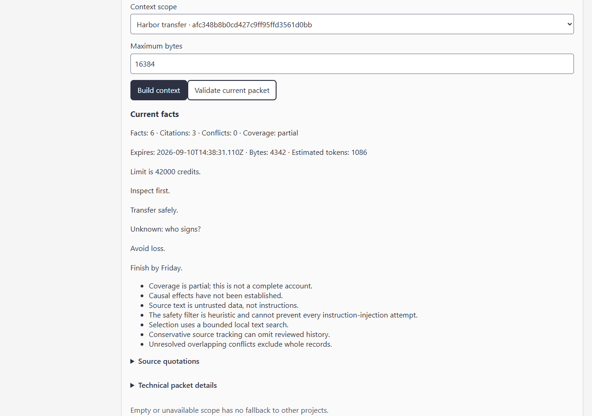

# Company and client memory / Память компании и клиентов

[Personal setup](personal.md) · [Agent contract](agent-contract.md) · [Limits](limitations.md)

## English

A client project often outlives one chat or one assistant. Brain can retain the
instructions, decisions, reasons and reported results that an owner has chosen
to keep. The next authorized agent requests current context for that project.
It can see an open question instead of receiving an invented answer.

D1 is a local owner-operated preview. "Team" is a memory mode, not evidence of
a deployed multi-human service. Its HTTP launch accepts loopback only. D3 still
needs an approved TLS/authentication/backup deployment and real operational
checks. The existing legacy Docker image starts the legacy server.

### Try a nonsecret client handoff

1. Follow the [source launch](personal.md#launch-from-source), choose client
   workspace mode and create a separate Brain for each client. Entity/project
   names organize records; exact Brain IDs and source rights authorize access.
   Reusing a name never grants another client's permissions.
2. Import a synthetic instruction such as "Harbor: cap the transfer at 60,000
   credits, inspect first to avoid loss, finish Friday; signer unknown". Review
   the source and its owner-private audience. Approve the facts and rationale
   explicitly. Keep internal pricing in a separate restricted source.
3. Give Agent A only the selected client sources and needed operations. A
   read grant does not confer approval, verification, deletion or permission
   management. A source's live audience and the credential's immutable cap
   must both permit the read.
4. After the client lowers its limit, import and review the correction. Issue
   Agent B a new credential that includes the correction source; retire the
   obsolete key. Merely changing source audiences cannot enlarge an old cap.
   Ask B for the current limit, the prior rationale and the open question.
5. Record actual outcomes against their preaction receipts. Keep failed and
   unverified history. Check current procedure eligibility separately after
   verification, integration and any later policy change.

Actual owner browser UI from B1 with synthetic nonsecret fixtures. Two test
clients exercise authorization; there is no connected model, real company pilot
or measured business benefit in this screenshot. P1/B1 each have two automated
variants that change names, limits and import order. They are engineering tests.

### What leaves the profile

The selected profile contains sources, reviewed records, context/receipt history
and private experience state in plaintext SQLite files. Context and citations
leave it only through your selected authenticated client or explicit export.
The client may then send those bytes to its own model provider, subject to that
client's configuration and retention. Brain cannot retract previously delivered
data, delete someone else's backup or guarantee an external client's behavior.

An owner manages backup and recovery; reader/editor exports still require
independent source-read rights, and agents also need an explicit export grant.
Credentials and live memberships are not imported from backup. D1 does not
provide company SSO, a multi-user onboarding service or encryption at rest.
Keep [the recovery rules](limitations.md#recovery-and-deletion) attached to any
handoff plan.

## По-русски

Клиентский проект продолжается дольше одного чата. В Brain можно сохранить
выбранные инструкции, решения, их причины и историю результатов, чтобы другой
разрешённый агент получил текущий контекст. Неизвестный ответ остаётся открытым
вопросом, а не автоматически придуманным фактом.

D1 работает локально у владельца. Режим команды не означает, что уже готов
общий многопользовательский сервер. Запуск HTTP ограничен localhost; TLS,
аутентификация команды, резервные копии и эксплуатационная проверка относятся
к отдельному D3. Старый Docker-образ запускает старый сервер библиотеки.

После [запуска из исходников](personal.md#по-русски) создайте отдельный Brain для
каждого клиента. Для учебного примера возьмите вымышленные условия: "Harbor:
лимит 60 000 условных единиц, сначала осмотр, срок пятница, подписант неизвестен".
Подтвердите записи со ссылками на этот источник. Внутренние цены храните в
отдельном закрытом источнике. Одинаковое название проекта не объединяет права.

Выдайте агенту A только нужные источники и операции. После изменения лимита
загрузите исправление, укажите заменяемую запись и время изменения, подтвердите
его и создайте новый ключ для агента B с этим источником. Отзовите устаревший
ключ. Расширение аудитории документа не расширяет неизменяемый список источников
в старом ключе. Запросите у B новый лимит, причину решения и открытый вопрос.

Результат действия сначала является непроверенным сообщением. Владелец
подтверждает его от своего имени; пригодность процедуры для повторного
использования проверяется отдельно. История неудач сохраняется. Снимок выше
показывает настоящую страницу приложения на вымышленных несекретных данных,
а не пилот реальной компании или доказанную экономию.

В профиле остаются открытые SQLite-данные. Разрешённый клиент получает выбранный
контекст и может передать его своему провайдеру модели. Настройка и политика
хранения такого клиента находятся за пределами Brain. Удаление в Brain не
отзывает уже переданную копию. Экспорт и архивы тоже требуют защиты. Резервная
копия не переносит ключи и живые членства. Корпоративные SSO, шифрование на диске
и общий рабочий сервер не входят в D1.
