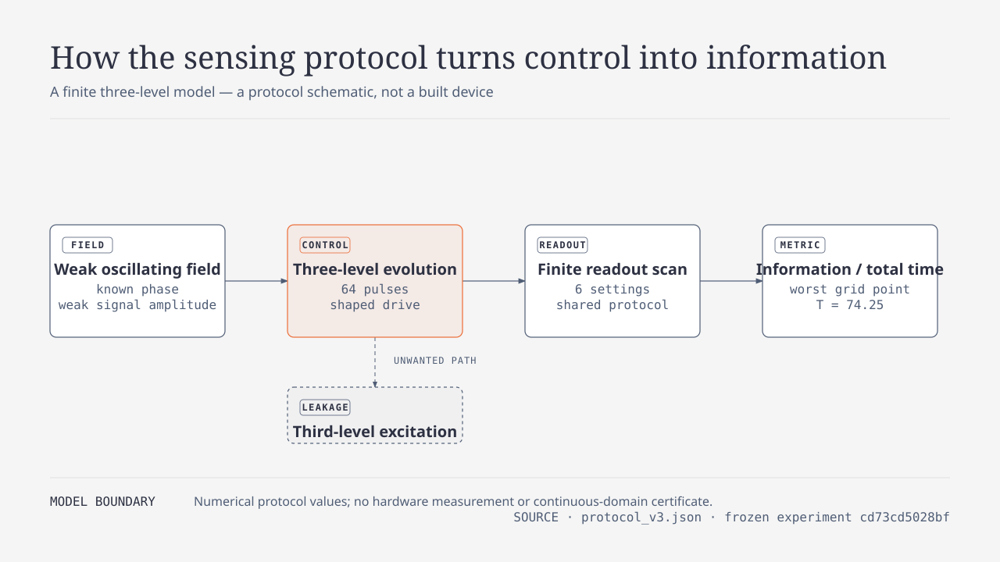
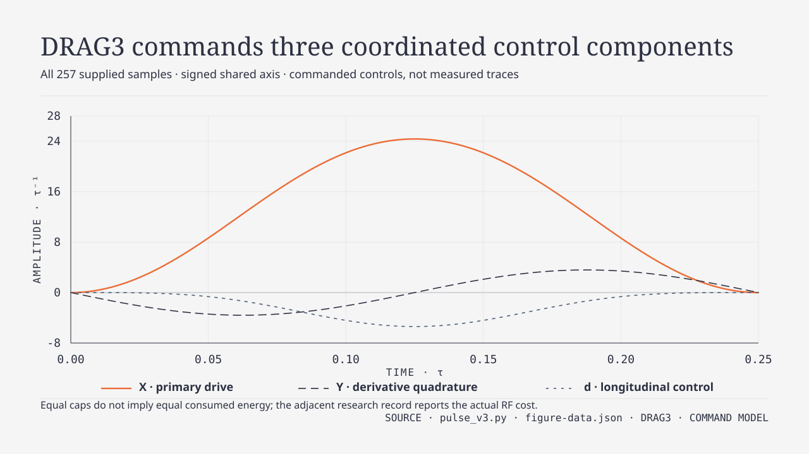

# Where does the signal go?

Quantum sensing research · 8 September 2026

[По-русски](START_HERE_RU.md) · [Latest results](sensing_rs/RESULTS_V3_RU.md) · [Frozen protocol](sensing_rs/protocol_v3.json) · [Reproduce](#reproduce-or-audit) · [Archive](#research-archive)


*Conceptual illustration.*

A quantum state can respond to a weak field while a chosen measurement
reveals almost none of that response. This investigation asks how pulse
control and readout can preserve useful, observable information.

**Current status: simulation only; no qualifying advantage over known
controls.** There is no built device, independent priority clearance or
validated consumer/enterprise benefit. The released WaveMind library manages
agent experience. The physics work is a separate research track, not a
quantum feature of that library.

## The experiment in one minute

The model has two sensing levels and an unwanted third level. A weak field
changes the state. A train of 64 pulses controls its evolution, after which
six readout settings share the measurement budget. The score is local Fisher
information about the weak signal divided by total time, including readout
and assumed overhead. Higher is better within this model; the score is not
a calibrated device sensitivity or an inspection success rate.



*From a weak field to an observable score. A calculation schematic, not a
built sensor. [Full-size figure](assets/sensing-model.svg) ·
[Mathematical model](sensing_rs/PULSE_V3_THEORY.md).*

| Version | Question | What survived the test |
|---|---|---|
| v1 · Sequence | Can Rudin–Shapiro phase coding control leakage? | A restricted first-order bound survived, but eight off-grid blind spots defeated the chosen readout. |
| v2 · Readout | Can six native settings recover the observable signal? | All eight known blind spots were repaired in-model; randomized XY8 still had a 5.14-times higher grid minimum. |
| v3 · Pulse | Does pulse-local compensation add an RS advantage? | Shaping greatly improved RS, but known sequences given the same controls benefited too. The advantage gate failed. |

Versions are separate frozen experiments. In particular, v3 samples new
detuning midpoints; its before/after gain compares two v3 variants on that
same grid, not results stitched across different test sets.

## What changed inside the pulse

We tested rectangles, shorter rectangles, a smooth Hann envelope and fixed
DRAG3 compensation. DRAG3 adds a derivative quadrature, a cubic in-phase
correction and longitudinal level control. DRAG is an
[established method](https://arxiv.org/abs/0901.0534), not an invention of
this repository. The question was whether combining it with RS would add
something beyond giving those same controls to established sequences.

The candidate and coefficients were frozen before the main run. We evaluated
36 pulse/sequence combinations, each at 9,216 model settings. Randomized XY8
uses 32 retained phase realizations sharing one shot budget, not 32 times
the resources.


*Shaping helps both methods. RS and the strongest known grid minimum are
shown for each shape; the complete experiment has 36 combinations.
[Full-size figure](assets/pulse-comparison.svg).*

<details>
<summary>Chart values and units</summary>

| Pulse shape | RS minimum FI/time | Best known minimum at the same shape |
|---|---:|---:|
| RECT | 0.001124 | 0.004749 · RXY8 |
| FAST_RECT | 0.00001443 | 0.0009915 · RXY8 |
| HANN | 0.013050 | 0.013487 · RXY8 |
| DRAG3 | 0.013893 | 0.014128 · RXY8 |

Model units; minima over the finite v3 grid. This compact table selects RS
and the strongest known minimum per shape. [All 36 results remain available](sensing_rs/runs/pulse_v3/results.json).

</details>

DRAG3/RS improved **12.37-fold** over RECT/RS, reaching **98.34%** of the
best known minimum. The frozen requirement was at least **200%**, together
with a median-score requirement. It did not pass. Nor is the gain free:
DRAG3 consumes 47.47% more RF energy than RECT and needs added level control.
All methods have equal caps and waveform choices, not equal consumed energy.



*Inside one pulse: X is the primary drive, Y its quadrature correction,
and d the added level control. These are commanded shapes, not measured
oscilloscope traces; axes use model units.
[Full-size figure](assets/drag3-waveform.svg) ·
[Equations and assumptions](sensing_rs/PULSE_V3_THEORY.md).*

## What useful would have to mean

A possible future application is magnetic inspection: infer currents or
changes inside an object from weak fields. That could matter to an individual
checking a device or a company inspecting many objects, **if** a complete
procedure proves more reliable, faster or less costly than a strong ordinary
inspection method. No such outcome has been measured here.

The remaining tests are distinct: demonstrate a new capability beyond known
control; reproduce it independently; calibrate and test a real sensor; then
compare a complete workflow on independently labeled held-out objects.
Include calibration time, operator burden, false alarms and missed defects.
An improved simulation score cannot substitute for those observations.

## Audit trail

35 focused implementation/evidence tests pass. A fresh local v3 run matched
all 228 saved arrays; 43 archived files also matched their Git blobs byte for
byte. This is a same-investigator reproduction, not an independent review.
[Validation record](sensing_rs/validation_v3.json).

[Figure sources, data and visual checks](assets/README.md) are also included.
The figures use the owner's selected diagram-design style; they do not change
the experimental protocol or the admission criteria.

The scientific advantage gate remains false even when every software test
passes. Protocols, raw arrays, source digests and rejected results remain
available so another person can check the conclusion.

## Research archive

This mission began on 2026-09-06. Both long-term gates remain open: a novel,
independently reproducible scientific capability, and an order-of-magnitude
or previously impossible improvement in real consumer and enterprise work.
External expert scrutiny is required before calling a result a breakthrough.

<details>
<summary>Current sensing evidence and previous investigations</summary>

- [Current sensing v3: pulse compensation helps; the combination advantage fails](sensing_rs/RESULTS_V3_RU.md)
- [Preserved sensing v2: blind spots repaired in-model; matched-budget advantage fails against randomized XY8](sensing_rs/RESULTS_V2_RU.md)
- [Reproduction and independent/device validation handoff — unsent](sensing_rs/VALIDATION_HANDOFF.md)
- [Preserved sensing v1: leading leakage bound survives; off-grid readout blindness defeats robust-sensor admission](sensing_rs/RESULTS_RU.md)
- [Что сделано и почему это ещё не доказанный прорыв — без жаргона](PLAIN_LANGUAGE_RU.md)
- [Decisive closure: R8 REJECTED; sole alternative refuted; no qualifying candidate](R8_DECISIVE_REVIEW_20260907.md)
- [Bounded QEC hypothesis selection: three candidates, none admitted](QUANTUM_HYPOTHESIS_SELECTION_RESULTS_20260907.md)
- [Selection criteria frozen before the literature search](QUANTUM_HYPOTHESIS_SELECTION_GATE_20260907.md)
- [Current scientific decision gate: exact residual claim, proof and falsifiers](SCIENTIFIC_DECISION_GATE.md)
- [Decision-gate results: full replay, physical negatives, no novelty clearance](SCIENTIFIC_DECISION_RESULTS.md)
- [Frozen public-workflow selection and measurement contract](PUBLIC_WORKFLOW_SELECTION_PROTOCOL.md)
- [Selected public consumer/enterprise workflows and rejected-source ledger](PUBLIC_WORKFLOW_SELECTION.md)
- [Actual UCI intake results: preserved failure, amended replay, quality and terms hold](WORKFLOW_INTAKE_V2_RESULTS.md)
- [Frozen intake guide, access history and companion notebook](WORKFLOW_INTAKE_GUIDE.md)
- [Compact R8 handoff: exact claim and remaining prior-art questions](R8_NEXT_GATE_BRIEF.md)
- [Starting state and instruction audit](STATE_AND_AUDIT.md)
- [Primary-source novelty map and decision matrix](NOVELTY_REVIEW.md)
- [Frozen first experiment](protocol_r1.json)
- [Mechanism and proof boundary](MECHANISM.md)
- [Results and next decision](DECISION.md)
- [External baseline source pins](baseline_pins.json)
- [Diagnostic reduction and exact R4 baseline](DIAGNOSTIC_REDUCTION.md)
- [R5 full local-Clifford criterion and proof boundary](LC_PROJECTOR.md)
- [R5 complete 368-code audit, results and plain Russian explanation](LC_PROJECTOR_R5_RESULTS.md)
- [R6 polynomial stitching candidate and proof](LC_STITCHING.md)
- [R6 34,047-case falsifier, limitations and plain Russian report](LC_STITCHING_R6_RESULTS.md)
- [R7 adversarial affine-frame protocol and assumptions](LC_ADVERSARIAL_FRAMES.md)
- [R7 384-case multi-piece audit, ablations and limits](LC_ADVERSARIAL_R7_RESULTS.md)
- [Theorem-level prior-art applicability audit and refuted shortcut](PRIOR_ART_THEOREM_AUDIT.md)
- [Independent review request — unsent draft](EXPERT_REVIEW_PACKET.md)
- [R8 scalar-component simplification and known foundation](LC_SCALAR_COMPONENTS.md)
- [R8 complete small-subspace falsifier and narrowed novelty boundary](LC_SCALAR_R8_RESULTS.md)
- [Workflow bridge audit: correct CSS conversion can worsen fixed-noise protection](WORKFLOW_BRIDGE_AUDIT.md)
- [Safe-transfer prior-art audit: known mechanisms and incompatible guarantee targets](SAFE_TRANSPORT_PRIOR_ART_AUDIT.md)
- [Historical learned-structure triage and external requirements](LEARNED_TRANSPORT_TRIAGE.md)

</details>

The subsequent instruction authorizes autonomous selection of public licensed
consumer and enterprise workflows. Missing owner-selected tasks no longer
blocks local research. Independent review and real-workflow validation remain
required for the full gates; the earlier paused posture is historical.

Results are recorded after execution, including rejection. No released runtime
is changed by this experiment. No paid API, judge, simulator, quantum hardware,
or LongMemEval execution is authorized by these local runners.

## Reproduce or audit

Python and NumPy suffice (`numpy==2.5.2` was used). Audit stored evidence:

For the current sensing line, run its focused implementation/evidence tests
(Pytest required). These reproduce both positive results and the failed
scientific advantage gate; they do not reopen the rejected R8 line:

```sh
python -m pytest research/breakthrough/sensing_rs -q -p no:cacheprovider
```

For a fresh full v3 reproduction and byte-level Git evidence audit:

```sh
python research/breakthrough/sensing_rs/experiment_v3.py --output /NEW/PARENT/pulse-v3-replay
python research/breakthrough/sensing_rs/verify_v3_replay.py /NEW/PARENT/pulse-v3-replay --check-git
```

Replace the placeholder with a new local path. The final directory must not
already exist, and tracked sources must be committed. See the
[sensing handoff](sensing_rs/VALIDATION_HANDOFF.md#reproduce-locally) for v2
reproduction and the conditions needed for an independent or device test.
The following commands are retained for historical evidence, not a request
to restart those closed investigations:

```sh
python research/breakthrough/verify_evidence.py
python research/breakthrough/verify_r4.py
python research/breakthrough/verify_r5.py
python research/breakthrough/verify_r6.py
python research/breakthrough/verify_r7.py
python research/breakthrough/verify_prior_art_applicability.py
python research/breakthrough/verify_r8.py
python research/breakthrough/verify_workflow_bridge.py
python research/breakthrough/decision_gate_falsifier.py --verify research/breakthrough/runs/decision_gate
```

For reproduction, create a clean detached checkout at the run's source SHA
in `DECISION.md` (or the linked R5/R6/R7/R8 reports), then invoke its `experiment_r1.py`,
`experiment_r2.py`, `experiment_r3.py`, `experiment_r4.py`, `experiment_r5.py`, `experiment_r6.py`, `experiment_r7.py` or `experiment_r8.py`
with `--output` pointing to a new directory. Runners reject
existing output directories and tracked uncommitted changes. Preserve original
outcomes and record the reproducer's own environment and timing uncertainty.
